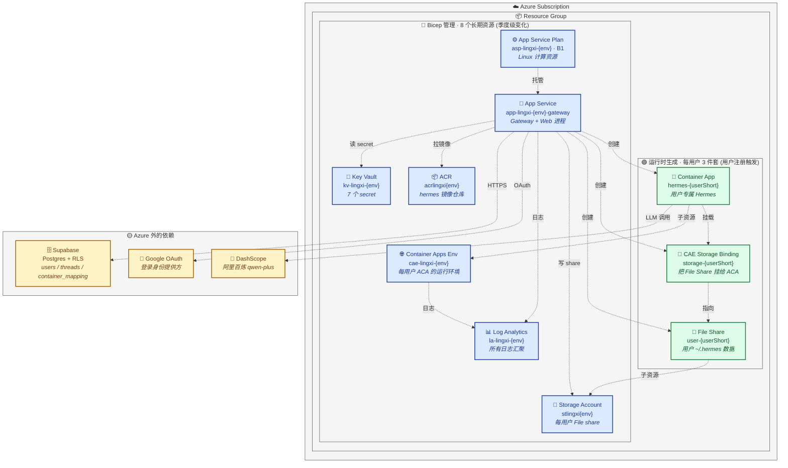

# 部署架构

灵犀整体跑在 Azure 上。按"变化频率"和"管理工具"分四类资产，互不混淆。

> - dev 与 prod 的环境差异、env 命名守则、加新 env 的标准动作，见 [environments.md](./environments.md)。
> - 首次部署踩过的 7 个坑 + 现成的 prod 部署快捷脚本，见 [deployment-azure-first-run.md](./deployment-azure-first-run.md)。

```
变化频率：低 ─────────────────────────────────────────────► 高

  ①基础设施         ②Hermes 镜像        ③Gateway+Web         ④每用户实例
  (季度级)           (月级)              (天级)                (用户注册触发)
       ↓                ↓                  ↓                      ↓
  infra/bicep/      docker/hermes/   apps/{gateway,web}     apps/gateway/src/
   main.bicep      build-and-push.sh  scripts/build-deploy   provisioning/azure.ts
       ↓                ↓                  ↓                      ↓
  az deployment    az acr build      vite bundle → zip →     Azure SDK
   group create                       Storage SAS URL         (运行时)
                                      → App Service
```

---

## ① 基础设施 (infra/bicep/)

**职责**：声明长期存在的 Azure 资源 — RG、ACR、Storage、Container Apps Env、Log Analytics、App Service Plan、App Service。

**工具**：Bicep + `az deployment group create`。

**部署**：
```bash
cd infra/bicep
./deploy.sh dev    # 或 prod
```

**特点**：
- 幂等，可反复跑修补
- 一份模板 + `parameters.{env}.json` 切环境
- 输出 (acrLoginServer / storageAccountName / appServiceHost) 用于下游配置

**何时改**：新增长期资源、调整 SKU、加 Key Vault。

---

## ② Hermes 镜像 (docker/hermes/)

**职责**：构建用户实例运行的 Hermes Agent 容器镜像，推到 ACR。

**工具**：ACR Build (`az acr build`)，云端构建 amd64。

**部署**：
```bash
cd docker/hermes
ACR_NAME=<acr-name> IMAGE_TAG=v1.2.0 ./build-and-push.sh
```

**特点**：
- 不在本地 build (Mac arm64 与 Azure amd64 不兼容)
- 上传 build context (几十 KB) 而非镜像 (~1GB)
- 镜像 tag 是声明式版本号，gateway 通过 env `HERMES_IMAGE_TAG` 引用

**何时改**：Hermes 源码 / Dockerfile / 系统依赖变更。

---

## ③ Gateway + Web (apps/)

**职责**:编排服务 (Express) + 前端 (Vite/React) **合并为一个 Node 进程**部署到 App Service。

- Gateway 监听 `PORT`(8080) 提供 `/api/*` + `/auth/*`
- 同进程 `express.static` 托管 `apps/web/dist`, SPA fallback 给 React Router
- 前后端同源, 无 CORS、OAuth redirect_uri 也同源

**工具**:GitHub Actions → 上传到 Storage → `WEBSITE_RUN_FROM_PACKAGE=<SAS URL>`。

**为什么是这条路**:App Service 的 Oryx 后处理对 pnpm monorepo 不友好 (会把 `.pnpm/` 误判压缩, 导致依赖丢失)。`WEBSITE_RUN_FROM_PACKAGE=<URL>` 把 zip 作为只读 FUSE 挂载, 完全跳过 Oryx——zip 里是啥结构就跑啥结构。配套的 build-deploy.sh 用 vite lib mode 把 gateway TS + `@lingxi/shared` 一起打包成单文件, 工作区协议、symlink、构建顺序问题在打包阶段就消解掉了。

**部署分两阶段**: build (产物) 和 deploy (推到 Azure)。两者解耦——build 是确定性的纯本地动作, 可以反复跑、本地 smoke test、对比产物; deploy 是有副作用的 Azure 操作, 需要明确意图触发。

### 阶段 A: build (本地或 CI 都一样)

`scripts/build-deploy.sh` 一条命令搞定, 不调任何 az cli, 产物落到 `app-service-deploy/`:

```bash
./scripts/build-deploy.sh
# 内部步骤:
#   1. vite lib mode bundle: gateway 全部源码 + @lingxi/shared 内联 → dist/index.mjs
#   2. vite build web (前端静态资源)
#   3. 拼装 app-service-deploy/:
#        index.mjs / index.mjs.map     ← gateway 单文件 (~52KB)
#        web-dist/                     ← 前端静态资源
#        package.json                  ← 从 pnpm-lock 取精确版本, 无 workspace:* 协议, 无 devDeps
#   4. cd app-service-deploy && npm install --omit=dev   ← 产扁平 node_modules
```

可选本地 smoke test (用真 env, 真起来):
```bash
cd app-service-deploy && PORT=19999 SESSION_SECRET=... node index.mjs
```

### 阶段 B: deploy 到 Azure

```bash
ENV=dev   # 或 prod
cd app-service-deploy && zip -rq ../deploy.zip . -x '*.map' && cd ..
az webapp deploy \
  -g "rg-lingxi-${ENV}" \
  -n "app-lingxi-${ENV}-gateway" \
  --src-path deploy.zip --type zip
curl https://app-lingxi-${ENV}-gateway.azurewebsites.net/healthz
```

**App Service 设置**:Linux Node 22, Always On, WebSocket on, HTTPS only。全套 env 由 Bicep 声明 (敏感值走 Key Vault reference)。

**何时改**:日常业务代码变更。

---

## ④ 每用户实例 (运行时)

**职责**：用户注册时创建专属 Hermes Container App + Azure Files share + storage binding。

**工具**：Azure SDK，gateway 内 `apps/gateway/src/provisioning/azure.ts`，由 `purchase` 路由触发。

**特点**：
- 不在 IaC 里 — 资源数量等于用户数，必须运行时
- provision 22s / destroy 22s 实测 (Phase B)
- 失败状态机由 `recovery.ts` 恢复，启动时扫描 stuck 行

**何时改**：用户系统逻辑变更，不是基础设施变更。

---

## Azure 资源全景图

服务完美运行时, 一个环境 (dev 或 prod) 的资源清单和归属:



### 资源详细清单

#### 🔵 Bicep 管理 (8 项, `infra/bicep/main.bicep` 声明)

| 资源 | dev 名字 | 角色 | 是否扩展到每用户 |
|---|---|---|---|
| **Log Analytics workspace** | `la-lingxi-dev` | 所有 App Service + CAE 日志的统一汇聚点, 30 天保留 | 否 (共享) |
| **Container Registry (ACR)** | `acrlingxidev` | 存 hermes 镜像 (单一 repository: `hermes`, tag 如 `latest` / `v1`) | 否 (共享) |
| **Storage Account** | `stlingxidev` | 给每用户开 File share 用; **不存 deploy zip** | 否 (共享, 内部按用户分 share) |
| **Container Apps Environment** | `cae-lingxi-dev` | 每用户 ACA 的运行环境; 接 Log Analytics | 否 (共享, 内部按用户分 storage binding) |
| **Key Vault** | `kv-lingxi-dev` | 7 个 secret: session/supabase-url/supabase-key/google-id/google-secret/anthropic/dashscope | 否 (共享) |
| **App Service Plan** | `asp-lingxi-dev` | Linux B1, 跑 App Service 的计算资源 | 否 (共享) |
| **App Service** | `app-lingxi-dev-gateway` | Gateway + Web 同进程跑这里, system identity 持有创资源所需的 5 个 role | 否 (单实例) |
| **Role Assignments** (5) | — | 给 App Service identity 授权: KV Secrets User, Storage Contributor, CAE Contributor, RG Contributor, ACR Pull | 否 |

#### 🟢 运行时生成 (每用户 3 件套, `apps/gateway/src/provisioning/azure.ts` 创建)

用户首次点"创建数字员工"时, gateway 用 system identity 调 Azure SDK 在 ~22s 内建出:

| 资源 | 命名 | 角色 |
|---|---|---|
| **Container App** | `hermes-{userId 前 8 位}` | 用户专属 Hermes 容器, 跑 docker/hermes 镜像, 挂用户 File share 到 `/home/hermes` |
| **File Share** | `user-{userId 前 8 位}` | 用户 ~/.hermes 数据 (session 历史 / config / pip 包 / npm 包), 容器重启不丢 |
| **CAE Storage Binding** | `storage-{userId 前 8 位}` | 把 File Share 注册到 CAE, ACA 才能挂载 |

每用户实例的 URL: `https://hermes-{userShort}.{caeDomain}.azurecontainerapps.io`, 写在 supabase `container_mapping` 表里供 gateway 路由消息时查。

#### 🟡 Azure 外的依赖

| 资源 | 角色 | 凭据存放 |
|---|---|---|
| **Supabase** | Postgres + RLS, 存 users / threads / container_mapping / wechat_binding 等业务数据 | KV: `supabase-url` + `supabase-service-role-key` |
| **Google OAuth** | 登录身份提供方, 唯一启用的 OAuth provider | KV: `google-client-id` + `google-client-secret` |
| **DashScope (阿里百炼)** | LLM provider, hermes 容器内通过 OpenAI 兼容端点调 qwen-plus | KV: `dashscope-api-key`, 通过 ACA env 注入 |

### 资源管理速查

| 想做什么 | 用什么 | 文件/命令 |
|---|---|---|
| 加/改长期资源 (SKU / 新 KV / region) | Bicep | `infra/bicep/main.bicep` + `./deploy.sh {env}` |
| 加/改 KV secret | az CLI | `az keyvault secret set --vault-name kv-lingxi-{env} --name X --value Y` |
| 推新 hermes 镜像 | ACR Build | `docker/hermes/build-and-push.sh` |
| 发新 gateway+web 代码 | CI 或手动 | 推 main 或 `./scripts/build-deploy.sh` + `az webapp deploy` |
| 清理失败用户残留 | az CLI + supabase REST | 见 `docs/deployment-azure-first-run.md` 末尾或 catchup.md |
| 看 App Service 日志 | Log Analytics | Azure Portal → `la-lingxi-{env}` → Logs (KQL) |
| 看用户实例日志 | Log Analytics | 同上, 表名 `ContainerAppConsoleLogs_CL` |

---

## 配置对照

跨资源的配置流向 (谁产出 → 谁消费):

| 来源 | 配置 | 消费方 |
|---|---|---|
| Bicep 输出 | `acrLoginServer` / `storageAccountName` / `containerAppsEnvId` / `appServiceHost` | App Service appsettings (bicep 自动写入), gateway 读 env 创建用户实例 |
| Key Vault | 7 个 secret | App Service appsettings 通过 `@Microsoft.KeyVault(...)` reference 注入 |
| 手动 / CI | `HERMES_IMAGE_TAG` | gateway 创建用户 ACA 时引用的镜像 tag |

详细对照见上面"Azure 资源全景图"章节。

---
