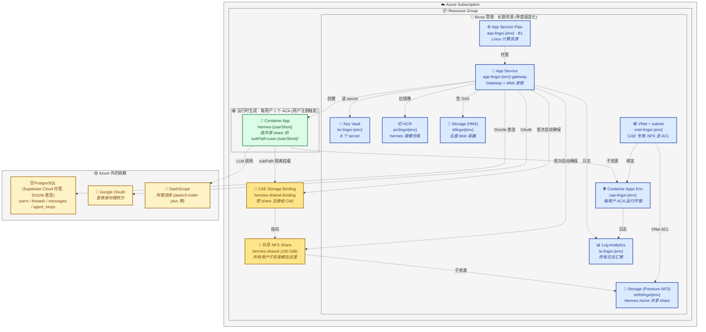

# 部署架构

灵犀整体跑在 Azure 上。按"变化频率"和"管理工具"分四类资产，互不混淆。

> - dev 与 prod 的环境差异、env 命名守则、加新 env 的标准动作，见 [environments.md](./environments.md)。
> - 首次部署踩过的 7 个坑 + 现成的 prod 部署快捷脚本，见 [deployment-azure-first-run.md](./deployment-azure-first-run.md)。

```
变化频率：低 ─────────────────────────────────────────────► 高

  ①基础设施         ②Hermes 镜像        ③Gateway+Web         ④每用户实例
  (季度级)           (月级)              (天级)                (用户注册触发)
       ↓                ↓                  ↓                      ↓
  infra/bicep/      docker/hermes/   apps/{gateway,web}     apps/gateway/src/
   main.bicep      build-and-push.sh  scripts/build-deploy   provisioning/azure.ts
       ↓                ↓                  ↓                      ↓
  az deployment    az acr build      vite bundle → zip →     Azure SDK
   group create                       Storage SAS URL         (运行时)
                                      → App Service
```

---

## ① 基础设施 (infra/bicep/)

**职责**：声明长期存在的 Azure 资源 — RG、ACR、Storage、Container Apps Env、Log Analytics、App Service Plan、App Service。

**工具**：Bicep + `az deployment group create`。

**部署**：
```bash
cd infra/bicep
./deploy.sh dev    # 或 prod
```

**特点**：
- 幂等，可反复跑修补
- 一份模板 + `parameters.{env}.json` 切环境
- 输出 (acrLoginServer / storageAccountName / appServiceHost) 用于下游配置

**何时改**：新增长期资源、调整 SKU、加 Key Vault。

---

## ② Hermes 镜像 (docker/hermes/)

**职责**: 构建用户实例运行的 Hermes Agent 容器镜像, 推到 ACR, **并把存量用户 ACA roll 到新镜像**。

**工具**: ACR Build (`az acr build`) 云端构建 amd64 + `scripts/rollout-hermes.sh` 批量 update 用户 ACA。

### Tag 规范 (硬约束)

- 镜像 tag 用 **`vN` 单调递增** (v9 → v10 → v11), N 是十进制整数。**禁止跳号、禁止只推 `:latest` 不带 vN、禁止重用旧 vN**。
- 每次 build 同时打两个 tag: 显式版本 `vN` (用于 rollout pin 到具体版本, 可回滚) 和 `latest` (gateway provisioning 给新用户用)。`build-and-push.sh` 已经做了双 tag。
- **打 tag 前必须先查 ACR 当前最大 vN**, 下一个 = 最大 + 1:
  ```bash
  az acr repository show-tags -n acrlingxi${ENV} --repository hermes \
    --orderby time_desc --top 10 -o tsv
  ```
  漏跳号不算 bug, 但**不允许重复或回退**。

### 部署分四阶段

#### 阶段 A: 决定 tag
查现有 tag (上面那条命令) → 取最大 vN → 下一个 = N+1。

#### 阶段 B: 云端 build + push
```bash
cd docker/hermes
ACR_NAME=acrlingxi${ENV} IMAGE_TAG=v11 ./build-and-push.sh
# 内部: az acr build --image hermes:v11 --image hermes:latest --platform linux/amd64 .
# 同时打 v11 和 latest, 上下文几十 KB, 云端 amd64 构建, 单次 2-4 min。
```

#### 阶段 C: 验证镜像 (这个灵活安排，不强制)
push v11 改了 Dockerfile 哪几行, 验证就照那几行的预期落点去戳。没有通用清单。

大致思路: 看一下我们这次改了一些什么东西。寻找一些可验证的点, 比如新增了一个文件。那么就可以去镜像里面看一下这个文件是不是存在。总之，灵活安排。

执行壳子 (改 vN, 检查内容随每次 push 变):
```bash
az acr login -n acrlingxi${ENV}
docker pull acrlingxi${ENV}.azurecr.io/hermes:v11
docker run --rm acrlingxi${ENV}.azurecr.io/hermes:v11 bash -c '
  # ★ 这一段按这次 push 的 diff 现写, 每次都不一样
'
```
Mac arm64 拉 amd64 会走 QEMU 模拟, 慢但够用。**任一项不通过 → 回到改代码, 不要继续 rollout**。

> **历史踩坑 (2026-06-16)**: 推过一版 `hermes:latest` (那次还违反 Tag 规范, 没打 vN), Dockerfile 里 `RUN cat > /etc/profile.d/lingxi.sh <<EOF` heredoc 在 ACR Build 上没生效, 产物是 0 字节空文件, login shell PATH 救不回来, AI agent 跑 `pnpm add -g` 一直警告 PATH 缺失。当时**跳过了阶段 C**, 直接信任 push 成功, 三个用户 ACA 都中招。这次改动的 diff 里 `RUN cat > .../lingxi.sh` 是新增 RUN, 按上面的思路本该专门 `wc -c /etc/profile.d/lingxi.sh` 验一下产物非空 — 这种**针对本次 diff 设计的检查**正是阶段 C 的意义。

#### 阶段 D: 对存量用户 ACA rollout
ACA revision 不可变, push 新镜像后**现有用户实例不会自动跟随**, 必须显式 update 触发新 revision。
```bash
ENV=dev ./scripts/rollout-hermes.sh v11
# 默认并发 10, 每个 ACA 跑 az containerapp update --image .../hermes:v11
# 失败不中断其他, 结尾给出 success/failed 汇总, 失败 ACA 列名字
# 可加 DRY_RUN=1 先看目标列表, PARALLEL=20 调并发
```

**如果要回滚**: 再跑一遍, tag 换成上一版即可: `ENV=dev ./scripts/rollout-hermes.sh v10`。

### 特点
- 不在本地 build (Mac arm64 与 Azure amd64 不兼容, QEMU 模拟太慢)
- 上传 build context (几十 KB) 而非镜像 (~1GB)
- gateway 通过 App Service env `HERMES_IMAGE_TAG=hermes:latest` 给**新注册用户**自动用最新镜像; 存量用户必须走阶段 D 才会跟上

**何时改**: Hermes 源码 / Dockerfile / 系统依赖变更。

---

## ③ Gateway + Web (apps/)

**职责**:编排服务 (Express) + 前端 (Vite/React) **合并为一个 Node 进程**部署到 App Service。

- Gateway 监听 `PORT`(8080) 提供 `/api/*` + `/auth/*`
- 同进程 `express.static` 托管 `apps/web/dist`, SPA fallback 给 React Router
- 前后端同源, 无 CORS、OAuth redirect_uri 也同源

**工具**:`scripts/build-deploy.sh` 打包 → `az webapp deploy --type zip` (Kudu Zip Deploy) 推到 App Service。

**构建策略**:`build-deploy.sh` 用 vite lib mode 把 gateway TS + `@lingxi/*` workspace 包一起打包成单文件 `index.mjs`, 然后从 pnpm-lock 抽精确版本生成扁平 `package.json` + `package-lock.json`(无 workspace:* 协议),**本地** `npm install --omit=dev` 把 node_modules 也打进 zip。bicep 设 `SCM_DO_BUILD_DURING_DEPLOYMENT=false` 让 Oryx 完全旁路, App Service 解压 zip 后直接用包内 node_modules 起 Node。运行时依赖 (express / drizzle-orm 等) 都是纯 JS, 没有 native binding, Mac arm64 装出来的 node_modules 在 Linux Node 22 下直接能跑。

**部署分两阶段**: build (产物) 和 deploy (推到 Azure)。两者解耦——build 是确定性的纯本地动作, 可以反复跑、本地 smoke test、对比产物; deploy 是有副作用的 Azure 操作, 需要明确意图触发。

### 阶段 A: build (本地或 CI 都一样)

`scripts/build-deploy.sh` 一条命令搞定, 不调任何 az cli, 产物落到 `app-service-deploy/`:

```bash
./scripts/build-deploy.sh
# 内部步骤:
#   1. vite lib mode bundle: gateway 全部源码 + @lingxi/shared 内联 → dist/index.mjs
#   2. vite build web (前端静态资源)
#   3. 拼装 app-service-deploy/:
#        index.mjs / index.mjs.map     ← gateway 单文件 (~52KB)
#        web-dist/                     ← 前端静态资源
#        package.json                  ← 从 pnpm-lock 取精确版本, 无 workspace:* 协议, 无 devDeps
#        package-lock.json             ← 锁定运行时依赖版本
#   4. cd app-service-deploy && npm install --omit=dev (产扁平真目录 node_modules)
```

可选本地 smoke test (用真 env, 真起来):
```bash
cd app-service-deploy && PORT=19999 SESSION_SECRET=... node index.mjs
```

### 阶段 B: deploy 到 Azure

```bash
ENV=dev   # 或 prod
cd app-service-deploy && zip -rq ../deploy.zip . -x '*.map' && cd ..
az webapp deploy \
  -g "rg-lingxi-${ENV}" \
  -n "app-lingxi-${ENV}-gateway" \
  --src-path deploy.zip --type zip
curl https://app-lingxi-${ENV}-gateway.azurewebsites.net/healthz
```

**App Service 设置**:Linux Node 22, Always On, WebSocket on, HTTPS only, `SCM_DO_BUILD_DURING_DEPLOYMENT=false` (Oryx 旁路, 直接用 zip 内自带的 node_modules)。全套 env 由 Bicep 声明 (敏感值走 Key Vault reference)。

**何时改**:日常业务代码变更。

---

## ④ 每用户实例 (运行时)

**职责**：用户注册时创建专属 Hermes Container App, 通过 ACA `volumeMount.subPath` 挂到全局共享的 NFS share 子目录上。

**工具**：Azure SDK，gateway 内 `apps/gateway/src/provisioning/azure.ts`，由 `purchase` 路由触发。

**特点**：
- 不在 IaC 里 — 资源数量等于用户数，必须运行时
- **每用户只建 1 个资源 (Container App)**, 不再 per-user 建 share/binding。所有用户共用一个 NFS share `hermes-shared` 和一个 binding `hermes-shared-binding`, 各自挂 `subPath=user-<8hex>/`, 容器内看不到兄弟用户的目录。**存储成本因此固定 ~$16/月不随用户数线性涨** (vs 每用户独享一个 100 GiB Premium share = 每人 $16/月)。详见 [nfs.md](./nfs.md) §十。
- 开通流程先起一个 busybox **initContainer 以 root 跑 `chown 1000:1000`** 修 subPath 子目录 owner (ACA `no_new_privs` 禁 sudo, 主容器自己改不了), exit 0 后才起 hermes 主容器。见 [known-issues.md](./known-issues.md) #10。
- provision / destroy 实测均 ~22s
- 失败状态机由 `recovery.ts` 恢复，启动时扫描 stuck 行

**何时改**：用户系统逻辑变更，不是基础设施变更。

---

## Azure 资源全景图

服务完美运行时, 一个环境 (dev 或 prod) 的资源清单和归属:



### 资源详细清单

#### 🔵 Bicep 管理 (`infra/bicep/main.bicep` 声明)

| 资源 | dev 名字 | 角色 | 是否扩展到每用户 |
|---|---|---|---|
| **Log Analytics workspace** | `la-lingxi-dev` | 所有 App Service + CAE 日志的统一汇聚点, 30 天保留 | 否 (共享) |
| **Container Registry (ACR)** | `acrlingxidev` | 存 hermes 镜像 (单一 repository: `hermes`, tag 如 `latest` / `v1`) | 否 (共享) |
| **Storage Account · StorageV2 (HNS)** | `stlingxidev` | `isHnsEnabled=true`. 只承担**云盘**: Blob container `laifu-cloud` + 目录级 SAS 隔离。**不再挂 Hermes home** (已迁到下面的 NFS account) | 否 (共享, 内部按 Blob 前缀分用户) |
| **Blob Container** | `laifu-cloud` | 云盘存储入口, 每用户在容器内独享 `users/<userId>/` 前缀, gateway 签 directory-scoped SAS 强制隔离 | 否 (共享) |
| **Storage Account · Premium FileStorage (NFS)** | `stnfslingxidev` | 专门给 Hermes home 用。`kind=FileStorage` + `Premium_LRS`, 禁 HTTPS-only / 禁 account key, 鉴权完全靠 VNet ACL | 否 (共享, 内部一个 share + subPath 分用户) |
| **VNet + subnet** | `vnet-lingxi-dev` / `cae-subnet` (`10.20.0.0/23`) | CAE 专用子网, delegate 给 `Microsoft.App/environments`, Service Endpoint 给 `Microsoft.Storage`。NFS account 的 networkAcls 只放行这个子网。**创建时绑定不可改** | 否 (共享) |
| **Container Apps Environment** | `cae-lingxi-dev` | 每用户 ACA 的运行环境, `infrastructureSubnetId` 绑上面那个子网, 接 Log Analytics | 否 (共享, 内部按用户分 ACA) |
| **Key Vault** | `kv-lingxi-dev` | secret: session / gateway / database-url / google-id / google-secret / hermes-api-key + 邮件三件套。RBAC 模式, 7 天 soft delete | 否 (共享) |
| **App Service Plan** | `asp-lingxi-dev` | Linux B1, 跑 App Service 的计算资源 | 否 (共享) |
| **App Service** | `app-lingxi-dev-gateway` | Gateway + Web 同进程跑这里, system identity 持有创资源所需的全部 role | 否 (单实例) |
| **Role Assignments** (8) | — | 给 App Service identity 授权: ① KV Secrets User; ② Storage Account Contributor × 2 (云盘 account + NFS account 各一份, 控制面建 share); ③ **Storage Blob Data Owner (数据面签 User Delegation Key, 云盘必需)**; ④ CAE Contributor; ⑤ RG Contributor (建每用户 ACA); ⑥ ACR Pull。另有条件部署的 KV Secrets Officer 授给部署者本人 | 否 |

#### 🟢 运行时生成 (每用户 1 个 ACA, `apps/gateway/src/provisioning/azure.ts` 创建)

用户首次点"创建数字员工"时, gateway 用 system identity 调 Azure SDK 在 ~22s 内建出**用户专属的 Container App**。共享 NFS share 和 binding **只在首次开通时懒创建一次**, 之后所有用户复用。

| 资源 | 命名 | 角色 | 多用户共享? |
|---|---|---|---|
| **Container App** | `hermes-{userId 前 8 位}` | 用户专属 Hermes 容器, 跑 docker/hermes 镜像。先以 root 跑 `init-chown` busybox initContainer 修 subPath 子目录 owner (UID 1000), exit 0 后才起主容器, 把 `hermes-shared` 的 `user-<8hex>/` 子目录挂到 `/home/hermes` | 否, 每用户一个 |
| **NFS File Share** | `hermes-shared` (100 GiB) | 所有用户的 Hermes home 数据 (session 历史 / config / pip / npm 包) 都放这里, 各自一个 subPath 子目录, 容器内看不到兄弟用户 | **是, 全局唯一** |
| **CAE Storage Binding** | `hermes-shared-binding` | 把 `hermes-shared` 注册到 CAE, ACA 才能挂载。所有用户 ACA 都引用这一个 binding, 通过 `volumeMount.subPath` 区分 | **是, 全局唯一** |

每用户实例的 URL: `https://hermes-{userShort}.{caeDomain}.azurecontainerapps.io`, 写在 Postgres `container_mapping` 表里供 gateway 路由消息时查。

> **为什么共享 share + subPath**: Premium FileStorage 每个 share 最小配额 100 GiB ≈ $16/月。per-user 一个 share 等于每个用户 $16 起跳; 共享 share + subPath 让总成本固定 ~$16/月不随用户数涨。详见 [nfs.md](./nfs.md) §十。
>
> **为什么需要 initContainer**: ACA 主容器开了 `no_new_privs`, 容器内 hermes 用户 (UID 1000) 没法 sudo chown 自己挂载点。ACA 自动 mkdir 出来的 subPath 子目录 owner 是 root, 只能让一个独立的 root 容器 (busybox) 在主容器启动前先 `chown 1000:1000`。详见 [known-issues.md](./known-issues.md) #10。

#### 🟠 Azure 自动管理的隐藏资源 (`ME_*` RG, 我们看不到也改不了)

CAE 一旦配 VNet (我们必须配, 为了把 NFS account 锁在 Service Endpoint 里), Azure 就自动在订阅下额外建一个 RG `ME_cae-lingxi-{env}_rg-lingxi-{env}_southeastasia`, 里面放 ACA 入口流量需要的网络资源。**Bicep 摸不到, Portal 也只能查看不能改**, 但**账单照收**。

| 资源 | 命名 | 角色 | 月成本 (实测 SEA 区) |
|---|---|---|---|
| **Standard Load Balancer** | `capp-svc-lb` | 所有用户 ACA Ingress 的统一入口, 2 条规则 (HTTP/HTTPS), 后端转 envoy 31080/31443 | ~$18 (LB 基础 $0.025/h) + ~$0.12 (2 条规则 $0.005/h) |
| **Standard Public IP** | `capp-svc-lb-ip` | Static, 绑在 LB 前端, 暴露给公网 | ~$3.6 ($0.005/h) |
| **合计** | — | — | **~$22/月固定** |

> **关键性质**: 这个 LB 是 **CAE 级别**, 不是 per-ACA, 也不是 per-user。100 个用户 ACA 共用同一个 LB, 仍只收一份。**$22/月是 ACA + VNet 模式无法绕过的硬地板** — 哪怕 CAE 里 0 个 ACA 也照样收。
>
> **成本影响**: 见 [architecture.md §7](./architecture.md#七成本结构azure-基础设施)。早期 (10 用户) Azure 月底价从 ~$30 修正为 ~$52, 主要差额就来自这里。

#### 🟡 Azure 外的依赖

| 资源 | 角色 | 凭据存放 |
|---|---|---|
| **PostgreSQL** | Drizzle ORM 直连 (无 supabase-js client), 存 users / threads / messages / agent_loops / container_mapping / wechat_binding 等业务数据。当前 prod 跑在 Supabase Cloud, 长期可换 Azure DB for PG (改 `DATABASE_URL` 即可) | KV: `database-url` |
| **Google OAuth** | 登录身份提供方, 唯一启用的 OAuth provider | KV: `google-client-id` + `google-client-secret` |
| **DashScope (阿里百炼)** | LLM provider, hermes 容器内通过 OpenAI 兼容端点调用 | KV: `hermes-api-key` (一身二用: gateway↔hermes token + LLM provider key) |

### 资源管理速查

| 想做什么 | 用什么 | 文件/命令 |
|---|---|---|
| 加/改长期资源 (SKU / 新 KV / region) | Bicep | `infra/bicep/main.bicep` + `./deploy.sh {env}` |
| 加/改 KV secret | az CLI | `az keyvault secret set --vault-name kv-lingxi-{env} --name X --value Y` |
| 推新 hermes 镜像 | ACR Build | `docker/hermes/build-and-push.sh` |
| 发新 gateway+web 代码 | CI 或手动 | 推 main 或 `./scripts/build-deploy.sh` + `az webapp deploy` |
| 清理失败用户残留 | az CLI + psql | 见 `docs/deployment-azure-first-run.md` 末尾或 catchup.md |
| 看 App Service 日志 | Log Analytics | Azure Portal → `la-lingxi-{env}` → Logs (KQL) |
| 看用户实例日志 | Log Analytics | 同上, 表名 `ContainerAppConsoleLogs_CL` |

---

## 配置对照

跨资源的配置流向 (谁产出 → 谁消费):

| 来源 | 配置 | 消费方 |
|---|---|---|
| Bicep 输出 | `acrLoginServer` / `storageAccountName` (云盘) / `storageNfsAccountName` (Hermes home) / `containerAppsEnvName` / `appServiceHost` | App Service appsettings (bicep 自动写入), gateway 读 env (`AZURE_STORAGE_ACCOUNT` / `AZURE_STORAGE_ACCOUNT_NFS` / `AZURE_CONTAINER_APPS_ENV`) 创建用户实例 |
| Key Vault | 8 个 secret | App Service appsettings 通过 `@Microsoft.KeyVault(...)` reference 注入 |
| 手动 / CI | `HERMES_IMAGE_TAG` | gateway 创建用户 ACA 时引用的镜像 tag |

详细对照见上面"Azure 资源全景图"章节。

---
