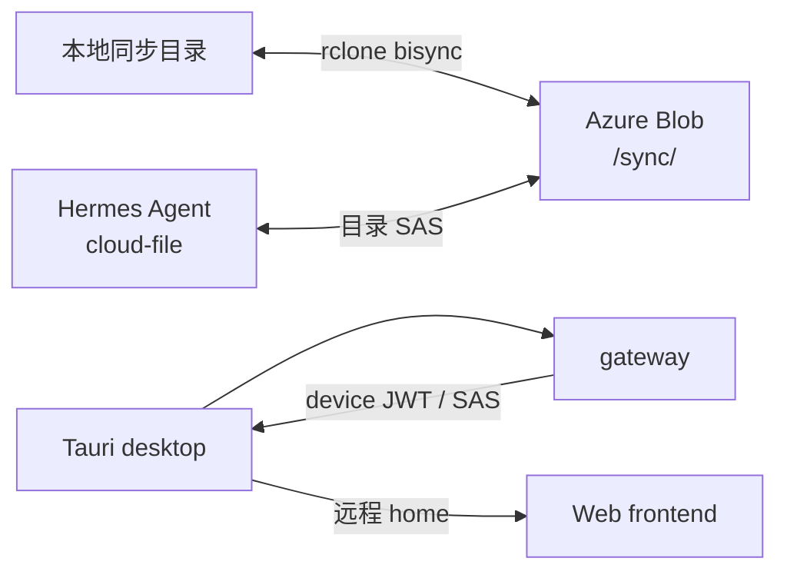

# Desktop App Architecture

本文是来福桌面端的当前架构说明。它描述已存在的边界、协议与运行约束；实现细节以链接的源码为准，不记录历史实施过程。

## 1. 定位与边界

桌面端是 macOS 与 Windows 上的 Tauri 2 应用，为 Web 产品提供原生容器、设备级认证和用户文件的双向同步。

- **Web 产品业务**仍在 `apps/web`；启动主界面 `home` 远程加载该 Web 首页。
- **桌面壳能力**在 `apps/desktop`：系统托盘、窗口管理、设备 JWT、同步目录、rclone、深链回流与本地持久化。
- **同步后端**为 Azure Blob。gateway 只签发目录级 User Delegation SAS；账户密钥不会进入客户端。
- **支持平台**为 macOS 与 Windows；不将 Linux 纳入发布或 UI 验收范围。



## 2. 代码与运行时组成

| 层 | 位置 | 职责 |
|---|---|---|
| Desktop frontend | `apps/desktop/src/` | Bundled flyout、settings、login 的 React UI。React 19、Vite、Tailwind v4、shadcn/ui、React Router HashRouter；状态使用 `@lingxi/atom`。 |
| Native core | `apps/desktop/src-tauri/src/` | Tauri 装配、surface、ACL、认证、SAS、同步编排、目录迁移和本地状态。 |
| Sync transport | rclone sidecar | `azureblob` remote 与 `bisync`；二进制经 `scripts/fetch-rclone.mjs` 获取，不提交到 Git。 |
| Gateway | `apps/gateway/src/api/` | Session/device JWT、云盘授权、SAS、远端变更列表与 OAuth 交接。 |
| Agent | `docker/hermes/skills/cloud/` | 通过 `cloud-file` 读写用户虚拟路径；面向用户的产物必须写入 `sync/...`。 |

Rust core 的纯逻辑与系统集成分开：默认 feature 不依赖系统库；`app` feature 才包含 Tauri、Keychain、文件监听和窗口状态。模块索引见 [`apps/desktop/src-tauri/src/lib.rs`](../apps/desktop/src-tauri/src/lib.rs)。

## 3. Desktop surfaces 与生命周期

所有窗口由 Rust 程序化创建；`tauri.conf*.json` 只承载 OS 注册和渠道差异。

| Surface | 内容来源 | label | 职责与生命周期 |
|---|---|---|---|
| Home | 远程 Web | `home` | 默认主界面，承载虚拟桌面/助理/文件等产品功能；关闭时保存几何后隐藏。 |
| Flyout | Bundled React `#/flyout` | `flyout` | 托盘或 Home Dock 触发的 380×400 状态面板；显示认证、同步状态、目录摘要与打开设置入口；失焦或再次触发即隐藏，不进任务栏，不保存几何。 |
| Settings | Bundled React `#/settings-window` | `settings` | 720×520 桌面设置中心；承载同步目录安全操作、设备登出和打开状态面板；关闭时保存几何后隐藏。 |
| Login | 远程登录页 | `login` | 短生命周期登录 WebView；成功或取消后销毁。 |

系统托盘 ID 固定为 `main-tray`。左键切换 flyout；右键菜单提供显示来福、设置与退出。应用退出仅由显式退出路径放行；关闭 home/settings 不应停止后台同步。single-instance 插件会将第二次启动聚焦现有 home 窗口。

### Flyout 定位

flyout 统一使用物理像素定位：tray rect 直接可用；Home Dock 的 CSS rect 会以 home 的窗口位置和 scale factor 换算为屏幕物理坐标。定位器根据锚点和 monitor 边界向工作区内侧展开并 clamp，覆盖顶部/底部/左右任务栏、多显示器和高 DPI。settings 打开 flyout 时优先 tray 锚点；不可用时在 settings 上方居中降级。

该算法与 surface 构建集中在 [`app/surfaces.rs`](../apps/desktop/src-tauri/src/app/surfaces.rs)。窗口几何使用物理像素持久化到本地，恢复前验证至少与一个当前显示器相交，避免副屏移除后窗口落在屏幕外。

## 4. 权限与信任边界

Bundled surfaces 与远程 home 必须保持不同的 Tauri capability。

- `flyout`、`settings`、`login` 通过 `allow-app-commands` 调用认证、同步状态和受限目录操作。
- `home` 使用独立的 `home-remote` capability，远程 URL 必须匹配静态 allowlist。它只被授权发起 OAuth、下载云文件、显示 flyout 或 settings。
- 远程 home **不得**读取或变更同步目录、设备 JWT、认证状态或其他 settings 业务数据。
- `LINGXI_HOME_URL` 不提供运行时覆盖：改变具有 native command 权限的远程 origin 必须同时审查 `capabilities/home-remote.json`。

权限清单位于 `apps/desktop/src-tauri/{capabilities,permissions}/`。新增自定义 Tauri command 时，必须显式添加 permission 并将其授予正确 surface；默认 capability 不会自动放行自定义 command。

## 5. 认证与 Google OAuth

### Web session 与设备 JWT

Web 登录使用 httpOnly session cookie；同步后台使用存放在 OS Keychain 的设备 JWT。设备 JWT 由 `POST /api/auth/device-token` 交换、90 天有效并可通过 refresh endpoint 续期。JWT 不会经过 bundled frontend JavaScript。

启动时若 home WebView 已有 session，Rust 可读取其 cookie 并交换设备 JWT，避免重复登录。SAS 与普通配置不属于机密凭据：SAS 缓存落入渠道数据目录，JWT 留在 Keychain。

### Google OAuth 回流

Google OAuth 必须在系统浏览器中完成，不能在内嵌 WebView 中授权。

1. home 调用 `open_oauth_in_browser`，系统浏览器打开 gateway 的 Google OAuth 起点并携带渠道名。
2. OAuth 完成后，gateway 生成 60 秒、一次性使用的交接码，重定向到 Web 的 `/desktop-oauth-complete`。
3. 用户点击桥接页的按钮，浏览器打开该渠道的 deep link：`laifu[-dev|-canary]://auth-callback?code=...`。
4. App 同时处理运行中 `on_open_url` 与冷启动 `get_current()` 回流，用交接码换设备 JWT。
5. App 再用设备 JWT 取得第二个一次性交接码，导航 home WebView 以写入其自己的 session cookie。

一次性交接码仅保存在 gateway 内存中；gateway 重启会使飞行中的登录失效，用户需重新登录。

## 6. 三渠道

渠道在构建时由 `LAIFU_CHANNEL` 固定为 `dev`、`canary` 或 `stable`。未知值会在 `build.rs` 失败。渠道同时决定 OS identity、deep link、Keychain service、默认 gateway 与本地数据目录，因此三者可并存且互不读取凭据或同步状态。

| 渠道 | 用途 | 默认 gateway | bundle ID / deep link | 本地数据 |
|---|---|---|---|---|
| `dev` | 本地开发 | `http://localhost:9000` | `com.lingxi.desktop.dev` / `laifu-dev` | `~/.laifu/dev-data/` |
| `canary` | 线上测试 | `https://app-lingxi-dev-gateway.azurewebsites.net` | `com.lingxi.desktop.canary` / `laifu-canary` | `~/.laifu/canary-data/` |
| `stable` | 线上生产 | `https://laifu.uncagedai.org` | `com.lingxi.desktop` / `laifu` | `~/.laifu/` |

`LINGXI_GATEWAY_URL` 与 `LINGXI_LOGIN_URL` 仅用于临时覆盖 gateway/login。home URL 保持构建期固定，见上一节的 capability 边界。渠道常量在 [`channel.rs`](../apps/desktop/src-tauri/src/channel.rs)；OS 级配置在 `tauri.conf.json`、`tauri.conf.canary.json`、`tauri.conf.dev.json`。

## 7. 本地数据与目录安全

每个渠道的数据根目录保存：

```text
config.json          # 当前同步目录与路径迁移恢复记录
rclone.conf          # azureblob remote 与目录 SAS URL
_cloud_sas.json      # SAS 缓存
window_state.json    # home/settings 物理像素几何
```

同步目录由 Rust 维护，不允许通用“任意目录 setter”。可用操作只有：

- **配置/改用空目录**：候选必须是空目录，且不能与当前目录相同、互为父子；提交前再次检查。
- **移动到新位置**：用户选目标父目录，最终根为 `<target-parent>/<old-name>`；目标必须不存在，且只用单次 `rename`，所以只支持同卷迁移。

所有目录变更先要求当前同步完成一次正常收敛；操作由互斥锁与同步工作锁序列化。移动前写入 `pending_move`，启动恢复只处理“旧在新不在”或“旧不在新在”的确定状态；其他状态进入 `NeedsAttention`，不猜测也不删除文件。

## 8. 同步协议

### 数据模型与授权

每位用户在 Blob container 内拥有 `<user_id>/` 前缀；桌面仅同步其 `<user_id>/sync/` 子树。Agent 向用户交付文件必须使用 `sync/...` 虚拟路径，其他 Agent 工作文件不会下载到用户机器。

gateway 对设备 JWT 或 Web session 鉴权后签发覆盖 `<user_id>/` 的目录级 User Delegation SAS；rclone 只使用该授权范围内的 `sync/` 路径。有效权限受限于：

```text
SAS permissions ∩ 签发 User Delegation Key 主体的数据面 RBAC
```

Gateway 的 Azure identity 必须具备签发 UDK 所需的 Blob 数据面角色。客户端和 Agent 永远不持有 storage account key。

目录级 SAS 依赖 HNS，query 必须保留 `sr=d&sdd=1`。gateway 为此手写目录 SAS 签名；调用方不得用 `URLSearchParams` 等方式重新排序或编码已签名的 `sas_token`，否则签名会失效。rclone 接收 container 级 SAS URL，并由同步 remote 路径限定到 `<user_id>/sync/`；该行为已与 `azureblob` backend 兼容。

### rclone 与触发

同步引擎执行等价于：
```text
rclone bisync laifu:<container>/<user_id>/sync <local_dir> \
  --resilient --recover --max-lock 2m \
  --conflict-resolve newer \
  --compare size,modtime \
  --max-delete 50 \
  -v --color NEVER
```

首次或需要重建基线时追加 `--resync`。`--max-delete 50` 是 bisync 的百分比语义，不能写成 `50%`。目录 SAS 的权限串含 `d`，正常删除可以传播；`--max-delete 50` 仍会中止异常的大批删除。SAS 在过期前刷新；遇 403 强制刷新后重试。Agent/gateway 上传需写 RFC3339 `mtime` metadata，以便与 rclone 的 `size,modtime` 比较一致。

`-v --color NEVER` 是同步引擎解析 rclone delta 摘要的硬依赖，不是调试开关。若 rclone 因「all files were changed」安全中止，且两侧均无删除、每侧原有文件数不超过 3，才会以 `--force` 精确重跑一次；此时不会绕过实际删除保护。包含删除、规模超过 3 或无法解析摘要时，必须 fail-safe 地进入 `NeedsAttention`，不自动 force。

本地 watcher 负责本地变更触发；远端 poller 通过 `GET /api/cloud/list?prefix=sync/` 发现远端变更。由于 list API 按层级列举，缺少 `prefix=sync/` 只会看到目录项而不会触发下行。

两端均为空时，成功的 `bisync --resync` 不构成可增量的非空基线；引擎必须继续使用 initial resync，直到同步根出现普通文件。空子目录不计入该判断。

## 9. 本地开发与构建

常用命令：

```bash
pnpm desktop:fetch-rclone       # 获取当前 host 所需 sidecar
pnpm dev:desktop                # dev 渠道
pnpm dev:desktop:canary         # canary 渠道
pnpm dev:desktop:stable         # stable 渠道

pnpm --filter @lingxi/desktop lint
cargo test --manifest-path apps/desktop/src-tauri/Cargo.toml --features app
cargo clippy --manifest-path apps/desktop/src-tauri/Cargo.toml --features app --all-targets -- -D warnings
```

本地 OAuth 需要 gateway `:9000` 和 Web `:3000` 同时运行。见 [`environments.md`](./environments.md) 获取完整本地环境与 OAuth 配置；同步开发还需要 HNS-enabled Azure Storage account。

桌面安装包通过 GitHub Release 分发，而非 Azure 部署。正式发布步骤、四个 asset、版本与签名约束见 [`deployment.md`](./deployment.md) 的「Desktop 安装包（GitHub Release）」；本地 `workflow_dispatch` 只产生测试 artifact，不创建 Release。

## 10. 当前限制与维护重点

- 同步核心已经覆盖双向文件传输、SAS 刷新、初始基线、安全目录切换、正常删除的 SAS 授权，以及小规模「all files were changed」误报的安全重试；后续数据正确性优先级是冲突副本、大规模删除的用户恢复、中断恢复、大文件/SAS TTL 与 mtime 混合写入。
- tray/flyout 的多显示器、高 DPI、Windows notification area/overflow，以及所有渠道同时安装时的 OAuth deep-link 回流，需保持 macOS/Windows 真机验收。
- 发布 workflow 的 Windows runner、干净 Windows 安装、从 GitHub 下载后的 macOS Gatekeeper 路径仍需作为发布前验收。
- 新增 desktop 表面、命令、渠道或同步状态时，先维护本文件中的边界与不变量；过程性计划放入 `docs/todo/`，不要污染此架构文档。
