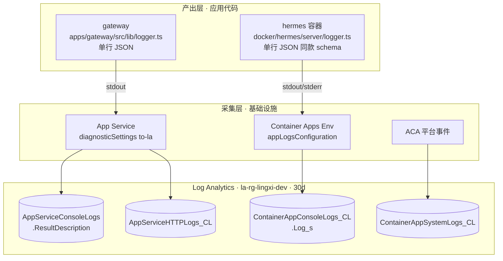
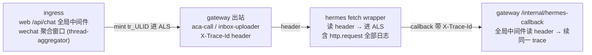

# 日志系统 / Logging

> 本文是日志体系的**权威参考**:架构、产出规范、事件字典、查询与排查手册。
> 面向两类读者 —— ① 协助排查的 LLM/开发者;② 想加新指标的人。
> 这是日志/可观测性的**唯一文档**(已并入并取代旧的 `docs/observability.md`)。

---

## 1. 一句话现状

所有 Azure 端日志(App Service 上的 **gateway** + 每用户 ACA 容器里的 **hermes**)统一进**同一个** Log Analytics workspace `la-rg-lingxi-dev`(资源组 `rg-lingxi-dev`,保留 30 天)。两侧应用层都吐**单行 JSON**,带 `event` 字段;Portal → Logs 用 KQL `parse_json(...)` 按字段切片。

两侧**格式已对齐**(同款 `{ts, level, event, user_id, trace_id, ...}` schema),但落在**不同的表**(Azure 资源类型决定,不可合并),跨层分析用 KQL `union` + 按 `user_id` / `trace_id` 关联。

每条日志还带一个**请求级 `trace_id`**:贯穿一次请求 gateway → ACA → 回调全链路,是串联前后事件、做因果分析的首选关联键(机制见 [§4.4](#44-trace_id请求级关联全链路串联),查询见 [§8.2.1](#821-按-trace_id-串一次请求的全链路首选关联键))。

---

## 2. 架构:两层模型

日志分**「应用层产出」**和**「基础设施层采集」**两段。



### 表映射速查

| 来源 | 表 | 业务字段在哪 |
|---|---|---|
| gateway stdout(我们的 JSON) | `AppServiceConsoleLogs` | `ResultDescription`(整行 JSON) |
| gateway HTTP 访问日志 | `AppServiceHTTPLogs_CL` | 原生列(CsHost/ScStatus/...) |
| hermes 容器 stdout/stderr(我们的 JSON) | `ContainerAppConsoleLogs_CL` | `Log_s`(整行 JSON),`Stream_s`=stdout/stderr,`ContainerAppName_s`=`hermes-<userId前8位>` |
| ACA 平台事件(probe 失败 / OOM / scaler / scale-from-zero) | `ContainerAppSystemLogs_CL` | `Reason_s` / `Log_s` / `ContainerAppName_s` |

> 注:`AppServiceConsoleLogs` 是原生表(无 `_CL`);容器侧是自定义日志表(`_CL`)。

---

## 3. 设计背景与哲学

为什么是现在这套,而不是引第三方 logger / App Insights:

- **单行 JSON 是刻意的**。App Service 把每行 stdout 原样塞进 `ResultDescription`,CAE 把容器每行塞进 `Log_s`。只要每条日志是**一行合法 JSON**,KQL `parse_json` 就能按字段切片——无需建表、无需 DCR、无需 schema 迁移。多参 `console.log('msg', obj)` 拼接会让 KQL 解析变成噩梦,**禁止**。
- **不引第三方 logger 是刻意的**(gateway / hermes 一致)。体积 + 全局副作用不值,各自 ~35 行的 `logger.ts` 够用。容器内 Bun 直跑 `.ts`,镜像构建 `.dockerignore` 排除 `node_modules`,所以**不能**走 `packages/shared` 复用——hermes 的 `logger.ts` 是 gateway 那份的**同款副本**,不是共享包。
- **两张表无法合并**:gateway 在 App Service、hermes 在 Container Apps,是两种 Azure 资源,各自的诊断管线落各自的表。所以「对齐」指的是**字段 schema 对齐**(同样的 `event` / `user_id` / 数值字段命名),不是进同一张表。跨表用 `union`。
- **`user_id` 是跨层关联的核心**。hermes 容器是**每用户独占**,容器名只编码 userId 前 8 位(`hermes-<prefix>`),但日志里记的是 gateway 注入的**完整** `USER_ID`,跟 gateway 侧完整 `user_id` 一致。这让两侧日志可以直接 `union ... summarize by user_id`,不必再用 `substring(user_id, 0, 8)` 去桥接容器名。

---

## 4. 产出层:怎么打日志

### 4.1 Gateway

`apps/gateway/src/lib/logger.ts`:

```ts
import { log } from './lib/logger.js';

log.info({ event: 'my.event', user_id, thread_id, ms: 123 });
log.warn({ event: 'my.event.degraded', user_id, reason: 'xxx' });
log.error({ event: 'my.event.failed', user_id, err: e instanceof Error ? e.message : String(e) });
```

输出:`{"ts":"<ISO>","level":"info","event":"my.event","user_id":"...","thread_id":"...","ms":123}`
`error`→`console.error`、`warn`→`console.warn`、其余→`console.log`。

### 4.2 Hermes(ACA 容器)

`docker/hermes/server/logger.ts`,**同款 API**,差别只有一处:`user_id` **自动注入**(读 `config.USER_ID`,容器即单用户),所以调用点**不必**手传 `user_id`:

```ts
import { log } from './logger.ts';

log.info({ event: 'session.delete', session: sessionName, hermes_session_id: uuid, status: 'ok' });
```

`USER_ID` 由 gateway provisioning 注入(`apps/gateway/src/provisioning/azure.ts` 的 `buildSpec`,env `{ name: 'USER_ID', value: userId }`)。dev / 未注入时为空,logger **省略** `user_id` 字段(本地跑 `bun test` 看到的日志行就没有该字段,属正常)。

### 4.3 字段约定(两侧通用,务必遵守)

- **`event`**:必填,层级化点分命名(`domain.action[.outcome]`),snake_case 域 + 动词。
- **`user_id`**:opaque id(gateway 手传 / hermes 自动注入)。**绝不打 PII**(邮箱 / 微信昵称等明文)。
- **数值用 number**,不要塞字符串(`ms: 123` 不是 `ms: "123"`),否则 KQL 要 `tolong()` 转。时延字段统一 `*_ms` 后缀。
- **错误**:`err` 存 message 字符串(`e instanceof Error ? e.message : String(e)`)。
- **状态**:多结局的事件用 `status`(如 `ok` / `timeout` / `error` / `http_<code>`)区分,而非拆成多个 event 名。
- **单行**:绝不换行、绝不多参拼接。
- **`trace_id`**:请求级关联 id,**自动注入**(见 §4.4),不手传。串一次请求全链路用。

### 4.4 trace_id:请求级关联(全链路串联)

`trace_id` 贯穿**一次请求**从 gateway 入口 → ACA 容器 → 回调的整条链路,让你用一条查询把分散在两张表里的相关事件串起来做前后/因果分析。它是**纯观测**字段,跟功能性的 `loop_id` 正交(`loop_id` 只在 chat loop 上、用于 callback rendezvous;`trace_id` 覆盖**所有**请求,含 slash 拦截 / session 删除 / history / inbox 这些无 loop 的)。两者都在时,日志同时带。

**隐式透传(AsyncLocalStorage)**:两侧 `logger.ts` 的 `emit()` 自动从 `AsyncLocalStorage`(`lib/trace-context.ts` / `server/trace-context.ts`)读 `trace_id` 并入每行 —— **所有现有 + 未来日志自动带,无需手传**。显式 `fields.trace_id` 可覆盖 ambient。

**跨进程透传(`X-Trace-Id` header,双向)**:



- **mint**:gateway 全局中间件给每个入站 HTTP 请求 `trace_id = X-Trace-Id ?? genId.trace`(ULID,前缀 `tr_`)。**wechat 非 HTTP**:在**聚合窗口建立时**(`thread-aggregator.ts` 建 slot)mint **一个 burst trace**,`flush` 用 `runWithTrace(slot.traceId)` 包住 onFlush + uploadChain → 一次对话(N 条拆分 push)合成的**图片上传 + 派发 + 容器 + 回调全归同一个 trace**;`/new args` 直派不经聚合,`dispatchMerged` 兜底现起一个(有 ambient 则复用)。
- **gateway → 容器**:`aca-call.ts`(`/chat`、`DELETE /session`)、`inbox-uploader.ts`(`/inbox/image`)出站时把当前 `trace_id` 写 `X-Trace-Id` header。
- **容器内**:`server/index.ts` 的 `Bun.serve` fetch wrapper 读 header(缺则 `newTraceId()` 兜底)`runWithTrace` 包住整个请求 → 连 `http.request` 访问日志都带;fire-and-forget 的 async chat、心跳 `setInterval`、callback 都在同一 ALS 链里继承。
- **容器 → gateway**:`chat.ts postCallback` 回调时回写 `X-Trace-Id`,gateway 全局中间件读 header **续上同一个** `trace_id` → 闭环,回调侧日志(`hermes.callback.result` 等)归到原 trace。

> 注:① warm-cache 的 `/health` 保活 ping **不带** trace(基础设施保活,非对话链路;hermes health 端点也不打日志)。② wechat 的 `wechat.inbound.arrived` 在聚合窗口建立**之前**(thread 尚未解析)就打,故**不带** burst trace —— 它是「各条 push 到达间隔」的计时探针,按 `message_id`/`thread_id` 关联即可;真正进容器的那一程(上传/派发/回调)才在 burst trace 里。

## 5. 事件字典

> 下表「关键字段」只列各事件**特有**字段。**所有**行还通用带:`ts`、`level`、`event`,以及请求上下文里的 `trace_id`(§4.4)、`user_id`(gateway 手传 / hermes 自动)。查询时这些字段随时可用。

### 5.1 Gateway(`AppServiceConsoleLogs`)

| event | level | 关键字段 | 触发点 |
|---|---|---|---|
| `aca.chat.dispatch` | info/error | `user_id` `thread_id` `source` `status`(`202`/`http_<code>`/`0`) `err?` | `lib/aca-call.ts` 异步派发 `/chat`,只等 202 ack |
| `aca.session.delete` | info/warn/error | `user_id` `thread_id` `source` `status`(`ok`/`http_<code>`/`error`) `deleted` `hermes_session_id?` | `lib/aca-call.ts` 调容器 `DELETE /session` |
| `aca.wake` | info | `user_id` `wake_ms` `cold`(`wake_ms > 阈值`) | `lib/container-warm-cache.ts` 主动唤醒容器 |
| `aca.keepwarm` | info/warn | `user_id` `status` `err?` | `lib/container-warm-cache.ts` 保温 `/health` |
| `aca.reconcile.failed` | warn | `user_id` `err` | `provisioning/reconcile.ts` 后台 reconcile 失败 |
| `aca.reconcile.sweep.start` / `.done` | info | `count` | 部署后全量拉齐 stale 容器 |
| `hermes.callback.result` | info | `loop_id` `thread_id` `user_id` `completion` `reply_chars` | `api/internal-callback.ts` 收到容器结果回调 |
| `callback.usage.record.failed` | warn | `user_id` `loop_id` `err` | 回调里记账失败 |
| `callback.wechat.reply.failed` | warn | `thread_id` `err` | 回调后回微信失败 |
| `chat.slash.intercepted` | info | `user_id` `thread_id` ... | `api/chat.ts` web 端 slash 命令拦截 |
| `usage.balance.check.failed` | warn | `user_id` `err` | 余额检查失败 |
| `loop.deadline.fired` | warn | `loop_id` `thread_id` `user_id` `source?` | 响应超时,loop 被判超时收尾 |
| `email.inbound.received` / `email.inbound.drop` | info/warn | `id` `to_localpart` `from` / `reason` `phase?` | `api/email.ts` 入站邮件 |
| `thread.delete.container_failed` | warn | `user_id` `thread_id` | `api/threads.ts` 删 thread 时容器侧失败(留孤儿) |
| `thread.serial.task.error` | warn | `thread_id` `err` | `lib/thread-serializer.ts` 串行车道任务异常 |
| `pricing.loaded` / `pricing.load.failed` / `pricing.miss` | info/warn | `count` / `err` / `provider` `model` | `lib/pricing.ts` 计价表 |
| `wechat.inbound.arrived` | info | `thread_id` `from_user_id` `message_id` `has_image` ... | `wechat-ilink/inbound-handler.ts` 入站微信消息 |
| `wechat.slash.new` / `wechat.slash.intercepted` | info | `user_id` `new_thread_id`/`cmd` `log_tag` | 微信 slash 命令 |
| `wechat.quota.check.failed` / `wechat.image.wake.failed` / `wechat.image.fetch.failed` | warn | `user_id` `err` | 微信配额 / 图片唤醒 / 拉取失败 |
| `wechat.image.upload.ok` / `wechat.image.upload.failed` | info/warn | `user_id` `size`/`status` `upload_ms`/`err` | `wechat-ilink/inbox-uploader.ts` 推图到容器 |
| `thread.agg.upload.error` | warn | `thread_id` `err` | `wechat-ilink/thread-aggregator.ts` 聚合上传失败 |

### 5.2 Hermes(`ContainerAppConsoleLogs_CL`,均自带 `user_id`)

| event | level | 关键字段 | 触发点 |
|---|---|---|---|
| `http.request` | info | `method` `path` `status` `dur_ms` | `server/index.ts` 每个非 `/health` 请求的访问日志 |
| `http.handler.error` | error | `err` | handler 末端兜底异常 |
| `http.connection.error` | error | `err` | 连接层异常(parse/abort) |
| `server.listening` | info | `host` `port` `hermes_timeout_s` | 启动 |
| `server.shutdown` | info | `signal` | 收到 SIGTERM/SIGINT |
| `session.map` / `session.map.miss` | info/warn | `session` `hermes_session_id?` `source` | `server/chat.ts` 首次请求建立 gateway_name↔hermes_uuid 映射(miss=没解析出 id) |
| `session.delete` | info/error | `session` `hermes_session_id?` `status`(`ok`/`timeout`/`error`) `exit_code?` `stderr?` `err?` | `server/http.ts` `DELETE /session` |
| `callback.ok` / `callback.failed` / `callback.skipped` | info/error/warn | `type`(`result`/`heartbeat`) `loop_id` `err?` `reason?` | `server/chat.ts` 回调 gateway |
| `chat.async.unhandled` | error | `loop_id` `err` | 异步 chat 的 unhandled rejection 兜底 |
| `hermes.proc.timeout` | error | `timeout_ms` `pid` | `server/hermes-proc.ts` hermes 子进程硬超时被杀 |
| `session.list.failed` | error | `source` `err` | `hermes sessions list` 失败 |
| `prompt.read.failed` | error | `file` `err` | 读 dynamic system prompt 失败 |
| `history.load.failed` | error | `err` | `GET /history` 读 state.db 失败 |
| `statedb.open.failed` / `statedb.snapshot.open.failed` / `statedb.snapshot.failed` | error | `err` `hermes_session_id?` | `server/state-db.ts` SQLite 读失败(吞错返回 fallback) |
| `inbox.image.upload.failed` | error | `err` `bytes` | `server/inbox.ts` 微信图片 streaming 落盘失败 |

### 5.3 ACA 平台事件(`ContainerAppSystemLogs_CL`,非我们产出)

平台直接报:容器创建 / `Started container` / probe 失败 / OOMKilled / scale-from-zero(冷启动)。字段 `Reason_s`、`Log_s`、`ContainerAppName_s`。冷启动判断走这张表(不放业务路径里测,避免每次 chat 多一发 RTT)。

---

## 6. 采集层接线(基础设施)

改采集行为要动这两处 bicep:

- **App Service → Log Analytics**:`infra/bicep/main.bicep` 的 `appServiceDiag`(`Microsoft.Insights/diagnosticSettings`,name `to-la`),启用 `AppServiceConsoleLogs` / `AppServiceAppLogs` / `AppServiceHTTPLogs` / `AppServicePlatformLogs` 四类 + AllMetrics。
- **Container Apps Env → Log Analytics**:`main.bicep` 的 `cae`(`Microsoft.App/managedEnvironments`)的 `appLogsConfiguration.destination = 'log-analytics'`。**建 CAE 时就接好**,每用户 `hermes-*` 容器是 `provisioning/azure.ts` 运行时动态创建的,挂在同一 CAE 下**自动继承**这条线,无需逐个配。

> 应用层只要继续吐单行 JSON,**采集层零改动**——这是这套设计省事的核心。

---

## 7. 查询入口

### 7.1 Portal

Portal → Log Analytics workspace `la-rg-lingxi-dev` → Logs → 贴 KQL。

### 7.2 CLI

```bash
WID=$(az monitor log-analytics workspace show -g rg-lingxi-dev -n la-rg-lingxi-dev --query customerId -o tsv)

az monitor log-analytics query -w "$WID" --analytics-query '
AppServiceConsoleLogs
| where TimeGenerated > ago(10m)
| extend j = parse_json(ResultDescription)
| where j.event == "aca.chat.dispatch"
| project TimeGenerated, tostring(j.user_id), tostring(j.status)
'
```

---

## 8. 查询技巧

### 8.1 解析 JSON 的固定开头

```kusto
// gateway
AppServiceConsoleLogs | extend j = parse_json(ResultDescription)
// hermes
ContainerAppConsoleLogs_CL | extend j = parse_json(Log_s)
```

解析后字段是 dynamic,**比较 / 聚合前显式转型**:`tostring(j.event)`、`tolong(j.dur_ms)`、`todatetime(j.ts)`。

> 健壮性:非我们产出的行(平台噪声 / 第三方库直接 print)`parse_json` 会得到 null,`where isnotempty(j.event)` 可先过滤。

### 8.2 跨层 union(核心技巧)

把两张表归一成 `src + j` 再查,`user_id` 现在两侧都是完整值,直接关联:

```kusto
let gw = AppServiceConsoleLogs
  | extend j = parse_json(ResultDescription) | extend src = "gateway";
let hm = ContainerAppConsoleLogs_CL
  | extend j = parse_json(Log_s) | extend src = "hermes";
union gw, hm
| where TimeGenerated > ago(1h) and isnotempty(j.event)
| where tostring(j.user_id) == "u_xxx"
| project TimeGenerated, src, event = tostring(j.event), level = tostring(j.level), j
| order by TimeGenerated asc
```

### 8.2.1 按 trace_id 串一次请求的全链路(首选关联键)

`trace_id` 是跨 gateway / hermes、跨 dispatch / callback 的**唯一稳定关联键**。先用任一已知条件(用户、thread、报错时间)捞到一条带 `trace_id` 的行,再用它把整条链路拉齐:

```kusto
let gw = AppServiceConsoleLogs
  | extend j = parse_json(ResultDescription) | extend src = "gateway";
let hm = ContainerAppConsoleLogs_CL
  | extend j = parse_json(Log_s) | extend src = "hermes";
union gw, hm
| where TimeGenerated > ago(2h) and isnotempty(j.event)
| where tostring(j.trace_id) == "tr_XXXX"
| project TimeGenerated, src, event = tostring(j.event), level = tostring(j.level),
          status = tostring(j.status), dur_ms = tolong(j.dur_ms), j
| order by TimeGenerated asc
```

典型成功链(单 trace):(gateway)`aca.chat.dispatch` status=202 →(hermes)`http.request` POST /chat 202 →(hermes)`session.map` →(hermes)`callback.ok` type=result →(gateway)`hermes.callback.result`。某一环缺失或 level=error 即断点。

> 从「报错」反查全链路:先 `where j.level=="error"` 找到出错行的 `j.trace_id`,再用上面的查询把这条请求**出错前后**的所有事件拉出来做因果分析 —— 这正是 trace_id 的核心用途。

### 8.3 容器名 ↔ 用户

`ContainerAppName_s` = `hermes-<userId前8位>`。要从平台表(无 `user_id`)对到用户,用前缀;但**业务日志直接用 `j.user_id`** 即可,不必走前缀。

---

## 9. 排查手册(场景 → 查询)

### 9.1 某用户最近的失败(全链路)

```kusto
let gw = AppServiceConsoleLogs | extend j = parse_json(ResultDescription) | extend src="gateway";
let hm = ContainerAppConsoleLogs_CL | extend j = parse_json(Log_s) | extend src="hermes";
union gw, hm
| where TimeGenerated > ago(6h)
| where tostring(j.user_id) == "u_xxx"
| where tostring(j.level) in ("warn","error")
| project TimeGenerated, src, event=tostring(j.event), j
| order by TimeGenerated desc
```

### 9.2 一条消息的端到端轨迹(按 thread / loop 串)

```kusto
let gw = AppServiceConsoleLogs | extend j = parse_json(ResultDescription) | extend src="gateway";
let hm = ContainerAppConsoleLogs_CL | extend j = parse_json(Log_s) | extend src="hermes";
union gw, hm
| where TimeGenerated > ago(2h)
| where tostring(j.thread_id) == "t_xxx" or tostring(j.loop_id) == "loop_xxx"
| project TimeGenerated, src, event=tostring(j.event), status=tostring(j.status), j
| order by TimeGenerated asc
```

典型成功序列:`aca.wake` →(gateway)`aca.chat.dispatch` status=202 →(hermes)`http.request` POST /chat 202 →(hermes)`callback.ok` type=result →(gateway)`hermes.callback.result`。
缺哪一环就是断点:无 `aca.chat.dispatch`=没派发;有 dispatch 无 hermes `http.request`=容器没收到(冷启/网络);有 hermes 跑但无 `callback.ok`=回调失败,查 `callback.failed`。

### 9.3 端到端时延(无单一字段,需关联)

> ⚠️ 当前架构是**异步派发 + 回调**,`aca.chat.dispatch` 只记 202 ack,**没有**端到端 `chat_ms` 字段(旧文档曾埋的 `aca.chat.call`/`chat_ms` 已废弃)。端到端 = `aca.chat.dispatch` 到对应 `hermes.callback.result` 的时间差,按 `thread_id` 关联:

```kusto
let disp = AppServiceConsoleLogs | extend j=parse_json(ResultDescription)
  | where j.event == "aca.chat.dispatch" and tostring(j.status) == "202"
  | project t0 = TimeGenerated, thread_id = tostring(j.thread_id), user_id = tostring(j.user_id);
let done = AppServiceConsoleLogs | extend j=parse_json(ResultDescription)
  | where j.event == "hermes.callback.result"
  | project t1 = TimeGenerated, thread_id = tostring(j.thread_id);
disp
| join kind=inner (done) on thread_id
| where t1 between (t0 .. t0 + 10m)         // 防跨轮误配
| extend e2e_ms = datetime_diff('millisecond', t1, t0)
| summarize p50=percentile(e2e_ms,50), p95=percentile(e2e_ms,95), n=count()
```

> 单环时延可直接用 hermes `http.request.dur_ms`(注意:异步 chat 的 `/chat` 只统计到 202 ack;真正的 AI 计算时长目前不是单一字段)。这是已知观测缺口,需要时在 `callback.result` 加一个容器侧 `compute_ms` 即可补齐。

### 9.4 调用成功率(按 status)

```kusto
AppServiceConsoleLogs
| where TimeGenerated > ago(24h)
| extend j = parse_json(ResultDescription)
| where j.event == "aca.chat.dispatch"
| summarize n = count() by status = tostring(j.status)
```

### 9.5 冷启动命中率(平台表 join 业务日志)

```kusto
let chats = AppServiceConsoleLogs
  | where TimeGenerated > ago(24h)
  | extend j = parse_json(ResultDescription)
  | where j.event == "aca.chat.dispatch"
  | extend user_id = tostring(j.user_id),
           container_app = strcat("hermes-", substring(tostring(j.user_id), 0, 8));
let starts = ContainerAppSystemLogs_CL
  | where TimeGenerated > ago(24h)
  | where Reason_s has "ScalingReplicaSet" or Log_s has "Started container"
  | project start_ts = TimeGenerated, container_app = ContainerAppName_s;
chats
| join kind=leftouter (starts) on container_app
| extend cold = isnotnull(start_ts) and start_ts between (TimeGenerated - 10s .. TimeGenerated)
| summarize cold = countif(cold), warm = countif(not(cold)), total = count()
```

> 也可直接用 gateway 的 `aca.wake` 事件:`j.cold == true` 即判定冷启,比 join 平台表简单。

### 9.6 容器重启 / OOM / scaler

```kusto
ContainerAppSystemLogs_CL
| where TimeGenerated > ago(6h)
| project TimeGenerated, ContainerAppName_s, Reason_s, Log_s
| order by TimeGenerated desc
```

### 9.7 hermes 子进程超时（wedge 排查）

```kusto
ContainerAppConsoleLogs_CL
| where TimeGenerated > ago(24h)
| extend j = parse_json(Log_s)
| where j.event == "hermes.proc.timeout"
| project TimeGenerated, user_id = tostring(j.user_id), timeout_ms = tolong(j.timeout_ms)
```

### 9.8 回调链失败(用户「发了没回」)

```kusto
ContainerAppConsoleLogs_CL
| where TimeGenerated > ago(6h)
| extend j = parse_json(Log_s)
| where j.event in ("callback.failed","callback.skipped","chat.async.unhandled")
| project TimeGenerated, user_id=tostring(j.user_id), event=tostring(j.event),
          type=tostring(j.type), loop_id=tostring(j.loop_id), err=tostring(j.err)
```

### 9.9 reconcile 风暴(部署后)

部署改了 spec(如本次加 `USER_ID`)会让所有用户 `policy_hash` 变化,触发一次性全量 reconcile:

```kusto
AppServiceConsoleLogs
| where TimeGenerated > ago(1h)
| extend j = parse_json(ResultDescription)
| where j.event startswith "aca.reconcile"
| project TimeGenerated, event=tostring(j.event), count_=tolong(j.count),
          user_id=tostring(j.user_id), err=tostring(j.err)
| order by TimeGenerated asc
```

---

## 10. 想加新指标怎么办

1. 直接 `log.info({ event: 'domain.action', ... })`,字段名 snake_case,数值用 number,时延 `*_ms`。
2. **不需要**建表 / DCR;落到通用 `ResultDescription`(gateway)/ `Log_s`(hermes),KQL `parse_json` 取字段。
3. gateway 手传 `user_id`;hermes 自动带,无需传。
4. **不打 PII**,用 opaque id。
5. 多结局事件用 `status` 字段区分,别拆 event 名(方便 `summarize by status`)。
6. 端到端 / 单环时长这类**当前缺口**,在产出点埋一个 `*_ms` 数值字段即可(如容器侧给 `callback.result` 加 `compute_ms`)。

---

## 11. dev 体验

本地两侧都把 JSON 打到 stdout(终端 / `bun test` 输出)。dev 下 hermes 的 `USER_ID` 未注入 → 日志行省略 `user_id`,属正常。格式与线上完全一致,可在本地先验证字段。

---

## 12. 不在本仓 / 未来

- **Application Insights**(分布式 trace / Application Map):没开。当 `event=` 切片不够用、需要跨服务 span 关联时再加。
- **Metric Alert / 通知**:没配。
- **端到端 `compute_ms`**:见 §9.3,已知观测缺口,需要时在容器侧 callback 补一个数值字段。
