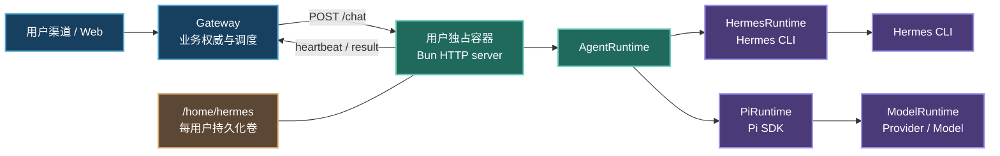
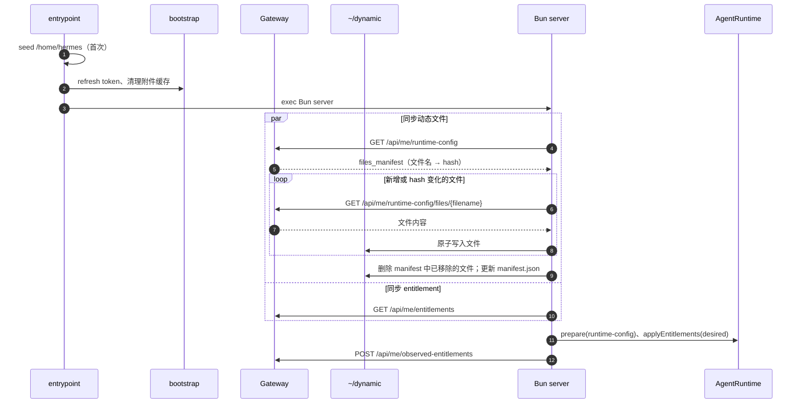
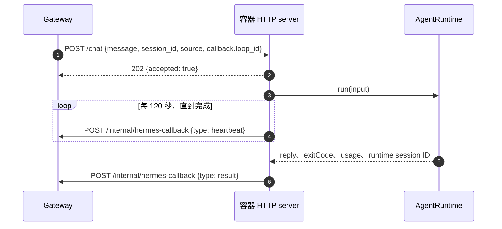
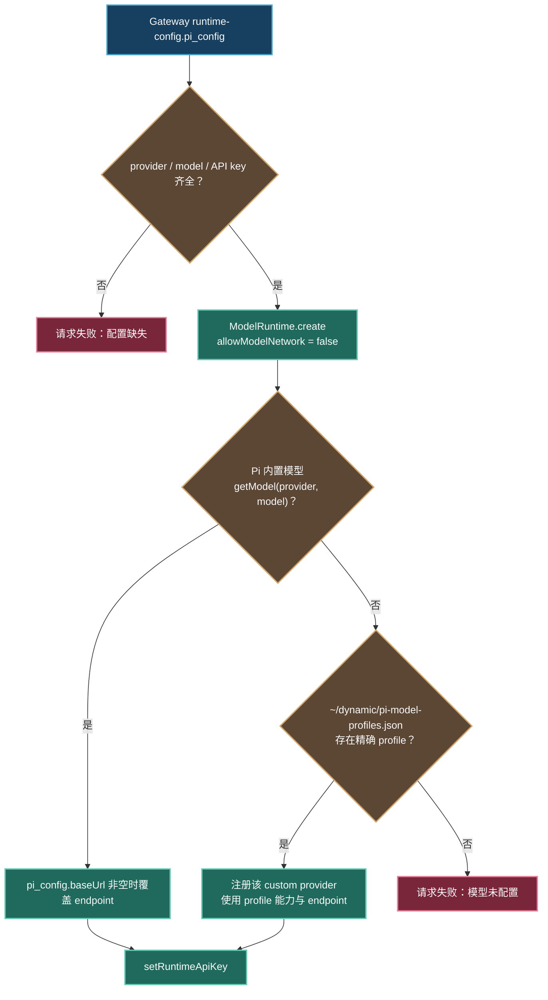
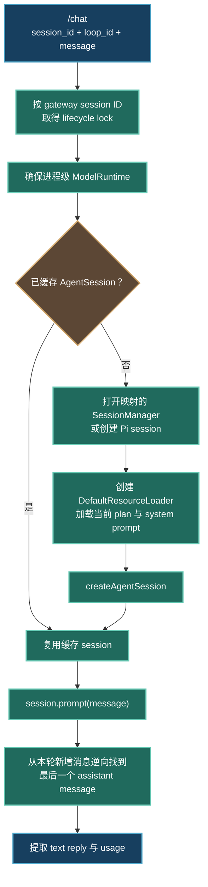

# Pi Agent 架构

> 本文描述灵犀容器中 **当前生效** 的 Pi Agent 集成。实现入口在 `docker/`；Gateway 是业务状态与调度的权威，Pi SDK 只负责容器内的 agent runtime。

## 边界与职责

Gateway 保存 thread、消息、agent loop、用量、鉴权、配额、渠道收发、Container App provisioning 与 Web history。每个用户对应一个独立容器及其 `/home/hermes` 持久化目录；容器不拥有这些业务状态。



容器 HTTP 层仅依赖以下 runtime 合约，不能引用 Hermes 或 Pi 的私有实现：

```ts
interface AgentRuntime {
  prepare(): Promise<void>;
  applyEntitlements(desired: string[]): Promise<string[]>;
  run(input: AgentRunInput): Promise<AgentRunResult>;
  deleteSession(sessionId: string): Promise<AgentDeleteSessionResult>;
  abort(loopId: string): Promise<void>;
}
```

`LINGXI_AGENT_RUNTIME` 决定具体实现：

|值|行为|
|---|---|
|未设置或 `hermes`|创建 `HermesRuntime`（默认）|
|`pi`|创建 `PiRuntime`|
|其他值|启动时抛错，拒绝隐式回退|

## 镜像与文件系统

`docker/Dockerfile` 构建单一生产镜像。业务源码只有 `/app` 一份；Pi SDK 及固定 Pi packages 在构建期安装到只读 vendor tree，`/app/node_modules` 只是一条符号链接。

```text
/app/                              # boot、runtime、hermes、pi、skills；运行期只读
/opt/lingxi-pi/node_modules/       # 构建期 bun install 的固定依赖
/opt/hermes-agent/                 # Hermes CLI 与其依赖；镜像只读
/home/hermes/                      # 每用户持久化卷
├── .hermes/                       # Hermes 配置、session、memory、token 等
├── .pi/                           # Pi SDK 管理的 agent state
├── dynamic/                       # Gateway 下发的动态文件
│   ├── manifest.json              # filename → content hash
│   ├── system-prompt.md
│   └── pi-model-profiles.json
├── inbox/{images,files}/          # 渠道附件缓存
└── pi-workspace/                  # Pi 固定 project cwd，权限 0700
```

生产启动期不执行 `npm install`、`bun install`、`pi install`，也不从 registry 下载 package。`pi-web-access`、`pi-subagents`、Pi SDK 与 first-party `@lingxi/pi-hermes-memory` 都在镜像构建期确定。

首次启动时 entrypoint 从 `/home/hermes-seed` 补齐 home 骨架，随后执行 bootstrap，最后 `exec` Bun HTTP server。bootstrap 与 server 是两个独立进程；不共享任何 Pi 内存状态。

## 容器启动与动态配置



`RuntimeConfig` 一次返回 `files_manifest` 与 `pi_config`。容器仅按 hash 同步动态文件，并删除 Gateway manifest 中已不存在的本地文件；旧目录 `~/dynamic_prompts` 会在同步时移除。`pi_config` 直接携带 Pi 的 provider、model、base URL 与 API key，在启动时传给 `PiRuntime`，不写入磁盘或 Pi settings。

当前使用的动态文件：

|文件|消费者|用途|
|---|---|---|
|`system-prompt.md`|Hermes、Pi|受管 system prompt|
|`pi-model-profiles.json`|Pi|非 Pi 内置模型的 provider/model profile|

`LAIFU_USER_TOKEN` 优先从环境变量读取，缺失时读取 `~/.hermes/.laifu_user_token`；bootstrap 会在 token 剩余不足七天时调用 Gateway 刷新并以 `0600` 写回。Pi 配置由 Gateway 的 `piAgentConfig` 通过 runtime-config 明文下发；当前以修改与部署便利为先，不走 ACA 环境变量或 secret。

## HTTP、回调与附件

容器服务在 `0.0.0.0:$PORT`（默认 `8080`）监听。

|方法与路径|作用|
|---|---|
|`GET /health`|返回 `{"status":"ok"}`；仅用于健康探针，不校验 Bearer token|
|`POST /chat`|校验请求并立即返回 `202`；后台运行 agent|
|`DELETE /session?session_id=`|删除对应 runtime session|
|`POST /inbox/image`|流式写入 `~/inbox/images`|
|`POST /inbox/file`|流式写入 `~/inbox/files`|
|`POST /internal/resync-entitlements`|在进程内重新应用 entitlement，返回 observed 集合|

除 `/health` 外，`GATEWAY_SECRET` 已配置时均要求 HS256 Bearer JWT：签名必须有效、未过期，且 `user_id` 必须匹配该单租户容器的 token。开发环境未配置该 secret 时不强制校验。



回调路径名称仍是 `/internal/hermes-callback`，无论实际 runtime 是 Hermes 或 Pi。回调携带 trace ID 并最多尝试三次。所有容器日志是 JSON 行，自动带 `user_id` 和请求级 `trace_id`。

附件端点以流方式写入 `.partial` 临时文件，完成后 rename；失败时清理临时文件。文件名会去除路径与控制字符，上传量受 Gateway 的 `X-Max-Bytes` 限制（缺失时上限 10 MiB）。缓存默认保留七天，并清理超过五分钟的孤儿 `.partial`。Pi 当前仅调用 `session.prompt(message)`，不会读取附件 bytes 或构造 native multimodal content。

## Pi Runtime

### 模型解析

Pi runtime 在第一次 `/chat` 时懒创建并缓存 `ModelRuntime`；`prepare()` 与 entitlement 同步不要求模型配置有效。



Pi 运行配置由 `GET /api/me/runtime-config` 的 `pi_config` 提供：

```text
provider        Pi provider ID
model           Pi model ID
apiKey          运行期密钥
baseUrl         可选 endpoint 覆盖
timeoutSeconds  运行超时秒数，默认 14,400
```

内置模型优先使用 Pi 自带的 provider/model 能力定义。只有内置模型未命中时，才从动态 profile 文件精确匹配 provider 与 model，并注册该 custom provider；`pi_config.baseUrl` 非空时覆盖 profile 的默认 endpoint。两者都未命中时明确失败，不猜测模型能力。

### 会话创建与执行

Pi 的模型 runtime 是进程级惰性单例；`AgentSession` 则按 Gateway session ID 缓存在 `PiRuntime.sessions`。首次 chat 才会完成模型解析、资源加载和 session 创建。模型初始化失败会清除缓存的初始化 promise，因此修正环境变量或动态 profile 后，下一次请求可以重新初始化。



执行语义：

- 同一 Gateway session 的 `run`、删除和 resource-plan 失效操作都经过同一个 lifecycle lock；不同 Gateway session 可并行。
- `activeRuns` 以 Gateway `loop_id` 索引正在执行的 `AgentSession`。`abort(loopId)` 直接调用该 session 的 `abort()`；Pi timeout 到期时也走同一路径。
- `timeoutSeconds` 按秒解析；超时会将当前运行标记为失败，并返回 `pi timeout`。
- 调用 `session.prompt()` 前记录消息数组长度；只在本轮新增消息中寻找最后一条 assistant message，避免 extension command 后误把旧回复作为本轮结果。
- reply 仅拼接 assistant content 中的 `text` part。无 assistant message、error、aborted 或空 text 都返回失败结果；usage 从该 assistant message 的 input/output/cache/reasoning 计数提取。

`SettingsManager` 由 workspace 与 `getAgentDir()` 创建，带 `projectTrusted: true`，并在 Pi runtime 进程内复用。业务代码不直接编辑 Pi settings，也不直接构造 Pi JSONL。

### Dynamic model profile 格式

`pi-model-profiles.json` 仅用于 Pi 内置 registry 中不存在的模型。它包含 revision 和 provider 列表；每个 provider 使用 provider ID 精确匹配，每个 model 使用 model ID 精确匹配。

|层级|必要字段|含义|
|---|---|---|
|根对象|`revision`、`providers`|Gateway 下发的 profile 版本与 provider 集合|
|provider|`provider`、`name`、`defaultBaseUrl`、`api`、`authHeader`、`models`|API 协议与默认 endpoint；`api` 可为 OpenAI Completions、OpenAI Responses 或 Anthropic Messages|
|model|`model`、`name`、`reasoning`、`input`、`cost`、`contextWindow`、`maxTokens`|Pi 运行时需要的模型能力与 token 限制；`cost.tiers` 可定义按输入 token 阈值切换的整次请求价格。|

可选 `thinkingLevelMap` 将 Pi 的 thinking level 映射为 provider 的 effort 值；`compat` 描述 provider 协议兼容性，包括 developer role、reasoning effort、store、OpenAI grammar tools 与 Qwen thinking format。`pi_config.baseUrl` 非空时优先覆盖 profile 的 `defaultBaseUrl`；`pi_config.apiKey` 在 provider 完成解析后通过 `setRuntimeApiKey()` 注入，不写入动态文件或 Pi settings。

### 资源与 entitlement

`resolveRuntimeResources()` 直接构造进程内 `RuntimeResourcePlan`，不会修改 Pi settings，也不会调用 package 安装命令。

|资源|启用条件|加载方式|
|---|---|---|
|`@lingxi/pi-hermes-memory`|始终|`DefaultResourceLoader.additionalExtensionPaths`|
|`pi-web-access`|始终|`additionalExtensionPaths`|
|`pi-subagents`|始终|`additionalExtensionPaths`|
|`/app/skills/email`|desired 包含 `email`|`additionalSkillPaths`|
|`/app/skills/cloud`|desired 包含 `cloud`|`additionalSkillPaths`|
|`~/.hermes/skills`|目录存在|额外 skill root|

资源路径都必须在镜像或用户 home 中实际存在，解析时会校验可访问性。`applyEntitlements()` 比较新旧 resource plan：若变更，则 abort 正在运行的 Pi session、dispose 缓存 session；下次 chat 从持久化 Pi session 重建，并使用新资源集。返回并上报的 observed entitlement 仅包含实际启用的 `email` 与 `cloud`。

每个 Pi session 创建单独的 `DefaultResourceLoader`，并将当前的 `system-prompt.md` 以 `appendSystemPrompt` 追加。动态 prompt 或 profile 在下一次容器启动后的新 Pi session 创建时生效。

### Session 与状态

Pi 的 agent state、settings 与 JSONL session 由 Pi SDK 管理：

- agent directory 通过 `getAgentDir()` 获取；settings 只经 `SettingsManager` 创建和传递。
- workspace 固定为 `/home/hermes/pi-workspace`，首次创建模式为 `0700`。
- Gateway session ID 与 Pi session 的关联保存在 `dirname(getAgentDir())/lingxi-session-map.json`。映射记录 Pi session ID 与 session 文件路径，以原子 rename、目录 `0700`、文件 `0600` 保存。
- 新会话经 `SessionManager.create(workspace)` 建立；重启后按映射以 `SessionManager.open(path)` 恢复。映射失效时删除映射并创建新会话。
- `DELETE /session` 会 abort、dispose 缓存 session，物理删除该映射所指向的 Pi session 文件，并删除映射；不存在或已失效的映射返回 `deleted: false`。
- 同一 Gateway session 的 chat 与删除操作由 promise lifecycle lock 串行，避免并发读写同一 Pi session。

### Hermes memory 兼容扩展

`@lingxi/pi-hermes-memory` 是 Pi extension，复用现有 Hermes 用户记忆：

- session start 时读取 `$HERMES_HOME/SOUL.md`、`memories/USER.md`、`memories/MEMORY.md`，在 `before_agent_start` 注入冻结 snapshot。
- 提供 `memory` tool，对 `user` 和 `memory` 支持 `add`、`replace`、`remove`。
- USER 上限 1,375 字符，MEMORY 上限 2,200 字符；重复 add 不写入，replace/remove 要求唯一 `oldText` 匹配。
- 写入使用同目录临时文件 + rename，模式 `0600`；变更在下一 session 载入。

这是兼容既有用户 memory 的边界适配，不写 Pi settings，也不手写 Pi JSONL。

## Hermes Runtime

Hermes 仍是默认 runtime。`prepare()` partial-merge `~/.hermes/config.yaml`，只管理模型、provider、可选 base URL、可选辅助视觉模型以及非交互 display/terminal 配置，保留其他已有配置。

每次 chat：

1. 从 `~/.hermes/_gateway_session_map.json` 获取 Gateway session 到 Hermes UUID 的映射；存在时以 `--resume` 运行。
2. 读取 `~/dynamic/system-prompt.md` 并注入 `HERMES_EPHEMERAL_SYSTEM_PROMPT`。
3. 移除 `GATEWAY_SECRET` 后再创建 agent 子进程环境；将通用 `HERMES_API_KEY`、`HERMES_BASE_URL` 映射为 provider 实际读取的环境变量。
4. 以独立进程组运行 `hermes chat -Q --yolo`。超时或 abort 时终止整个进程组，避免遗留子进程。
5. 对 Hermes `state.db` 做只读快照差分，计算本轮 token usage；首次成功运行后记录 Hermes session UUID。

Hermes entitlement 使用符号链接将 `/opt/hermes-skills/{email,cloud}` 收敛到 `~/.hermes/skills/{email,cloud}`。Pi 不复用这套链接作为其 entitlement 状态，但会在该目录存在时把它作为附加 skill root。

## 当前运行约束

- Runtime 选择只由 `LINGXI_AGENT_RUNTIME` 控制；默认值是 `hermes`。
- Gateway 保持业务数据与调度权威；容器只执行 agent、持久化 runtime 私有状态并回调结果。
- 动态下发文件全部位于 `~/dynamic/`，由 `files_manifest` 的 hash 驱动同步。
- Pi package 与 extension 是镜像固定内容；运行期不安装或下载 package。
- Pi session 的模型能力来自 Pi 内置 registry 或动态 profile，未配置模型必须失败。
- Pi 只处理文本 prompt；图片和文件通过已有 inbox 文本路径契约供 runtime/skill 使用。
