# Hermes 托管平台 — 架构全图

## 一、产品定位

把 Hermes Agent 做成托管服务，让普通用户**零部署、零运维**，注册即用。
用户通过微信或网页与自己的专属 AI 助理对话，背后是独立隔离的 Hermes 实例。

### 用户视角流程

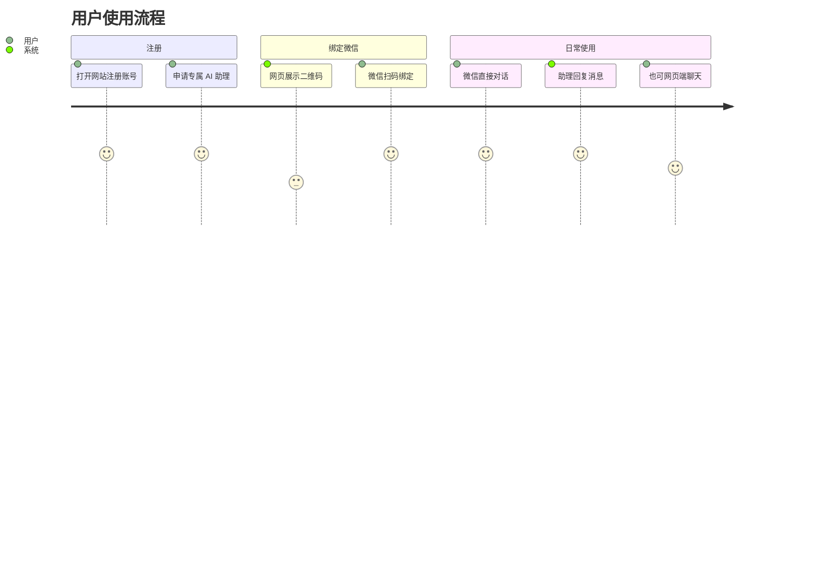

## 二、架构全图

```mermaid
flowchart LR
    WX(("👤<br/>微信")) -->|消息| GW
    BR(("🌐<br/>浏览器")) -->|HTTP| GW

    subgraph GW["🖥️ Gateway — Azure App Service"]
        direction TB
        POLL["iLink 会话管理器<br/>user_a · user_b · user_c polling ..."]
        ROUTES["网站后端 API<br/>/api/auth · /api/wechat · /api/chat"]
    end

    GW -->|"POST /chat"| CAE

    subgraph CAE["☁️ Container Apps Environment"]
        direction TB
        CA_A["hermes-user-a 🟢"]
        CA_B["hermes-user-b 💤"]
        CA_C["hermes-user-c 💤"]
    end

    CAE <-->|"/home/hermes"| AF

    subgraph AF["💾 Azure Files"]
        direction TB
        AF_A["user_a/home/"]
        AF_B["user_b/home/"]
        AF_C["user_c/home/"]
    end

    style GW fill:#1b4332,color:#fff,stroke:#2d6a4f
    style CAE fill:#264653,color:#fff,stroke:#2a9d8f
    style AF fill:#264653,color:#fff,stroke:#2a9d8f
    style WX fill:#07553B,color:#fff,stroke:#07553B
    style BR fill:#07553B,color:#fff,stroke:#07553B
```

## 三、核心设计决策回顾

### 1. 多租户隔离：每用户一个 Container（而非多 Profile）

- **方案**：一个 Docker Image，每用户启动一个 Container
- **为什么不用 Hermes 多 Profile**：Hermes 是单用户工具，所有 profile 共享同一台机器的文件系统和终端环境。一个用户的 Agent 调用 terminal 工具时，理论上能访问其他用户的数据，无法做到租户隔离
- **好处**：Docker 天然隔离，Container 里只跑一个 default profile，简单干净
- **Docker 工作方式**：Image 只构建一次（模板），每用户启动一个 Container 共享同一个 Image 的只读层，只有用户自己的数据是独立的写入层。磁盘上 Hermes 代码只存一份，不会重复

### 2. 微信 Gateway：App Service 集中管理所有用户的 iLink 会话

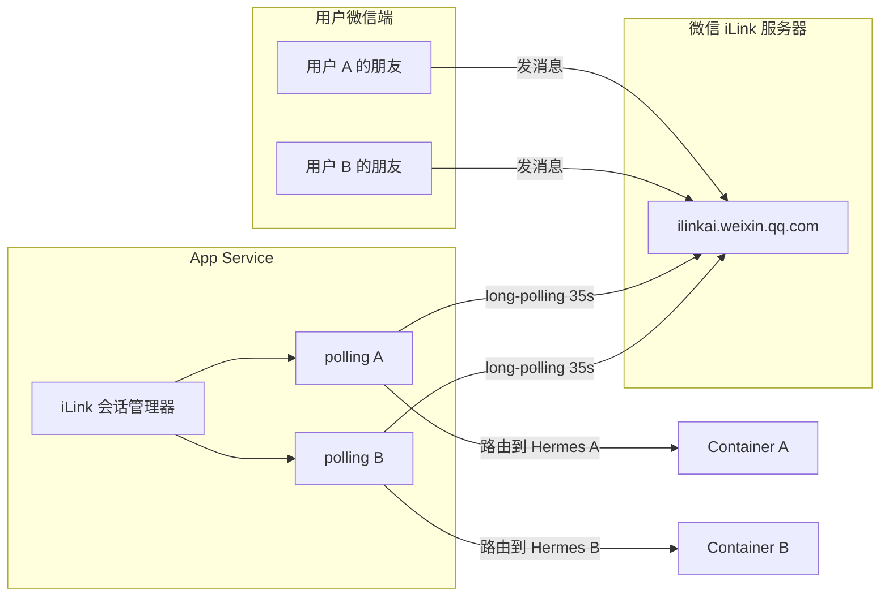

- **协议**：微信官方 ClawBot / iLink Bot API（2026-03 推出），合法接入，无封号风险
- **方案**：App Service 内为每个用户维护一个 iLink long-polling 协程，统一收发消息，按用户路由到对应 Container
- **iLink 核心机制**：HTTP/JSON 协议，通过 `https://ilinkai.weixin.qq.com` 通信，long-polling 收消息（服务端保持连接最长 35s），每条回复必须带上入站消息的 `context_token`
- **为什么不每用户各自跑 Gateway**：会导致所有 Container 必须常驻运行维持 polling 连接，无法缩容到 0，成本模型崩溃
- **为什么不用逆向协议（wechaty/itchat 等）**：微信已有官方 API，逆向方案有封号风险，且多实例更易触发微信风控
- **好处**：资源集中、Hermes Container 保持按需启停、便于管控（计费/风控/限流/审计）
- **限制**：iLink 目前只支持单聊（DM），不支持群聊

### 3. 计算层：Azure Container Apps

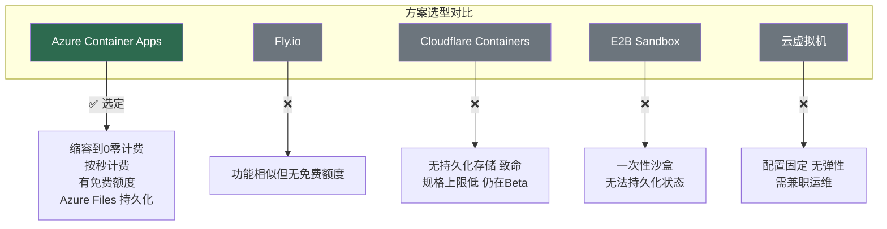

- **为什么选它**：缩容到 0 零计费、按秒计费、有免费额度（每月 180K vCPU-秒 + 360K GiB-秒 + 200 万次请求）、支持 Azure Files 持久化
- **缩容到 0 的计费确认**：微软官方文档明确写明 "When a revision is scaled to zero replicas, no resource consumption charges are incurred."——50 个 Container 全部 sleep 时计算费用 = $0
- **Environment 隐藏成本注意**：如果给 Container Apps Environment 配了 VNet 或 Private Endpoint，会产生约 €2/天的网络基础设施费用。**使用默认配置（不配 VNet）则无此费用**
- **对比 Fly.io**：功能相似，同为容器托管 + 按需扩缩。Azure 有免费额度且生态熟悉。小规模时 Azure 更便宜，规模大了差距缩小
- **对比 Cloudflare Containers**：CF 无持久化存储（致命，Hermes 的记忆/session/workspace 在容器 sleep 后会丢失）、最大规格仅 0.5vCPU + 4GiB、总并发上限低（40GiB 内存 / 40 vCPU）、仍在 Beta 阶段
- **对比 E2B**：E2B 是一次性执行沙盒，用完即毁，无法持久化 Hermes 状态。适合"跑段代码"场景，不适合需要长期积累记忆的 Agent
- **对比云虚拟机（VM）**：自己买服务器配置固定、无法弹性伸缩、需要兼职运维（操作系统、安全补丁、防火墙等），成本看似便宜但运维是隐性成本

### 4. Gateway 层：Azure App Service

- **运行时**：Node.js 24
- **为什么选它**：天然常驻、自带域名/SSL/部署/健康检查，就是为 Web 服务设计的
- **为什么不用 Container Apps**：Container Apps 设计初衷是弹性伸缩，Gateway 需要常驻运行维持微信 iLink long-polling 连接
- **为什么不用 VM**：省几块钱但要兼职运维（OS/补丁/防火墙/Nginx/SSL 证书续期等），不值得
- **为什么不用 Cloudflare Workers**：Workers 是无状态、请求驱动的，没有请求进来它就不存在，无法维持常驻的微信 long-polling 连接
- **必须开启 Always On**（B1 及以上支持），防止空闲时进程被回收导致 iLink polling 中断
- **推荐起步配置**：B1 档（1C 1.75GB，约 $13/月），可支撑几百个并发 polling

### 5. 存储层：Azure Files + 整个 home 目录挂载

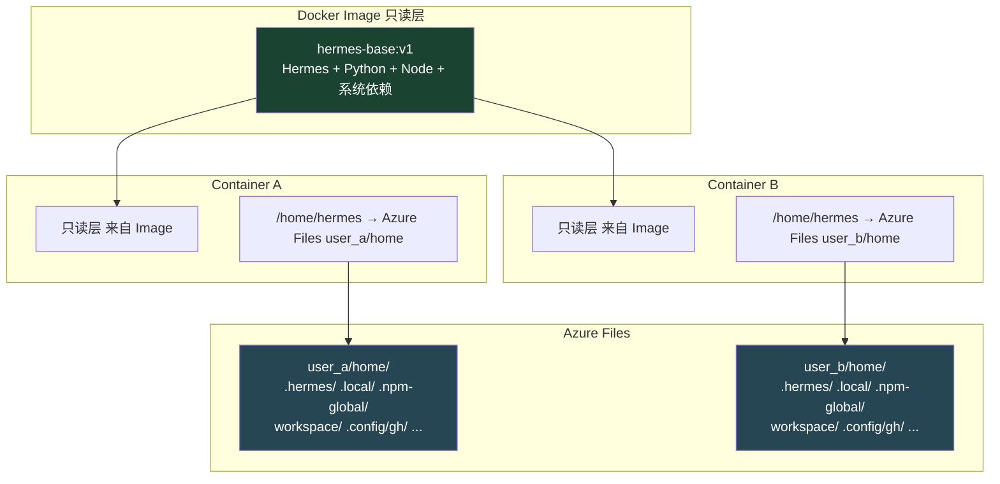

- **方案**：每用户一个 Azure Files volume，挂载到容器的 `/home/hermes`（整个 home 目录）
- **为什么挂整个 home 而非逐个子目录**：Agent 可能使用任意 CLI 工具（GitHub CLI → `~/.config/gh/`、Azure CLI → `~/.azure/`、SSH → `~/.ssh/` 等），各工具的认证和配置存储路径各不相同，逐个枚举挂不完。挂载整个 home 一劳永逸
- **成本**：Azure Files 约 $0.06/GB/月，Hermes 的配置和记忆文件很小，单用户通常几十到几百 MB
- **用户隔离**：每个 Container 挂自己的 volume，容器内看到的路径都是 `/home/hermes`，但背后对应的宿主机存储完全不同，天然隔离

### 6. 前端网站（待定）

- 候选：Azure Static Web Apps 或直接由 App Service 托管

## 四、App Service Gateway 细化设计

### 4.0 消息完整链路

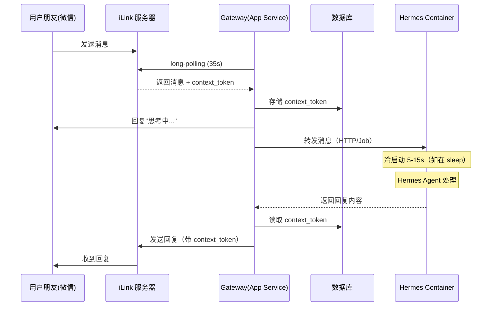

### 4.1 项目代码结构（Node.js 24）

```
gateway-service/
├── src/
│   ├── index.ts                   # 入口，启动 HTTP 服务 + iLink 会话管理器
│   ├── api/
│   │   ├── auth.ts                # 用户注册/登录
│   │   ├── wechat.ts              # 扫码绑定、解绑、重新登录
│   │   └── chat.ts                # 网页端聊天接口
│   ├── ilink/
│   │   ├── manager.ts             # 会话管理器：启动/停止/恢复全部用户的 polling
│   │   ├── poller.ts              # 单用户 long-polling 循环
│   │   ├── sender.ts              # 发消息（带 context_token + 限流队列）
│   │   └── token-store.ts         # bot_token / context_token 持久化
│   ├── hermes/
│   │   └── dispatcher.ts          # 调度层：将消息转发给 Hermes（方案 A/B 在此切换）
│   ├── db/
│   │   ├── schema.ts              # 数据库表结构定义
│   │   └── client.ts              # 数据库连接
│   └── config.ts                  # 环境变量、配置
├── package.json
├── tsconfig.json
└── Dockerfile
```

### 4.2 iLink 会话管理器

#### 启动与恢复

```
App Service 启动时：
  1. 从 DB 加载所有 status='active' 的用户
  2. 为每个用户启动一个 polling 异步任务
  3. 注册 SIGTERM handler 做 graceful shutdown

新用户绑定微信时：
  1. 调 iLink 接口生成登录二维码 → 返回给前端展示
  2. 轮询等待扫码确认 → 拿到 bot_token
  3. 存 DB（bot_token + 过期时间 + status='active'）
  4. 启动该用户的 polling 任务

bot_token 过期时（errcode -14）：
  1. 立即调 notifyStart 尝试恢复（绝不等 60 分钟）
  2. 恢复失败 → 标记 status='expired'
  3. 通知用户重新扫码
```

#### 单用户 polling

```
pollLoop(userId, botToken):
  retryCount = 0
  while true:
    try:
      resp = await fetch("https://ilinkai.weixin.qq.com/getupdates", {
        headers: { Authorization: `Bearer ${botToken}` },
        signal: AbortSignal.timeout(40_000)
      })
      retryCount = 0

      if resp.errcode === -14:
        await handleSessionExpired(userId)
        return

      for msg of resp.messages:
        await storeContextToken(userId, msg)
        await dispatchToHermes(userId, msg)    // ← 这里对接调度层

    catch (err):
      if err is TimeoutError:
        continue
      retryCount++
      delay = Math.min(2 ** retryCount * 1000, 30_000)
      await sleep(delay)
```

#### 发消息限流

```
每个用户维护一个发送队列，速率限制 1 条/秒
errcode -2（限流）→ 指数退避重试，最大间隔 30s
```

### 4.3 容量评估

以 App Service B1（1 vCPU, 1.75 GB RAM）为基准：

| 指标 | 评估 |
|------|------|
| 并发 polling 数 | Node.js 异步 I/O，单进程轻松撑几百个（绝大多数时间在等 35s 超时） |
| 每个 polling 内存 | 约几十 KB，100 个用户 ≈ 几 MB |
| CPU | 几乎为零（polling 是纯 I/O 等待） |
| 瓶颈 | 1000+ 用户时考虑升配到 B2/B3 或 S1 多实例 |

### 4.4 关键坑与应对

| 坑 | 应对 |
|---|---|
| App Service 重启 | 启动时从 DB 自动恢复所有 active 会话的 polling |
| bot_token 约 24h 过期 | 定时扫描 wechat_sessions 表，提前通知用户重新扫码 |
| errcode -14（会话过期） | 立即 notifyStart 恢复，失败才标记 expired |
| errcode -2（发送限流） | 每用户发送队列 + 指数退避 |
| context_token 必须持久化 | 存 DB，重启不丢 |
| iLink 目前不支持群聊 | 只支持单聊（DM），产品文案里需说明 |

## 五、调度层方案对比（待团队讨论决定）

Gateway 收到用户消息后，如何调用 Hermes 处理并拿到回复？这是整个系统的核心调度问题。
以下两个方案各有利弊，需团队讨论后决定。

---

### 方案 A：Container App + 同步 HTTP

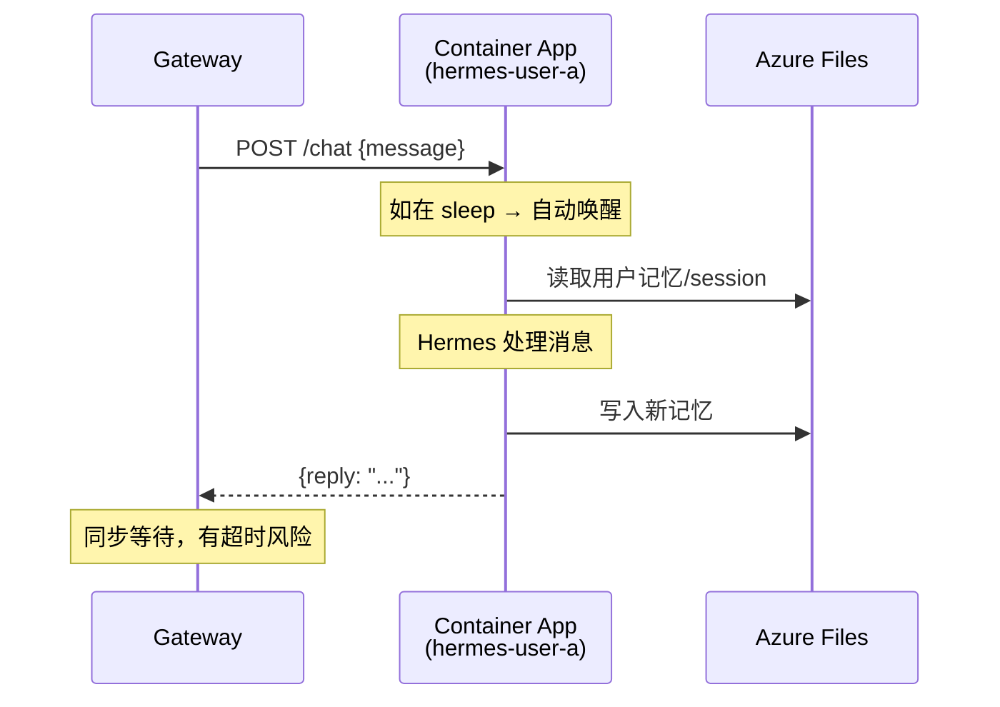

**模型**：每用户一个 Container App，设 min-replicas=0 缩容到 0。Gateway 通过 HTTP 直接调用，请求本身会自动唤醒 sleeping 的容器。

#### 架构

```
Gateway
  │
  │  POST https://hermes-user-a.<env>.azurecontainerapps.io/chat
  │  Body: { message: "帮我查明天天气" }
  │  （如果 container 在 sleep，Azure 自动唤醒）
  │
  │  ← 等待响应 →
  │
  │  Response: { reply: "明天北京晴，32°C" }
  │
  ▼
通过 iLink 发回微信
```

#### 用户注册时

```typescript
// 通过 Azure SDK 创建该用户的 Container App
import { ContainerAppsAPIClient } from "@azure/arm-appcontainers";

async function createUserContainer(userId: string) {
  const appName = `hermes-${userId}`;
  await client.containerApps.beginCreateOrUpdate(RESOURCE_GROUP, appName, {
    location: "eastasia",
    template: {
      containers: [{
        name: "hermes",
        image: `${ACR_HOST}/hermes-base:v1`,
        resources: { cpu: 0.5, memory: "1Gi" },
        volumeMounts: [
          { volumeName: "hermes-data", mountPath: "/home/hermes/.hermes" },
          { volumeName: "workspace", mountPath: "/home/hermes/workspace" }
        ]
      }],
      scale: { minReplicas: 0, maxReplicas: 1 }
    },
    configuration: {
      ingress: { external: true, targetPort: 8080 }
    }
  });

  await db.containerMapping.insert({
    userId,
    containerName: appName,
    containerUrl: `https://${appName}.${CONTAINER_ENV_FQDN}`
  });
}
```

#### Gateway 调用 Hermes

```typescript
async function dispatchToHermes(userId: string, msg: ILinkMessage) {
  const mapping = await db.containerMapping.get(userId);

  // 先回复"思考中"，因为冷启动 + 处理可能要等
  await ilinkSend(userId, msg.context_token, "思考中...");

  const resp = await fetch(`${mapping.containerUrl}/chat`, {
    method: "POST",
    headers: {
      "Content-Type": "application/json",
      "Authorization": `Bearer ${INTERNAL_API_KEY}`
    },
    body: JSON.stringify({ message: msg.content }),
    signal: AbortSignal.timeout(240_000)  // 4 分钟超时
  });

  const data = await resp.json();
  await ilinkSend(userId, msg.context_token, data.reply);
}
```

#### 认证方式

Container App 的 HTTP 端口是公网可达的，需防止外部直接调用：

- **起步方案**：共享 API Key — Gateway 带 `Authorization: Bearer <key>`，Hermes 侧验证
- **进阶方案**：Azure Managed Identity — 零密钥管理，Gateway 用 MI 获取 token，Container App 验证 Azure AD token

#### 优点

- **实现最简单**：同步请求-响应，代码直觉清晰
- **HTTP 请求自动唤醒**：Container App 缩容到 0 后，请求进来 Azure 自动拉起，不用写调度逻辑
- **Hermes 侧改动最小**：只需在 container 里加一个 HTTP 接口接收消息

#### 缺点与风险

- **HTTP 超时问题**：Hermes 是 AI Agent，复杂任务可能执行几分钟甚至十几分钟（调用工具、写代码、搜索、多轮推理）。Azure Container Apps 的 ingress 代理默认超时 240 秒（4 分钟），虽然可调大，但 HTTP 长时间挂起不够健壮——中间任何一跳网络抖动都会导致请求失败
- **每用户一个 Container App 资源**：50 个用户 = 50 个 Container App，Azure 资源管理侧有一定开销（虽然计算不收钱）
- **冷启动延迟**：5-15 秒，需要"思考中"过渡

#### 数据库表（方案 A 专属）

```sql
CREATE TABLE container_mapping (
  user_id        TEXT PRIMARY KEY REFERENCES users(id),
  container_name TEXT NOT NULL,
  container_url  TEXT NOT NULL,
  created_at     TIMESTAMP DEFAULT NOW()
);
```

---

### 方案 B：Container Apps Job + 异步队列

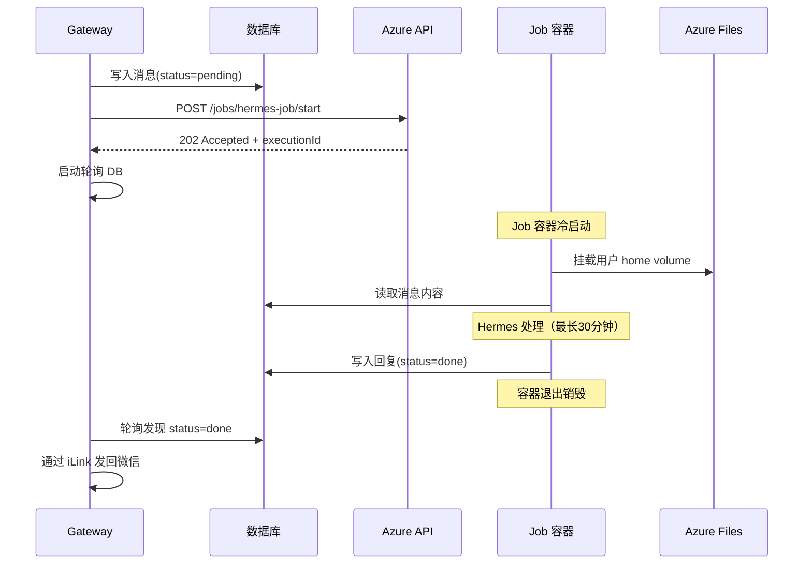

**模型**：不为每个用户预创建容器。每条消息触发一次 Job 执行，Job 挂载该用户的 Azure Files volume 处理消息，结果写入 DB，Gateway 轮询取回。

#### 架构

```
Gateway
  │
  │  1. 写入消息到 DB（status='pending'）
  │  2. 触发 Job 执行（REST API）
  │
  │     POST /jobs/hermes-job/start
  │     Body: { userId, messageId }
  │     ← 返回 202 Accepted + executionId
  │
  │  3. 先回微信"思考中..."
  │
  │  4. 轮询 DB 等结果（或 Job 回调通知）
  │     ┌──────────────────────────────────────┐
  │     │  Job 容器启动                        │
  │     │  ├── 挂载用户 Azure Files volume     │
  │     │  ├── 从 DB 读取消息                  │
  │     │  ├── 调用 Hermes CLI 处理            │
  │     │  ├── 将回复写入 DB（status='done'）  │
  │     │  └── 容器退出                        │
  │     └──────────────────────────────────────┘
  │
  │  5. 检测到结果 → 通过 iLink 发回微信
  ▼
```

#### Job 定义（只需要一个，所有用户共享）

```typescript
async function createHermesJob() {
  await client.jobs.beginCreateOrUpdate(RESOURCE_GROUP, "hermes-job", {
    location: "eastasia",
    configuration: {
      triggerType: "Manual",
      replicaTimeout: 1800,     // 最长 30 分钟
      replicaRetryLimit: 1,
    },
    template: {
      containers: [{
        name: "hermes",
        image: `${ACR_HOST}/hermes-base:v1`,
        resources: { cpu: 1, memory: "2Gi" },
        env: [
          { name: "MODE", value: "job" },
          // userId 和 messageId 在每次触发时通过 override 传入
        ]
      }]
    }
  });
}
```

#### 触发 Job 执行（每条消息）

```typescript
async function dispatchToHermes(userId: string, msg: ILinkMessage) {
  // 1. 消息入库
  const messageId = generateId();
  await db.messages.insert({
    id: messageId,
    userId,
    content: msg.content,
    contextToken: msg.context_token,
    status: "pending",
  });

  // 2. 触发 Job，通过环境变量覆盖传入 userId 和 messageId
  await client.jobs.beginStart(RESOURCE_GROUP, "hermes-job", {
    template: {
      containers: [{
        name: "hermes",
        env: [
          { name: "USER_ID", value: userId },
          { name: "MESSAGE_ID", value: messageId },
        ],
        volumeMounts: [
          { volumeName: `user-${userId}-data`, mountPath: "/home/hermes/.hermes" },
          { volumeName: `user-${userId}-workspace`, mountPath: "/home/hermes/workspace" }
        ]
      }]
    }
  });

  // 3. 先回复"思考中..."
  await ilinkSend(userId, msg.context_token, "思考中...");

  // 4. 启动轮询等待结果
  pollForResult(messageId, userId, msg.context_token);
}

async function pollForResult(messageId: string, userId: string, contextToken: string) {
  const maxWait = 30 * 60 * 1000;  // 最长等 30 分钟
  const interval = 3000;             // 每 3 秒查一次
  const start = Date.now();

  while (Date.now() - start < maxWait) {
    const row = await db.messages.get(messageId);
    if (row.status === "done") {
      await ilinkSend(userId, contextToken, row.reply);
      return;
    }
    if (row.status === "failed") {
      await ilinkSend(userId, contextToken, "处理出错了，请稍后重试");
      return;
    }
    await sleep(interval);
  }

  await ilinkSend(userId, contextToken, "处理超时了，请稍后重试");
}
```

#### Job 容器内的执行逻辑

```
容器启动：
  1. 读环境变量 USER_ID, MESSAGE_ID
  2. Azure Files volume 已自动挂载到 /home/hermes/.hermes 和 /home/hermes/workspace
  3. 从 DB 读消息内容
  4. 调用 Hermes CLI 处理消息：
     hermes chat --quiet -q "<消息内容>"
  5. 捕获 Hermes 的输出
  6. 写入 DB：UPDATE messages SET reply=..., status='done' WHERE id=MESSAGE_ID
  7. 退出（容器自动销毁，不收费）
```

#### 优点

- **无超时问题**：Job 的 replicaTimeout 可设到 30 分钟，Hermes Agent 可以从容地执行复杂任务
- **资源管理简单**：只需一个 Job 定义，不用为每个用户创建 Container App 资源
- **天然适合长任务**：Agent 需要调工具、写代码、多轮推理，Job 就是为这种场景设计的
- **成本和 Container App 一样**：按执行时间计费，不执行不收费

#### 缺点与风险

- **实现复杂度高**：异步架构需要消息入库 + 轮询/回调 + 状态管理
- **多了一层数据持久化**：消息和回复都要经过 DB，增加了 DB 依赖和运维
- **Job 启动延迟**：每次都是冷启动（拉镜像 + 启动），可能比已缩容的 Container App 唤醒更慢
- **Volume 动态挂载问题**：需要确认 Job 每次执行时能否动态指定不同用户的 volume（需验证 Azure API 是否支持 override volumeMounts）
- **并发控制**：同一用户同时发多条消息，可能触发多个 Job 并行执行，需要排队机制避免 Hermes 状态冲突

#### 数据库表（方案 B 专属）

```sql
CREATE TABLE messages (
  id            TEXT PRIMARY KEY,
  user_id       TEXT NOT NULL REFERENCES users(id),
  content       TEXT NOT NULL,
  context_token TEXT NOT NULL,
  reply         TEXT,
  status        TEXT NOT NULL DEFAULT 'pending',   -- pending / processing / done / failed
  execution_id  TEXT,                               -- Job execution ID
  created_at    TIMESTAMP DEFAULT NOW(),
  completed_at  TIMESTAMP
);
```

---

### 两方案对比总览

| 维度 | 方案 A: Container App + HTTP | 方案 B: Job + 异步队列 |
|------|---------------------------|---------------------|
| **实现复杂度** | ★☆☆ 最简单 | ★★★ 最复杂 |
| **长任务支持** | ⚠️ HTTP 超时风险（默认 4 分钟） | ✅ 完美（Job 支持 30 分钟） |
| **用户体验** | 简单任务好，长任务可能超时失败 | 全异步，始终能拿到结果 |
| **资源管理** | 每用户一个 Container App | 一个 Job 定义，所有用户共享 |
| **冷启动** | HTTP 请求自动唤醒 | 每次都冷启动 |
| **DB 依赖** | 轻（只存映射关系） | 重（消息+回复+状态全走 DB） |
| **并发控制** | Container 内天然串行 | 需自建排队机制 |
| **成本** | 相同（都按实际运行秒计费） | 相同 |
| **Hermes 侧改动** | 加 HTTP 接口 | 加 CLI job 模式 |
| **适合阶段** | MVP 快速验证 | 大规模 / 重度 Agent 任务 |

### 团队讨论要点

1. **Hermes Agent 任务通常多长？** 如果 90% 的任务在 1-2 分钟内完成，方案 A 足够。如果经常有 5-10 分钟的长任务，需要 B。
2. **MVP 优先还是一步到位？** 方案 A 最快出活。方案 B 最健壮但起步最慢。
3. **Volume 动态挂载验证**：方案 B 需要确认 Azure Container Apps Job 能否在每次执行时动态指定不同的 volume（这是技术可行性前提）。

---

## 六、共享数据库表结构

以下为所有方案共用的基础表：

```sql
-- 用户表
CREATE TABLE users (
  id          TEXT PRIMARY KEY,
  email       TEXT UNIQUE,
  created_at  TIMESTAMP DEFAULT NOW()
);

-- 微信 iLink 会话
CREATE TABLE wechat_sessions (
  user_id     TEXT PRIMARY KEY REFERENCES users(id),
  bot_token   TEXT NOT NULL,
  expires_at  TIMESTAMP NOT NULL,
  status      TEXT NOT NULL DEFAULT 'active',  -- active / expired / disabled
  updated_at  TIMESTAMP DEFAULT NOW()
);

-- context_token 缓存（每个对话方一个）
CREATE TABLE context_tokens (
  user_id     TEXT NOT NULL REFERENCES users(id),
  contact_id  TEXT NOT NULL,
  token       TEXT NOT NULL,
  updated_at  TIMESTAMP DEFAULT NOW(),
  PRIMARY KEY (user_id, contact_id)
);
```

方案 A 额外需要：

```sql
CREATE TABLE container_mapping (
  user_id        TEXT PRIMARY KEY REFERENCES users(id),
  container_name TEXT NOT NULL,
  container_url  TEXT NOT NULL,
  created_at     TIMESTAMP DEFAULT NOW()
);
```

方案 B 额外需要：

```sql
CREATE TABLE messages (
  id            TEXT PRIMARY KEY,
  user_id       TEXT NOT NULL REFERENCES users(id),
  content       TEXT NOT NULL,
  context_token TEXT NOT NULL,
  reply         TEXT,
  status        TEXT NOT NULL DEFAULT 'pending',   -- pending / processing / done / failed
  execution_id  TEXT,
  created_at    TIMESTAMP DEFAULT NOW(),
  completed_at  TIMESTAMP
);
```

## 七、成本结构（Azure 基础设施）

> 以下仅核算 Azure 基础设施成本，LLM API 费用另行计算。价格基于 Azure 官方定价（East Asia 区域），实际请以 [Azure 定价计算器](https://azure.microsoft.com/en-us/pricing/calculator/) 为准。

### 7.1 各服务单价参考

| 服务 | 计费项 | 单价（约） | 备注 |
|------|--------|-----------|------|
| **App Service B1（Linux）** | 月租 | **~$13/月** | 1C / 1.75GB，支持 Always On |
| **App Service B2** | 月租 | ~$26/月 | 2C / 3.5GB，升配备选 |
| **Container Apps（Consumption）** | vCPU 活跃秒 | $0.000024/s | 缩容到 0 时 $0 |
| | GiB 内存活跃秒 | $0.000003/s | |
| | HTTP 请求 | $0.40/百万次 | |
| | **每月免费额度** | — | 180K vCPU-s + 360K GiB-s + 200 万次请求 |
| **Azure Files（Hot）** | 数据存储 | ~$0.06/GB/月 | 按实际用量 |
| | 事务 | ~$0.015/万次 | 读写操作 |

### 7.2 单用户成本建模

假设 Container 配置 **1 vCPU + 2 GiB 内存**（Hermes 需要跑各类工具脚本：pip/npm install、playwright、编译、数据处理等，0.5vCPU/1GiB 在工具密集场景下吃紧）：

| 用户类型 | 日均对话轮数 | 每轮 Hermes 执行时长 | 日活跃秒数 | 月计算成本（扣除免费额度前） | 月存储成本 |
|---------|------------|-------------------|----------|--------------------------|----------|
| 轻度用户 | 5 轮 | 30s | 150s | $0.14 | ~$0.01 |
| 中度用户 | 20 轮 | 60s | 1,200s | $1.08 | ~$0.03 |
| 重度用户 | 50 轮 | 90s | 4,500s | $4.05 | ~$0.06 |

> **计算公式**：月成本 = 日活跃秒 × 30天 × (1 × $0.000024 + 2 × $0.000003) = 日活跃秒 × 30 × $0.000030

### 7.3 免费额度能撑多少用户

每月免费额度 180K vCPU-s + 360K GiB-s，以 1 vCPU + 2 GiB 的 Container 计算（两者按相同比例消耗，覆盖人数一致）：

| 用户类型 | 每用户月 vCPU-seconds | 免费额度可覆盖用户数 |
|---------|---------------------|------------------|
| 轻度用户 | 150s × 30天 × 1 = **4,500** | **40 个** |
| 中度用户 | 1,200s × 30天 × 1 = **36,000** | **5 个** |
| 重度用户 | 4,500s × 30天 × 1 = **135,000** | **1-2 个** |

> 早期用户少且以轻度使用为主时（≤40 人），Container Apps 计算费仍可完全在免费额度内。中度以上用户超过 5 个就会开始产生计算费用。

### 7.4 不同规模下的月基础设施成本

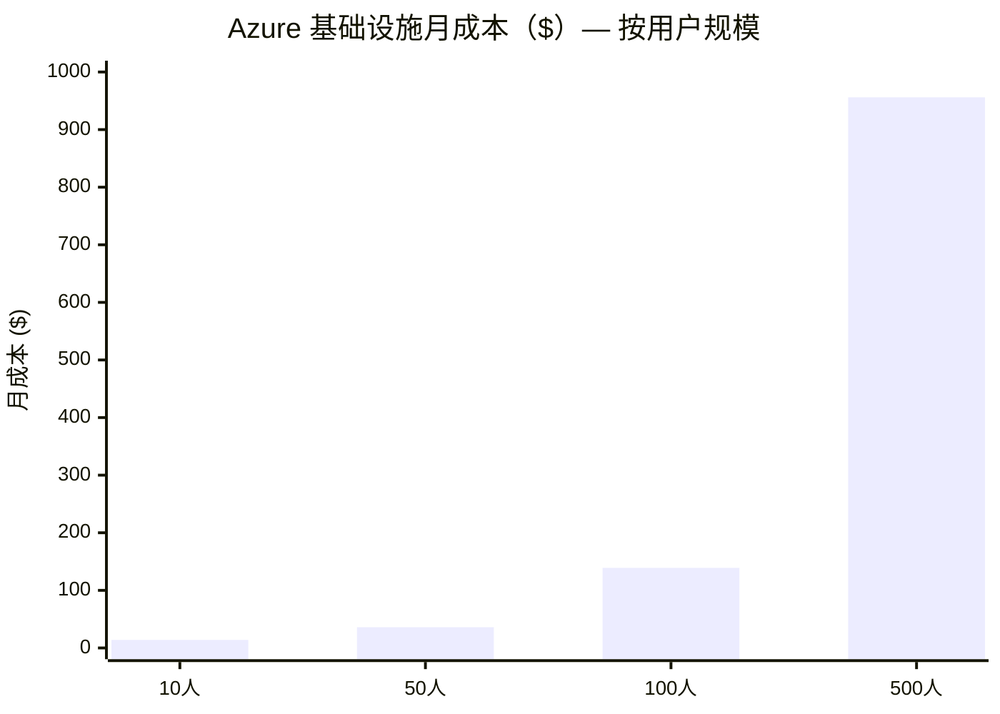

| 规模 | App Service | Container Apps 计算 | Azure Files | **月总成本** |
|------|------------|-------------------|-------------|------------|
| **10 用户** | $13 | $0（免费额度内） | ~$1 | **~$14** |
| **50 用户** | $13 | ~$20 | ~$3 | **~$36** |
| **100 用户** | $13 | ~$120 | ~$6 | **~$139** |
| **500 用户** | $26（升 B2） | ~$900 | ~$30 | **~$956** |

### 7.5 成本结构占比

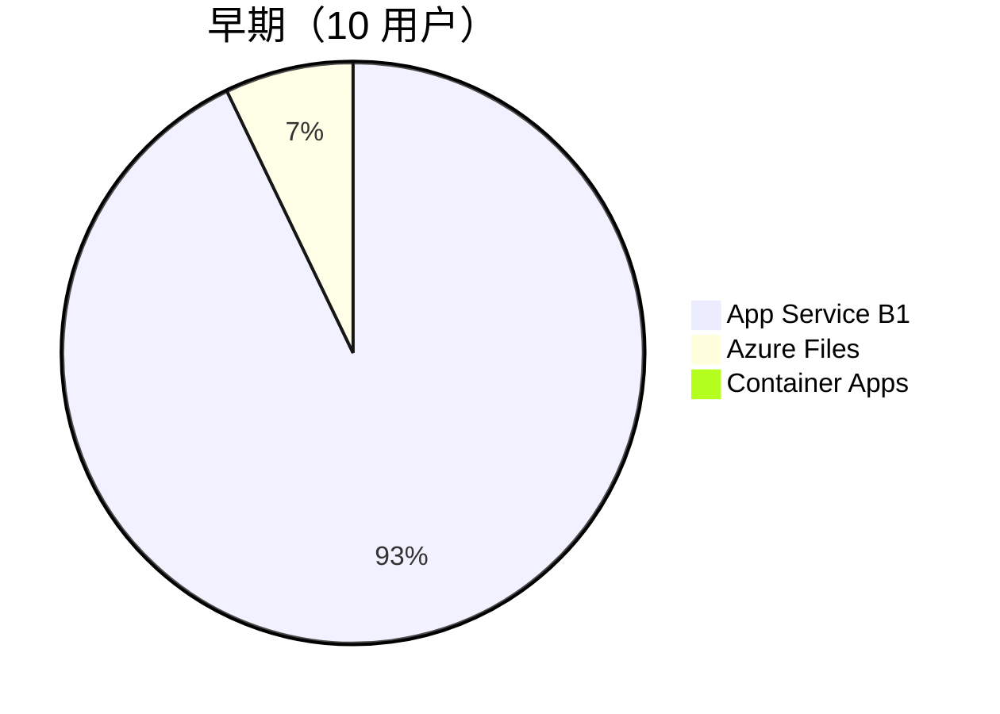

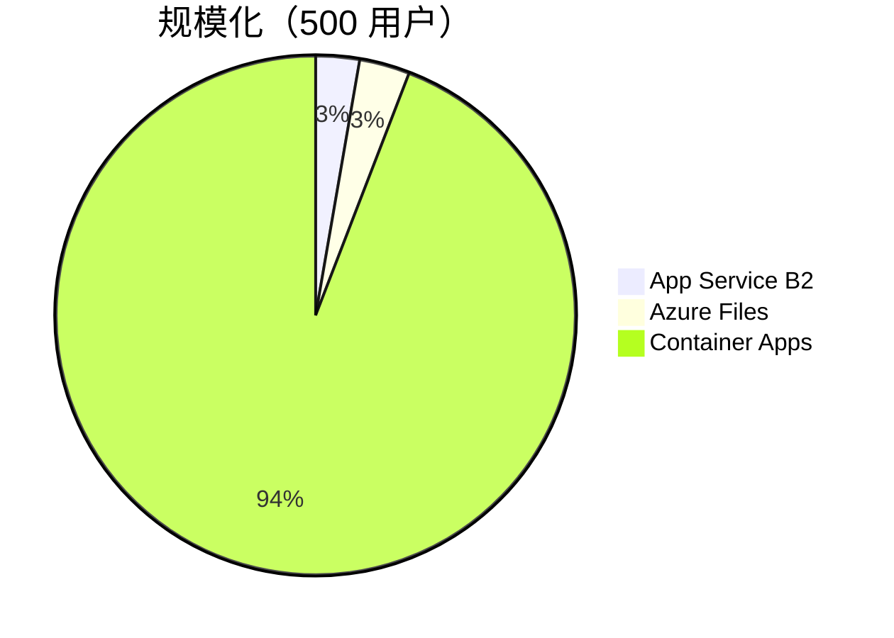

> **核心结论**：早期 Azure 基础设施成本极低（~$14/月），几乎只有 App Service 月租。规模化后 Container Apps 按秒计费成为主要支出项（500 人量级接近 $1000/月），需要在产品定价时充分考虑这一项。

### 7.6 替代方案对比：Cloudflare Workers + Fly.io

> 假设用 Cloudflare Workers 替代 Azure App Service，Fly.io Machines 替代 Azure Container Apps，其它设施按需搭配。

#### iLink 长轮询能否跑在 Cloudflare Workers 上？

**结论：可以，用 Durable Objects + Alarms 实现。**

首先澄清两个关键事实：

**微信 iLink Bot API 的通信模型**

iLink 是纯 pull-based 长轮询，**没有** webhook / WebSocket 等推送模式：
- Bot 端 POST `https://ilinkai.weixin.qq.com/ilink/bot/getupdates`
- 服务端 hold 连接约 **35 秒**，有消息立即返回，无消息超时返回空
- 每次响应带一个 `get_updates_buf` 游标，用于下次请求
- 回复消息需带入站消息的 `context_token`

**Cloudflare Workers / Durable Objects 的计费模型**

| | Workers（普通） | Durable Objects |
|---|---|---|
| **计费方式** | **CPU 时间**（I/O 等待免费） | **Wall-clock 时间**（I/O 等待也算） |
| **35s fetch 挂起的成本** | ~0（只有几 ms CPU） | 35s × 128MB = 4.48 GB-s |
| **适合长轮询？** | 不适合（无法自驱动循环） | 适合（alarm 链式调用） |

> Workers 2024 年起改为 CPU-time-only 计费，I/O 等待完全免费。但 DO 仍按 wall-clock 计费，这是关键区别。

**为什么能用 DO 实现长轮询**

Durable Objects 的 `alarm()` API 支持链式自唤醒，可以实现永续轮询循环：

```
alarm() 触发
  → Promise.all(所有用户的 fetch getupdates)  // 并发，35s wall-clock
  → 处理响应，分发消息到 Hermes
  → setAlarm(Date.now())  // 立即设下一轮
  → 循环
```

关键洞察：**一个 DO 实例可以并发管理所有用户的 polling**。无论 10 个还是 500 个用户，并发 fetch 的 wall-clock 时间都是 ~35s，不会叠加。成本是**固定的**，不随用户数线性增长。

**成本核算（单个 DO 管理全部用户）**

| 指标 | 计算 |
|------|-----|
| 每轮 wall-clock | ~35s（所有用户的 fetch 并发执行） |
| 每月 wall-clock | 35s × (86400/35) 轮/天 × 30天 = **2,592,000s** |
| 每月 GB-s | 2,592,000 × 0.128GB = **331,776 GB-s** |
| 免费额度 | **400,000 GB-s** |
| **月成本** | **$0（在免费额度内）** |

> 1 个常驻 DO 的月消耗 ~332K GB-s，低于 400K 免费额度。即使加第 2 个做冗余，超出部分仅 264K GB-s × $12.50/M = **$3.3/月**。

**限制与注意事项**

| 限制 | 说明 |
|------|------|
| 子请求数上限 | Paid plan 每次 invocation 最多 1,000 个 subrequests，即单 DO 最多并发 ~1000 个用户的 polling |
| 单点风险 | 所有用户的 polling 集中在一个 DO，崩溃时全部中断（alarm 有自动重试 + 指数退避） |
| 内存 | DO 固定分配 128MB，500 个并发 fetch ~5MB，足够 |
| alarm 精度 | alarm 最小间隔无硬性下限，可近乎无缝衔接下一轮 |

#### 架构调整

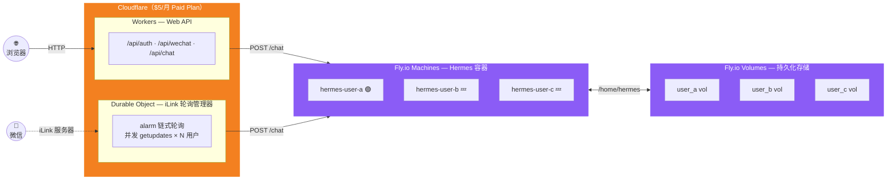

> 纯 Cloudflare + Fly.io 两家，无需第三方。Web API 和 iLink 轮询都跑在 Cloudflare 上。

#### 各服务单价对比

| 服务 | Azure 方案 | CF + Fly 方案 |
|------|-----------|--------------|
| **Gateway（Web API）** | App Service B1 = $13/月 | CF Workers Paid = **$5/月**（含 10M 请求） |
| **Gateway（iLink 长轮询）** | 同上（App Service 包含） | Durable Object ≈ **$0**（免费额度内） |
| **Hermes 容器计算** | $0.000030/s（1 vCPU + 2 GiB） | **~$0.0000276/s**（performance-1x：1 dedicated vCPU + 2GB）|
| **容器停止时** | $0（缩容到 0 零费用） | **$0.225/用户/月**（rootfs 1.5GB × $0.15） |
| **持久化存储** | Azure Files ≈ $0.06/GB/月（按用量） | Fly Volumes = **$0.15/GB/月（按预分配）** |
| **免费计算额度** | 180K vCPU-s + 360K GiB-s | **无**（Fly.io 无免费计算） |
| **出站带宽** | 包含 | Asia $0.04/GB |

> 为公平对比，Fly.io 选用 **performance-1x**（dedicated vCPU），与 Azure 的 dedicated 1 vCPU 算力对等。如改用 shared-cpu 系列可再便宜 5 倍，但会被邻居抢占算力，对 Hermes 的工具脚本（pip install、编译、playwright）执行时长不友好。

#### 不同规模成本对比

| | **10 用户** | | **50 用户** | | **100 用户** | | **500 用户** | |
|---|---|---|---|---|---|---|---|---|
| **项目** | **Azure** | **CF+Fly** | **Azure** | **CF+Fly** | **Azure** | **CF+Fly** | **Azure** | **CF+Fly** |
| Gateway | $13 | $5 | $13 | $5 | $13 | $5 | $26 | $5 |
| 容器计算 | $0 | $10 | $20 | $50 | $120 | $99 | $900 | $497 |
| 停机存储 | — | $2.3 | — | $11.3 | — | $22.5 | — | $112.5 |
| 持久化存储 | $1 | $1.5 | $3 | $7.5 | $6 | $15 | $30 | $75 |
| 带宽 | — | ~$0.5 | — | ~$2 | — | ~$4 | — | ~$20 |
| **合计** | **$14** | **$19.3** | **$36** | **$75.8** | **$139** | **$145.5** | **$956** | **$709.5** |

> 容器计算假设中度用户（日均 20 轮 × 60s）。Azure：1 vCPU + 2 GiB；Fly.io：performance-1x（1 dedicated vCPU + 2 GiB），算力对等。停机存储按 Docker image ~1.5GB rootfs 估算，持久化存储按每用户 1GB 预分配。

```mermaid
xychart-beta
    title "月基础设施成本对比（$，对等算力）"
    x-axis ["10人", "50人", "100人", "500人"]
    y-axis "月成本 ($)" 0 --> 1000
    bar "Azure" [14, 36, 139, 956]
    bar "CF+Fly" [19, 76, 146, 710]
```

#### 对比总结

| 维度 | Azure 全家桶 | CF Workers + Fly.io |
|------|------------|-------------------|
| **早期成本（≤10人）** | ✅ ~$14，免费额度兜底，反而更省 | ⚠️ ~$19，从第一个用户就开始计费 |
| **中期成本（50-100人）** | ⚠️ $36-139，过 50 人后免费额度耗尽，开始攀升 | ⚠️ $76-146，与 Azure 接近，互有胜负 |
| **规模成本（500人）** | ❌ ~$956 | ✅ ~$710，约为 Azure 的 75% |
| **成本结构** | 计算贵、存储便宜、免费额度缓冲 | 计算便宜、存储贵（预分配 + 停机也收费） |
| **Gateway 架构** | ✅ 单一 App Service 搞定一切 | ✅ 全在 Cloudflare 内（Workers + DO） |
| **运维复杂度** | ✅ 单一云、统一控制台 | ⚠️ 两家服务商（CF + Fly） |
| **生态成熟度** | ✅ 企业级、文档全 | ⚠️ Fly.io 较小众，偶有稳定性问题 |
| **全球部署** | 需手动多区域 | ✅ CF 天然全球边缘 + Fly 多区域简单 |
| **缩容到 0** | ✅ 零费用 | ⚠️ 停机仍收 rootfs 存储费 |
| **iLink 轮询上限** | 受 App Service 内存限制（B1 ~数百用户） | DO 单实例 ~1000 用户（子请求数上限） |

## 八、扩容路径

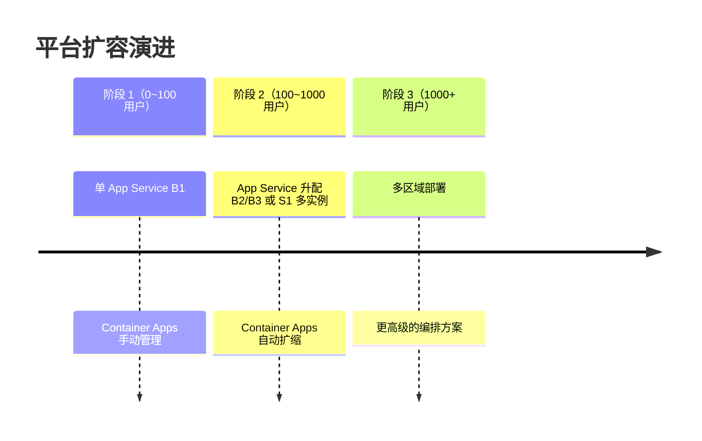

```
阶段 1（0~100 用户）   →  单 App Service B1 + Container Apps/Jobs，手动管理
阶段 2（100~1000 用户） →  App Service 升配 B2/B3 或 S1 多实例，Container Apps 自动扩缩
阶段 3（1000+ 用户）   →  考虑多区域部署或更高级的编排
```

## 九、已识别的风险

| 风险 | 影响 | 应对 |
|------|------|------|
| ~~微信 Gateway 依赖逆向协议，随时可能被封~~ | ~~产品命脉~~ | **已消除**：微信已推出官方 ClawBot / iLink Bot API（2026-03），合法接入，无封号风险 |
| LLM API 成本是大头，用户聊越多越贵 | 利润 | 需要设计合理的计费/限额模型 |
| 国内运营 AI 聊天服务需备案 | 合规 | 正式上线前需办理生成式 AI 备案 |
| Container 冷启动延迟（缩容到 0 后几秒到十几秒） | 体验 | Gateway 先回复"思考中..."，再等 Hermes 响应 |
| iLink bot_token 约 24h 过期需用户重新扫码 | 体验 | 定时检测 + 提前通知用户，未来关注 iLink 是否支持自动续期 |
| HTTP 长请求超时（方案 A 特有） | 可靠性 | 选方案 B 可规避 |
| 容器销毁后用户安装的包丢失 | 功能 | pip/npm 安装目录必须挂载到 Azure Files（见下方说明） |

### ⚠️ 关键约束：容器内安装的包必须持久化

**问题**：无论 Container App（缩容到 0 再唤醒）还是 Job（执行完容器销毁），容器可写层都会丢失。Hermes Agent 运行期间通过 `pip install`、`npm install -g` 安装的包默认装在系统目录，容器重建后全部丢失。

**此问题对 Container App 和 Job 两个方案都存在，不是某个方案特有的。**

**解决方案**：将整个用户 home 目录挂载为单个 Azure Files volume，一个挂载点覆盖所有场景：

| 容器内路径 | 覆盖内容 |
|---|---|
| `/home/hermes` （整个 home 目录） | Hermes 配置/记忆/session、workspace、pip 包、npm 全局包、各种 CLI 认证（gh/azure/aws/ssh/docker 等）、所有用户数据 |

**为什么不逐个目录挂载**：Agent 可能使用任意 CLI 工具（GitHub CLI → `~/.config/gh/`、Azure CLI → `~/.azure/`、SSH → `~/.ssh/` 等），逐个枚举挂不完。挂载整个 home 目录一劳永逸。

**Hermes Docker Image 的 Dockerfile 必须包含以下环境变量**：

```dockerfile
# 创建非 root 用户
RUN useradd -m hermes
USER hermes

# Python: 强制所有 pip install 都走 --user 模式，目标目录指向 home
ENV PIP_USER=1
ENV PYTHONUSERBASE=/home/hermes/.local

# Node: 全局包安装目录指向 home 下
ENV NPM_CONFIG_PREFIX=/home/hermes/.npm-global

# PATH 里加上这两个 bin 目录，装完直接能用
ENV PATH="/home/hermes/.local/bin:/home/hermes/.npm-global/bin:$PATH"
```

这样 Agent 执行 `pip install requests` 或 `npm install -g typescript` 时，包会自动装到 home 目录下，Agent 无需加任何特殊参数，完全无感。

**新用户初始化问题**：Azure Files volume 挂载到 `/home/hermes` 后，会遮盖 image 里预置的默认文件（`.bashrc`、Hermes 初始配置等）。新用户的 volume 是空的，需要初始化：

```dockerfile
# 构建时把默认 home 内容存到种子目录（不会被 volume 遮盖）
RUN cp -a /home/hermes /home/hermes-seed

ENTRYPOINT ["/entrypoint.sh"]
```

```bash
#!/bin/bash
# entrypoint.sh — 新用户首次启动时，从种子目录初始化 home

if [ ! -f /home/hermes/.initialized ]; then
  cp -a /home/hermes-seed/. /home/hermes/
  touch /home/hermes/.initialized
fi

exec "$@"
```

只有新用户第一次启动时执行复制，后续启动直接跳过。

## 十、待讨论的下一步

- [x] Gateway 技术选型 — Node.js 24 + Express/Fastify, 部署在 Azure App Service B1
- [x] 微信 Gateway 基于官方 iLink Bot API（long-polling 模式）接入 — App Service 集中管理所有用户的 iLink 会话
- **[待团队讨论] 调度层方案选择 — 方案 A / B（见第五章）**
- [ ] 用户注册/管理/计费系统设计
- [ ] Hermes Docker Image 的构建
- [ ] LLM API 成本由谁承担（平台包 vs 用户自带 key）
- [ ] 数据库选型（起步 SQLite vs PostgreSQL vs Azure Cosmos DB）
- [ ] 前端技术栈选型
