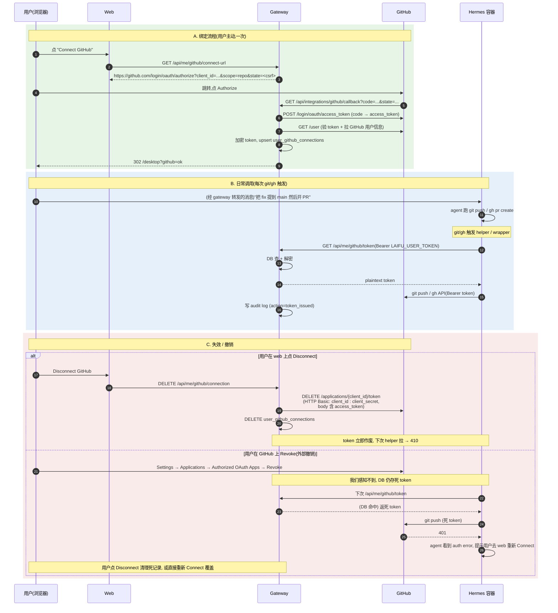

# GitHub 集成方案

让灵犀用户能让 AI 助理顺畅操作自己的 GitHub 仓库 — clone / push / 提 PR / 评 issue / 看 CI。
重点是**授权管理**:既要 agent 用着像在自己机器上跑 `git` / `gh` 一样无感,又要凭证不泄露、用户能管控、可审计。

**MVP 走 OAuth App**(1 天能落)。GitHub App 作为 P3+ 升级路径,触发条件明列于 §十。

---

## 一、定位与边界

**这件事是什么**:在灵犀里加一个"Connect GitHub"集成,绑定后,容器里的 git/gh CLI 能以该用户身份操作他的仓库。

**这件事不是什么**:
- 不是给灵犀加"用 GitHub 登录" — 那是站内身份的事,跟本集成是两件独立的事,**别混**。如果以后要加,在 `auth/providers/` 加一个 GitHub provider 即可,跟本文不冲突。
- 不是让 agent 自己跑 `gh auth login` — device-flow 阻塞 + agent 等不到 + 凭证落地不可靠。见 §九 否决方案。
- 不是给 agent 一个长生命周期 token 让它自己保管 — agent 看到的永远是"现取现用"的 token,缓存在 Gateway。

---

## 二、为什么 MVP 选 OAuth App

三种方案对照,按 MVP 视角排:

| | **OAuth App**(选定) | GitHub App | 用户 PAT |
|---|---|---|---|
| 注册成本 | 5 分钟,填个 callback URL | 30 分钟,permissions + 私钥 + webhook 全要配 | 0 — 用户自助 |
| 用户授权 UX | 一个 consent 页,Authorize 完事 | 一个 install 页(选 account+repos),Install | 自己去 Settings/Tokens 复制粘贴(反产品定位) |
| 权限粒度 | 整账号一刀切(`repo` scope = 所有仓库读写) | 可选 All / 部分仓库 | 用户自定 |
| Token 生命周期 | 长期(直到 revoke) | 1h,需 JWT 刷新 | 长期或细粒度 |
| Token 存哪 | DB 存一份(加密) | DB 只存 `installation_id`,token 现签现用 | 用户保管,我们存一份 |
| Gateway 复杂度 | 新建 `integrations/github/` 模块, 3-4 个 endpoint + token 加解密 | 同左 + JWT 签发 + 缓存 + webhook | 同 OAuth App 但跳过同意页 |
| 容器侧 helper | 完全一样 | 完全一样 | 完全一样 |
| Webhook 反向通知 | 不支持 | 支持 | 不支持 |
| Org 级审计 | 看不到 AI 具体操作 | Org admin 可看 audit log | 完全看不到 |
| Rate limit | 5000/h 全账号共享 | 每 install 独立 5000+/h | 用户 5000/h |
| 撤销 | GitHub Settings → Applications → Revoke | GitHub Settings → Apps → Uninstall | 用户自己删 token |

**关键观察**:
- OAuth App 与 GitHub App 在**用户感知**上几乎一样(一个 consent 页 vs 一个 install 页),都是一次点完
- 真正的差距在**我们这边**:GitHub App 多出 JWT 签发/刷新/webhook 三块基础设施
- 容器侧 credential helper 跟用哪种 App **完全无关**,Gateway 把 token 来源抽象掉了
- 切换路径平滑:OAuth → GitHub App 的代价是"用户重新点一次 Connect",代码改动隔在 Gateway 内

**所以 MVP 决定**:走 OAuth App,scope 选 `repo`(读写所有仓库) + `read:user`(回填 profile)。GitHub App 留到 §十 触发条件出现再切。

PAT 直接否决:反 AI 产品定位、用户操作成本高、无审计、出事赖谁不清。

---

## 三、凭证如何落到容器 — "Gateway 拉皮条 + 容器内 credential helper"

设计的核心环节,**这部分跟用哪种 OAuth 形态无关**。先排除不行的:

- ❌ **token 写到 Azure Files `~/.config/gh/hosts.yml`**:volume 上裸放 token 爆炸面大;并发 hermes 子进程读写会撕;切 GitHub App 后还要处理 1h 过期。
- ❌ **启动时注入 `GH_TOKEN` env**:跨 invocation 不持续;轮转/吊销做不掉。
- ❌ **agent 自己保管 token**:agent 行为不可控,prompt-inject 风险高。

### ✅ Lazy fetch via git credential helper

#### Helper 协议 — 跟语言无关的标准接口

`credential.helper` 是 git 自 2012 年起内置的协议(参考 macOS 的 `osxkeychain`、Codespaces 的远端 helper 都是这套):

```
git --(spawn)--> helper
       argv[1] = "get"
       stdin:  protocol=https\nhost=github.com\n[空行]
       stdout: username=x-access-token\npassword=<token>\n[空行]
       exit 0
```

任何能读 stdin / 写 stdout / 退出码正常的程序都可以当 helper。`git config credential.helper <VALUE>` 的 `VALUE` 有三种形式:

| 形式 | git 行为 | 我们用法 |
|---|---|---|
| `"foo"` | 在 PATH 找 `git-credential-foo` 直接 exec | 不用 |
| `"/abs/path/bin"` | 直接 exec 这个可执行文件 | **✓ 我们用这种** |
| `"!command"` | `!` 后整段交 `/bin/sh -c` 跑 | 不用,多一次 fork sh |

#### 为什么 helper / wrapper 用 Bun 而不是 shell

- 仓库里 `/opt/lingxi-scripts/` 已经是 Bun TS(bootstrap / sync-prompts / pull-runtime-config 都是),credential helper 是同类需求(从容器调 Gateway HTTP),没必要为了省 30ms 启动引入第二套语言/惯例
- 可直接 `import { httpJsonRetry } from './lib.ts'` 复用现成的退避 / JSON 解析 / 超时
- typed error + try/catch 比 shell `|| exit 1` 散落更易写对、易加单元测试
- helper 启动 ~25-40ms,被 Gateway 网络往返(50-200ms)和 LLM 响应时间淹没,**用户无感**
- Bun 二进制已经 `COPY` 进镜像(`Dockerfile` line 68),无额外体积成本

#### 容器侧实现

`docker/hermes/scripts/git-credential.ts`:

```ts
#!/usr/bin/env bun
// git 以 "get" 子命令调它, stdin 喂 protocol/host/path, stdout 期望 username/password
import { httpJsonRetry } from './lib.ts';

if (process.argv[2] !== 'get') process.exit(0);  // store/erase 我们不处理

// 吞掉 git 喂进来的 metadata, 我们固定走 github.com
await Bun.stdin.text();

const gateway = process.env.GATEWAY_BASE_URL;
const containerToken = process.env.LAIFU_USER_TOKEN;
if (!gateway || !containerToken) {
  console.error('lingxi-git-credential: missing GATEWAY_BASE_URL or LAIFU_USER_TOKEN');
  process.exit(1);
}

try {
  const { token } = await httpJsonRetry<{ token: string }>(
    `${gateway}/api/me/github/token`,
    { headers: { Authorization: `Bearer ${containerToken}` } },
  );
  process.stdout.write(`username=x-access-token\npassword=${token}\n`);
} catch (err) {
  console.error(`lingxi-git-credential: ${(err as Error).message}`);
  process.exit(1);
}
```

`docker/hermes/scripts/gh-wrapper.ts`(`gh` CLI 不走 credential helper 协议,自己读 `GH_TOKEN` env,所以包一层):

```ts
#!/usr/bin/env bun
import { httpJsonRetry } from './lib.ts';
import { spawn } from 'node:child_process';

const { token } = await httpJsonRetry<{ token: string }>(
  `${process.env.GATEWAY_BASE_URL}/api/me/github/token`,
  { headers: { Authorization: `Bearer ${process.env.LAIFU_USER_TOKEN}` } },
).catch((e: Error) => {
  console.error(`lingxi gh wrapper: ${e.message}`);
  console.error('Tip: connect GitHub at the web UI first.');
  process.exit(4);
});

const child = spawn('/usr/bin/gh.real', process.argv.slice(2), {
  stdio: 'inherit',
  env: { ...process.env, GH_TOKEN: token },
});
child.on('exit', (code) => process.exit(code ?? 1));
```

Dockerfile 改动:

```dockerfile
# 装 gh CLI(走官方 apt repo), 真 gh 改名 gh.real 给 wrapper 调
RUN curl -fsSL https://cli.github.com/packages/githubcli-archive-keyring.gpg \
         | dd of=/usr/share/keyrings/githubcli-archive-keyring.gpg \
 && echo "deb [signed-by=/usr/share/keyrings/githubcli-archive-keyring.gpg] \
          https://cli.github.com/packages stable main" \
         > /etc/apt/sources.list.d/github-cli.list \
 && apt-get update && apt-get install -y --no-install-recommends gh \
 && mv /usr/bin/gh /usr/bin/gh.real \
 && rm -rf /var/lib/apt/lists/*

# scripts/ 已经被 COPY 到 /opt/lingxi-scripts/ (见 Dockerfile 既有 line ~175), 这里只挂软链
RUN chmod +x /opt/lingxi-scripts/git-credential.ts /opt/lingxi-scripts/gh-wrapper.ts \
 && ln -sf /opt/lingxi-scripts/git-credential.ts /usr/local/bin/lingxi-git-credential \
 && ln -sf /opt/lingxi-scripts/gh-wrapper.ts /usr/local/bin/gh \
 && git config --system credential.https://github.com.helper /usr/local/bin/lingxi-git-credential
# 注: 不配 credential.useHttpPath true — 当前 helper 不按仓库区分 token,
#     P3 切 GitHub App + 仓库级 scope 收窄时再加,届时 helper 才用得上 path 字段。
```

`--system` 写到 `/etc/gitconfig`(镜像只读层),**用户 home volume 覆盖不到**,所有用户、所有从 sleep 拉起的容器,第一次 `git push` 就走我们的链路,agent 完全无感。

**Gateway 侧** — `GET /api/me/github/token`(走 `container-token.ts` 鉴权出 user_id):

1. 查 `user_github_connections` 拿用户的加密 token
2. 解密 → 返 plaintext
3. 没有 → 410 Gone(agent 看到 auth error,提示用户去 web 重新绑)

OAuth App 阶段 token 长期有效,**Gateway 不需要刷新逻辑**;切到 GitHub App 时再加 JWT 签发 + 1h 缓存,Helper / Wrapper 这边一行不动。

**关键性质**:
- 容器内 git/gh **不感知 token 形态**(长期 vs 短命都一样)
- 容器**不缓存** token,每次操作都从 Gateway 拉,要 revoke 一改 DB 即时生效
- DB 加密 + bump `users.token_version` 让旧 LAIFU_USER_TOKEN 失效 = 双层保护

---

## 四、端到端流程



---

## 五、数据模型

```sql
-- 用户的 GitHub 绑定(每用户最多 1 条)
CREATE TABLE user_github_connections (
  user_id              TEXT PRIMARY KEY REFERENCES users(id) ON DELETE CASCADE,
  github_user_id       BIGINT NOT NULL,                -- GitHub numeric id
  github_login         TEXT NOT NULL,                  -- "alice"
  encrypted_token      BYTEA NOT NULL,                 -- libsodium secretbox / age 加密
  token_scopes         TEXT[] NOT NULL,                -- 从 GitHub 响应头 X-OAuth-Scopes 解析
  connected_at         TIMESTAMP DEFAULT NOW(),
  last_used_at         TIMESTAMP,                      -- 每次 token endpoint 命中更新
  -- 同一 GitHub 账号只能绑一个灵犀用户; 冲突时 callback 返 409 "already linked to another user",
  -- 让用户去原账号上 Disconnect 后再来
  UNIQUE (github_user_id)
);

-- 审计 — 颁 token + (可选) 关键操作
CREATE TABLE github_audit_log (
  id              BIGSERIAL PRIMARY KEY,
  user_id         TEXT,
  action          TEXT NOT NULL,                       -- token_issued / connected / disconnected
                                                       -- / revoked_external / refresh_failed
  meta            JSONB,                               -- {github_login, scopes, ip, ...}
  created_at      TIMESTAMP DEFAULT NOW()
);
CREATE INDEX ON github_audit_log (user_id, created_at DESC);
```

**关键决策**:
- Token 加密存,**key 走 Azure Key Vault**(Gateway 启动时拉),DB dump 泄露不直接等于 token 泄露
- 每用户 1 条 = OAuth App 的天然限制(同账号 re-authorize 会得到同一个 grant,token 覆盖即可)
- 切 GitHub App 时这张表退化成"installations 索引",`encrypted_token` 字段废弃 — schema migration 一次性

---

## 六、改造清单(按模块)

### Gateway

1. **`apps/gateway/src/integrations/github/`** 新建(独立模块, **不接入 `auth/providers/` registry** — 该 registry 为"登录创建 session"设计, 我们做的是"给已有 session 加权能", 生命周期与语义都不同):
   - `oauth-handler.ts` — 自己拼 GitHub `/login/oauth/authorize` URL + 处理 callback (code → access_token → `GET /user`)
   - `crypto.ts` — token 加解密 (`libsodium.crypto_secretbox`, key 32 字节)
   - `revoke.ts` — 调 GitHub `DELETE /applications/{client_id}/token` (**HTTP Basic auth: client_id : client_secret**, body 含 access_token)
   - `dev-shortcut.ts` — local dev 模式下读 `GITHUB_LOCAL_DEV_TOKEN`, 短路 OAuth flow (见 §六.11)
   - `routes.ts`:
     - `GET    /api/me/github/connect-url` — 生成 OAuth URL + 写 `lingxi_github_oauth_state` cookie (10min TTL, 对齐 `oauth-router.ts` 的 `STATE_COOKIE` 写法)
     - `GET    /api/integrations/github/callback` — 校验 state cookie 与 query 一致 → 通过 lingxi session cookie 取 `user_id` → code 换 token → `GET /user` 拿 `github_user_id/login` → 检查 `UNIQUE (github_user_id)` 冲突 (409 "already linked to another user") → 加密入库 → 302 回前端
     - `GET    /api/me/github/token` — **容器侧调,返 plaintext**,走 `container-token` 中间件 + 限速 60 req/min/user
     - `GET    /api/me/github/connection` — 列绑定供前端展示 (login + scopes + connected_at)
     - `DELETE /api/me/github/connection` — 主动解绑 (调 `revoke.ts` + 清 DB)

2. **`apps/gateway/src/db/github-connections-dao.ts`** + Drizzle schema 加到 `packages/db/src/schema.ts`

3. **`apps/gateway/src/config.ts`** 加:
   ```ts
   github: {
     clientId: required('GITHUB_OAUTH_CLIENT_ID'),
     clientSecret: required('GITHUB_OAUTH_CLIENT_SECRET'),
     tokenEncryptionKey: required('GITHUB_TOKEN_ENCRYPTION_KEY'),   // 32-byte base64
     scopes: ['repo', 'read:user'],
     localDevToken: process.env['GITHUB_LOCAL_DEV_TOKEN'] ?? null,  // 仅 local 模式生效
   }
   ```
   `validateConfig` 加: 如果 `provisioner !== 'local'` 但 `localDevToken` 非空, **panic 退出** — 防止 dev 短路误进 prod。

4. **`apps/gateway/src/index.ts`** 注册 router。

5. **`infra/bicep/main.bicep`** `appSettings` 块加 3 行 (KV reference 模式, 跟 `SESSION_SECRET` / `DATABASE_URL` 同写法):
   ```bicep
   GITHUB_OAUTH_CLIENT_ID: 'Iv1.xxxxxxxxxxxx'   // 非 secret, 直接明文; 也可 param 化
   GITHUB_OAUTH_CLIENT_SECRET: '@Microsoft.KeyVault(VaultName=${kv.name};SecretName=github-oauth-client-secret)'
   GITHUB_TOKEN_ENCRYPTION_KEY: '@Microsoft.KeyVault(VaultName=${kv.name};SecretName=github-token-encryption-key)'
   ```
   部署前手工灌 KV:
   ```bash
   az keyvault secret set -n github-oauth-client-secret --vault-name kv-lingxi-<env> --value '<from GitHub>'
   az keyvault secret set -n github-token-encryption-key --vault-name kv-lingxi-<env> --value "$(openssl rand -base64 32)"
   ```
   ACA 容器**零改动** — GitHub 凭证全部锁在 Gateway 进程内。

### Container 镜像 (`docker/hermes/`)

6. **`docker/hermes/scripts/git-credential.ts`** 新建(§三 Bun TS)
7. **`docker/hermes/scripts/gh-wrapper.ts`** 新建(§三 Bun TS)
8. **`docker/hermes/Dockerfile`** 加 §三 那几行(装 gh CLI + 软链 + 系统级 credential.helper 配置)

### Web 前端

9. **`apps/web/src/apps/integrations/`**(或塞 `manage/`):
   - "Connected Services" 面板,展示 GitHub 状态:已连接 / 未连接
   - "Connect GitHub" → 跳 `/api/me/github/connect-url`
   - 已连接显示:`@github-login` + scopes + 连接时间 + "Disconnect" 按钮 + 链到 GitHub Settings

### Hermes 提示词

10. **`apps/gateway/prompts/`** 给 hermes 系统提示加 GitHub 工具使用约束:
   - 写操作(push / merge / 删分支 / release / 改 settings)**先在聊天里让用户确认**
   - 默认在 feature branch 工作,**不直接 push 到 main/master**
   - commit 前先 `git status` / `git diff` 摘要给用户看
   - 报错 "authentication required" 时**不要**自己跑 `gh auth login`,直接告诉用户去 web 重新绑定
   - 不试图改 repository settings、读 secrets、改 workflow secrets

### Local dev 短路(§六.11)

11. **`apps/gateway/src/integrations/github/dev-shortcut.ts`** — 仅 `config.provisioner === 'local'` 且 `config.github.localDevToken` 非空时挂载:
    - `GET /api/me/github/connect-url` 不返 GitHub URL, 直接返本地 `/api/integrations/github/dev-callback`
    - dev-callback 用 env 里的 token 调 `GET /user` 拿 `github_user_id/login`, 加密入库, 302 回前端
    - 开发者 onboarding 一次性: `echo "GITHUB_LOCAL_DEV_TOKEN=$(gh auth token)" >> apps/gateway/.env.local`
    - **双重 gate** 防误进 prod: `validateConfig` 已在 §六.3 加 panic 检查
    - 好处: 工程师不用各自注册 personal OAuth App; OAuth 真链路在 cloud dev 环境跑(每次 PR 上 dev), 本地不验证不构成问题

---

## 七、授权管理(用户视角)

OAuth App 阶段,管控点比 GitHub App 少,但够用:

### 1. 是否给产品 GitHub 权限
- **入口**:Web Settings → Integrations → GitHub → "Connect"
- **撤销**:
  - Web "Disconnect"(我们调 `DELETE /applications/{client_id}/token`,**HTTP Basic auth 用 client_id : client_secret**,body 含 access_token;token 立即作废,grant 关系保留 → 重连无需再过 consent 页)
  - GitHub Settings → Applications → Authorized OAuth Apps → Revoke(更彻底,撤掉 grant,**外部撤销我们感知不到** — 见 §四.C 与 §八)

### 2. 给哪些仓库 — **不支持细控**(OAuth App 局限)
- `repo` scope 一刀切:用户授一次 = AI 拿到他所有 repo 的读写权限
- 这是 MVP 阶段的明确取舍。**前端 connect 按钮旁边必须有清晰文案**:
  > 连接 GitHub 将允许灵犀代你访问**所有**仓库(包括 private)。如需限制具体仓库,请等待我们的 GitHub App 集成(P3)。
- 想细控的用户,告诉他暂时用"小号 GitHub 账号 + 只 fork/transfer 他想给 AI 碰的 repo"绕开,或等 P3

**OAuth App 的两个固有特性,产品文案要说清**:
- **Token 永不过期、无 refresh_token**(GitHub OAuth App 协议本身就不发 refresh)。我们检测不到用户在 GitHub 上外部 revoke, 只能等容器侧 git/gh 调 GitHub 收到 401, agent 提示用户重新 Connect。
- **Organization "Restrict OAuth App access"**: 用户加入的 org 若启用此策略, 即使用户授权了我们, 我们也读不到该 org 的 repo, 需要 org owner 在 GitHub 上 "Approve" 我们的 OAuth App。这是支持团队会被频繁问的点, 文档站要写明引导链接。

### 3. agent 能做什么 — 由 prompt 约束 + 行为审计
- **上限**:OAuth App 注册时的 scopes(整账号读写)
- **运行时**:agent prompt 策略(§六.10 写操作要确认、不动 main)
- **事后**:`github_audit_log` 回溯(MVP 只记 token 颁发;后续可加关键写操作)

---

## 八、风险与缓解

| 风险 | 影响 | 缓解 |
|---|---|---|
| OAuth token 长期有效, 一旦泄露危害大 | 单用户全 repo 被读写 | (a) token 加密存, key 在 Key Vault; (b) 用户 web 点 Disconnect 立即作废; (c) bump `users.token_version` 让容器侧 `LAIFU_USER_TOKEN` 失效, 断容器 → token endpoint 链路 |
| 用户在 GitHub 上外部 revoke, 我们感知不到 | git/gh 操作失败时用户体验差 | MVP 不做后台对账(简化); agent 看到 401 时显式提示 "Your GitHub authorization was revoked. Please reconnect at <url>"; 用户在 web 上 Disconnect 即可清死记录(或直接重新 Connect 覆盖) |
| `GITHUB_TOKEN_ENCRYPTION_KEY` 泄露 = **所有用户 token 同时裸奔** | 全平台爆炸 | Key Vault + 严控 access;轮换流程:加新 key (v2),解密用 v1,加密用 v2,后台 migrate;旧 key 销毁 |
| `LAIFU_USER_TOKEN` 泄露 = 攻击者能拿走该用户 GitHub token | 单用户爆炸 | 已有 `token_version` bump 机制(`container-token.ts`);Gateway 限速 `/api/me/github/token`(每用户 60 req/min) |
| Agent 误删分支 / force-push / 删 repo | 数据丢失 | Prompt 约束 + 文档建议用户对关键 repo 开 protected branch + audit log;P3 加二次确认弹窗 |
| GitHub rate limit 5000/h 被打爆 | 用户操作失败 | Gateway 在 token endpoint 加 per-user 计数,接近上限拦在网关,告诉 agent "GitHub 限流,等 X 分钟" |
| Org "Restrict OAuth App access" 策略生效 | 用户授权了我们但读不到 org 的 repo | 错误信息(GitHub 返 404/403)在 agent 提示时附加 "若 repo 属 org, 请让 org owner 在 GitHub Settings → Third-party Access 批准 Lingxi" |
| Gateway → GitHub 网络抖动 | git/gh 操作失败 | Helper 返非零退出 → agent 看到 auth error 自动重试一次;Gateway token endpoint 加 1s/3s 退避 |

---

## 九、否决的备选

| 方案 | 否决理由 |
|---|---|
| 让 agent 跑 `gh auth login` | Device flow 阻塞、polling 不可控、agent 等不到、credential 落 volume 不可靠 |
| 让用户生成 PAT 粘贴 | 反 AI 产品定位,操作成本高,无审计,粒度全靠用户自觉 |
| 把 OAuth token 明文存 DB | 数据库 dump = token 同时泄露;加密成本极低,没理由不加 |
| 把 token 写到 Azure Files volume | 多写者竞争,泄露面大,跨 invocation 状态难管 |
| 启动容器时注入 `GH_TOKEN` env | 跨 invocation 失效,revoke 不能即时生效 |
| MVP 直接上 GitHub App | 注册成本 + JWT 签发 + 缓存 + webhook 处理 = 多 2-3 天工,MVP 阶段 ROI 不成立 |

---

## 十、GitHub App 升级路径(P3+,触发条件明列)

当出现下列**任一**情况,启动从 OAuth App 切到 GitHub App 的迁移:

| 触发条件 | 为什么需要 GitHub App |
|---|---|
| 有 org / 企业客户问"能不能只给 AI 这几个 repo" | OAuth App 的 `repo` scope 一刀切,谈不下来 |
| 用户投诉"AI 能看到我所有 private repo 不放心" | 同上,信任成本 |
| 单用户被 5000/h rate limit 打爆 | GitHub App per-install 独立配额,且基础值更高 |
| 想要 PR review / CI failure 反向推送到聊天 | 必须 webhook,OAuth App 不发 |
| 准备 SOC2 / 上市合规 | Org admin 要能在 audit log 看见 AI 行为 |

### 迁移代价(可控)
- **Gateway**:新建 `integrations/github/app-client.ts`(JWT 签发 + LRU 缓存);webhook router;DB schema migration(`encrypted_token` → `installation_id`)
- **用户**:每个已绑定用户**需要重新点一次 "Connect",改成 install 流程**。前端可以做"一键迁移"引导
- **容器侧**:**0 改动**(Helper/Wrapper 跟 token 形态无关)
- **新增 permissions**:声明在 App 注册时,P3 一次性选稳(参考之前版本的 §二 表)
- **Webhook**:新增 P4 任务,反向推 PR/CI 事件入聊天

### 切换策略
两阶段并存:
1. 新用户走 GitHub App,老用户继续用 OAuth App
2. 给老用户发"升级到细粒度授权"通知,引导重新 Connect
3. 全量迁移完毕,下掉 OAuth App 代码 + GitHub OAuth App 注册

---

## 十一、落地阶段化

| Phase | 范围 | 估时 | 验收 |
|---|---|---|---|
| **P1** | 注册 OAuth App (cloud dev 用真 App, local 走 `GITHUB_LOCAL_DEV_TOKEN` 短路) + Gateway 5 个 endpoint (connect-url / callback / token / connection / disconnect) + 容器内 helper / gh wrapper + DB schema | **1-1.5 天** | local 通过 dev 短路绑定后, agent 能在容器里 `git clone / push / gh pr create` 私有 repo |
| **P2** | Web 绑定/状态/解绑面板 + token 加密 + bicep KV 注入 + 部署到 cloud dev/prod + audit log (仅 token_issued) | **1 天** | cloud 环境用户能真走 OAuth flow 绑/解; Disconnect 立即作废 token; DB dump 不直接泄 token |
| **P3 (条件触发)** | 切 GitHub App, 参考 §十 | 3-4 天 | 用户可以细控仓库; org admin 可见审计 |
| **P4 (条件触发, 依赖 P3 已完成)** | Webhook 反向通道, PR/CI 事件推聊天 — **OAuth App 不发 webhook, 必须先做 P3 才能起** | 2-3 天 | PR review request / CI failure 能到微信 |

**P1 + P2 = MVP**,做完即可上线。

---

## 十二、开 OAuth App 的 checklist(P1 起步前要先做)

### Cloud (dev + prod) — 两个真 OAuth App

1. 决定 OAuth App 注册在哪个 GitHub account:
   - **推荐**: Lingxi org (规范, 后期切 GitHub App 时不动 org)
   - 没 org 就先放个人账号下, 后期再迁 (迁的代价 = 所有用户重连一次)
2. 各环境各注册一个 (GitHub OAuth App **只允许一个 callback URL**, 没法 dev/prod 共用):
   - 在 https://github.com/settings/applications/new (个人) 或 org settings → Developer settings → OAuth Apps → New
   - Application name: `Lingxi (dev)` / `Lingxi (prod)`
   - Homepage URL: 灵犀官网
   - Authorization callback URL:
     - dev: `https://<dev-gateway-domain>/api/integrations/github/callback`
     - prod: `https://<prod-gateway-domain>/api/integrations/github/callback`
3. 每个 App 创建后拿:
   - Client ID: 形如 `Iv1.xxxxxxxxxxxx` (非 secret, 可直接放 bicep `appSettings` 明文)
   - Generate a new client secret (只能看一次, 立即灌 KV)
4. 每个环境生成独立的 token 加密 key: `openssl rand -base64 32` (32 字节)
5. 灌到对应环境的 Key Vault:
   ```bash
   az keyvault secret set --vault-name kv-lingxi-dev  -n github-oauth-client-secret    --value '<dev client secret>'
   az keyvault secret set --vault-name kv-lingxi-dev  -n github-token-encryption-key   --value '<dev base64 key>'
   az keyvault secret set --vault-name kv-lingxi-prod -n github-oauth-client-secret    --value '<prod client secret>'
   az keyvault secret set --vault-name kv-lingxi-prod -n github-token-encryption-key   --value '<prod base64 key>'
   ```
6. 在 `infra/bicep/main.bicep` 把三个 `appSettings` 加上 (§六.5), 重 deploy。

### Local dev — 不注册 OAuth App, 用 dev 短路

1. 开发机上确保有 `gh` CLI 且已 `gh auth login` (常态)
2. 一次性写到 `apps/gateway/.env.local`:
   ```bash
   echo "GITHUB_LOCAL_DEV_TOKEN=$(gh auth token)" >> apps/gateway/.env.local
   ```
3. `pnpm dev` 起来, 网页点 "Connect GitHub" 走的是 §六.11 短路路径, 立即成功
4. 后续 git/gh 链路全跑真的 (`/api/me/github/token` 返这个 env token)
5. 想模拟真 OAuth flow 时, 去 cloud dev 环境联调 (每次 PR 自动 deploy)

---

## 十三、相关文档

- 站内身份 OAuth(Google / 未来 GitHub-as-login,与本文集成无关):[auth-setup.md](../auth-setup.md)
- 整体架构:[architecture.md](../architecture.md)
- Container token / `LAIFU_USER_TOKEN` 机制:`apps/gateway/src/auth/container-token.ts`
- 现有 iLink 反向通道参考(P4 webhook 设计借鉴):`apps/gateway/src/wechat-ilink/inbound-handler.ts`
