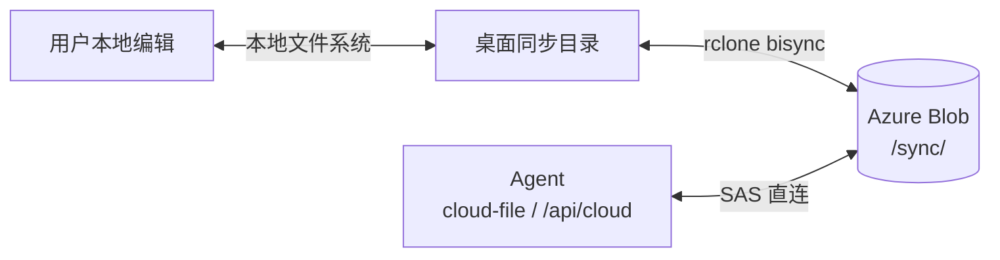
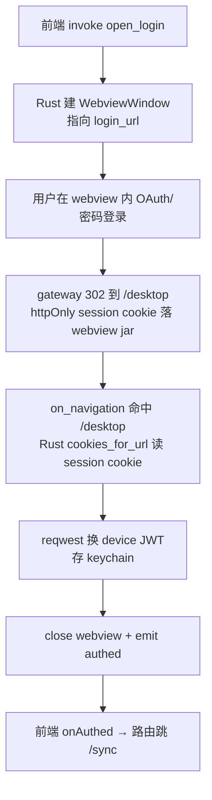
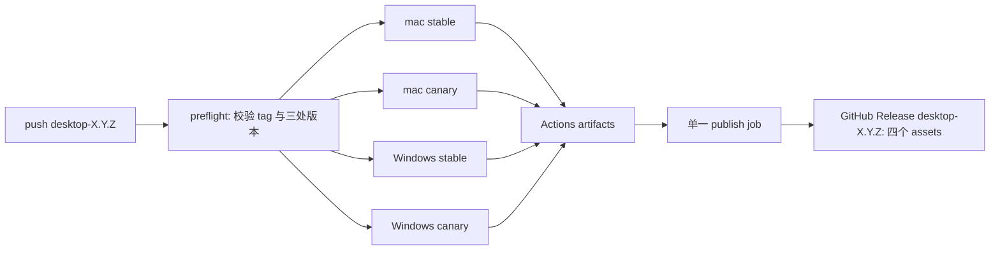

# 用户数据同步盘（Tauri 客户端 + gateway，双向）

> Status: **同步引擎 + 前端产品化外壳 + 安全同步目录切换/同卷迁移 + home/sync 三窗口拆分 + 桌面 Google OAuth（系统浏览器 + deep link）+ 系统托盘/后台常驻 + dev/canary/stable 三渠道已完成并本地编译验证通过；macOS stable/canary universal `.dmg` 已本地构建并验证免费 ad-hoc 签名；`desktop-<semver>` tag 触发的四包 GitHub Release 工作流已实现、待首次 GitHub runner 验证；无摩擦的公开分发/单实例/P2 数据语义加固待做**
> 技术栈：Tauri（Rust + React）+ rclone `bisync` + gateway + Azure Blob User Delegation SAS。
> 最后更新：2026-07-14（本轮新增：同步目录不再允许任意替换；只允许改用严格空目录，或用同卷原子 `rename` 移动整个目录。目录操作串行化，先经有确认的控制通道强制完成一轮**非 resync** 同步，再等待在途 rclone 结束；初始基线尚未建立时拒绝修改目录。`config.json` 以 `pending_move` 日志覆盖 rename 与配置提交之间的崩溃窗；启动时自动恢复无歧义状态，歧义状态进入 NeedsAttention。设置页新增强风险确认框。新增 Rust 目录/日志/控制通道单测；Rust app feature 85 tests、desktop tsc、Rust clippy 通过。真实 rclone 目录迁移尚待真机验证）。

---

## 0. 当前结论

同步盘的**技术核心已成立**：同一个 `<user_id>/sync/` 命名空间可被 Agent、桌面客户端、本地用户双向读写，并通过 rclone `bisync` 收敛。

已真机闭环：

| 核心诉求 | 状态 | 证据 |
|---|---:|---|
| Agent 产出 → 用户机器查看 | ✅ | 真 hermes 容器用 `cloud-file put` 写 `sync/agent-hello.txt`；桌面 poller 发现后 bisync 下行，内容一致 |
| 用户本地文件 → Agent 可读 | ✅ | 本地 `~/Desktop/sync/hello-laifu.txt` 经 bisync 上行到 `59419b16-…/sync/`；`cloud-file ls sync/` 可列出 |
| rclone 消费 `sr=d` 目录 SAS | ✅ | `stlingxidev` HNS 账户活 Azure 冒烟 8/8 通过 |
| agent 上传 mtime 兼容 | ✅ | 真 hermes 容器上传 metadata 带 `mtime`，`source=agent` |
| 桌面 Google OAuth（系统浏览器 + deep link 回流） | ✅ | 真机点击验证：`home` 窗口发起 → 系统浏览器登录 → `laifu://` deep link 拉起 app → 换设备 JWT + `home` 窗口种 cookie，双端同步变已登录 |

前端产品化外壳（§9.1 前两阻断项）已实施完成：真实登录 webview + 原生目录选择，全新技术栈重写（见 §9）。桌面 app 启动默认展示 web 首页（`home` 窗口，见 §9.7，启动展示已真机验证；`sync` 壳唤出/免二次登录仍是 `[INFERENCE]` 待验证）。桌面 Google 登录改走系统浏览器 + deep link 回流（见 §9.8，全链路真机验证通过）。

**仍未做**：系统托盘/后台常驻已实施但未真机验证（见 §9.9，含 macOS `Cmd+Q` 拦截存疑的已知上游限制）、单实例、无摩擦的正式打包分发（Developer ID 签名 + 公证、Windows 原生安装包与 CI 矩阵）、P2 数据语义加固（冲突/删除安全/中断恢复）。

---

## 1. 需求边界：为什么必须双向

同步盘解决两条方向相反的数据流：

1. **Agent 产出 → 用户查看**
   Agent 通过云盘产生 Office 等专业文件。我们不做高还原度在线预览，而是把文件同步到用户机器，由本机 Office/专业软件打开。

2. **用户数据 → 喂给 Agent**
   用户把文件丢进本地同步目录，自动上行到 Azure Blob；Agent 随后用现有 `cloud-file` / `/api/cloud/*` 链路读取。

因此单向同步不满足需求，双向是硬约束。

---

## 2. 最终架构



关键约束：

- 存储后端是 Azure Blob，租户隔离靠 `<user_id>/` 前缀。
- 同步范围固定为 `<user_id>/sync/`，避免把 Agent 临时产物灌进用户机器。
- gateway 只签 **User Delegation SAS**，账户密钥不出 gateway。
- SAS 授权仍签 `<user_id>/`，客户端 rclone 只同步其下 `sync/` 子树。
- Agent 要给用户看的文件必须写到虚拟路径 `sync/...`。

---

## 3. 已落地实现

### 3.1 gateway

| 能力 | 文件 | 状态 |
|---|---|---:|
| session cookie → 长效设备 JWT | `apps/gateway/src/api/device-token.ts` | ✅ |
| `/api/cloud/list` 双鉴权（session 或 Bearer JWT） | `apps/gateway/src/api/cloud.ts` | ✅ |
| gateway upload 写 rclone 兼容 `mtime` metadata | `apps/gateway/src/api/cloud.ts` | ✅ |
| device-token / cloud 双鉴权测试 | `apps/gateway/test/api/*.test.ts` | ✅ |

`POST /api/auth/device-token`：鉴权 `requireSession`；`session.user_id` → `getTokenVersion` → `signLaifuUserToken`；JWT shape 与容器 token 相同，90 天有效期，续期复用 `POST /api/auth/refresh-token`。`/api/cloud/sas` 天然接受该 Bearer JWT。

`GET /api/cloud/list`：web 用 session cookie；桌面 poller 用 Bearer JWT（避免 7 天 session 过期导致长期同步中断）。

### 3.2 desktop Rust core

| 模块 | 文件 | 状态 |
|---|---|---:|
| wire 契约镜像 | `contracts.rs` | ✅ |
| gateway HTTP client | `gateway.rs` | ✅ |
| keychain 存设备 JWT | `auth/keychain.rs` | ✅ |
| JWT 续期判定 | `auth/refresh.rs` | ✅ |
| SAS 缓存 / 过期前刷新 / 403 强刷 | `sas.rs` | ✅ |
| rclone config / `sync/` remote path | `sync/rclone_config.rs` | ✅ |
| bisync 命令编排 / 403 重试 | `sync/engine.rs` | ✅ |
| 本地 watcher / 远端 poller | `sync/watcher.rs` / `sync/poller.rs` | ✅ |
| Tauri commands + 登录 webview + 目录对话框 | `app/`（`mod.rs`/`core.rs`/`window.rs`/`auth_commands.rs`/`sync_commands.rs`/`tasks.rs`） | ✅ |

当前 rclone 参数：

```text
rclone bisync laifu:<container>/<user_id>/sync <local_dir> \
  --resilient --recover --max-lock 2m \
  --conflict-resolve newer \
  --compare size,modtime \
  --max-delete 50 \
  [--resync 首次]
```

注意：`--max-delete 50` 在 bisync 语义下是 50%，不能写 `50%`（见 §5.3）。

### 3.3 desktop 前端（已产品化重写，见 §9）

| 视图 | 文件 | 状态 |
|---|---|---:|
| 登录页（点按钮开 webview，无需 cookie） | `src/routes/Login.tsx` | ✅ |
| 同步状态 | `src/routes/Sync.tsx` | ✅ |
| 设置页（原生目录选择 + 登出） | `src/routes/Settings.tsx` | ✅ |
| 布局/守卫 + 路由表 | `src/routes/AppLayout.tsx` / `src/router.tsx` | ✅ |
| atom 状态层 | `src/state/{auth,sync,settings}.atom.ts` | ✅ |
| IPC 封装 | `src/lib/ipc.ts` | ✅ |

### 3.4 hermes / agent cloud-file

| 能力 | 文件 | 状态 |
|---|---|---:|
| `cloud-file put` 支持任意 virtual_path | `docker/hermes/skills/cloud/cloud_file/cli.py` | ✅ |
| agent upload 写 `mtime` metadata | `metadata.py` | ✅ |
| metadata 测试 | `docker/hermes/skills/cloud/tests/test_metadata.py` | ✅ |

Agent 下发给用户的文件必须用 `sync/...` 路径：`cloud-file put /tmp/agent-hello.txt sync/agent-hello.txt`。

---

## 4. 验证结果

### 4.1 自动化验证

```bash
# gateway
pnpm --filter @lingxi/gateway test device-token auth-refresh cloud

# atom 包
pnpm --filter @lingxi/atom build

# desktop Rust core（默认 + app feature）
cd apps/desktop
cargo test --manifest-path src-tauri/Cargo.toml --features app
cargo clippy --manifest-path src-tauri/Cargo.toml --all-targets -- -D warnings
cargo clippy --manifest-path src-tauri/Cargo.toml --features app --all-targets -- -D warnings
cargo build --manifest-path src-tauri/Cargo.toml --features app

# desktop frontend
pnpm --filter @lingxi/desktop lint   # tsc --noEmit
```

最近确认（2026-07-10）：Rust app feature `56/56` 通过（连跑 5 次确定性稳定）；desktop `tsc` 零错误；atom 包构建产 dist；web lint 零回归（53 个预存测试债不变）。

### 4.2 rclone + Azure SAS 冒烟

环境：`stlingxidev`，HNS=true，rclone v1.74.4。结果 **8/8 全过**：`sr=d`+`sdd=1` 目录 SAS 在 Blob API 端点可用；copy 上/下行内容一致；lsf 可列；越权隔离有效；`bisync --resync` 建基线；增量同步；本地新增可上行。

### 4.3 真实双向闭环

用户侧账号 `59419b16-403a-4c9c-9559-4430eced6fd6`。

- 上行：本地 `~/Desktop/sync/hello-laifu.txt`（102B）→ 远端 `59419b16-…/sync/`，`cloud-file ls sync/` 可列。
- 下行：agent 上传 `sync/agent-hello.txt`（156B，`source=agent`，带 mtime）→ poller 发现 → bisync 下行 → 本地内容一致。

### 4.4 真机 UI 联调（2026-07-13 更新）

已用 `cargo tauri build --features app --debug --bundles app` 产出真实 `.app` 双击验证：

- ✅ 桌面 Google OAuth 全链路：系统浏览器登录 → 桥接页真人点击 → deep link 拉起 app → 设备 JWT + `home` 窗口 cookie 双落地。
- ✅ `Info.plist` 正确带 `CFBundleURLSchemes: ["laifu"]`；二进制核实运行时默认值仍是 `localhost`，未误连生产。
- ✅ `home` 窗口启动即展示 web 首页（默认视图落地）。

**仍未在真实窗口跑过**：
- 系统菜单「同步盘 → 打开同步盘」唤出/聚焦 `sync` 窗口的实际交互。
- 原生目录对话框弹出与选择。
- 黑白主题在 WKWebView 的渲染。
- HashRouter 在 Tauri 协议下的路由行为。
- 先在 `home` 登录、再点系统菜单唤出 `sync` 壳是否真免二次登录（§9.7 提到的 cookie 跨 WebviewWindow 共享，目前仍是 `[INFERENCE]`）。

---

## 5. 已知不变量与踩坑记录

后续维护必须保留的知识。

### 5.1 User Delegation SAS 权限不变量

```text
有效权限 = SAS 权限位 ∩ 签 UDK 主体的数据面 RBAC
```

踩坑：本地 MSA 账号能签 UDK，但没有 `stlingxidev` 数据面角色，导致 rclone/SDK 都报 `AuthorizationPermissionMismatch`。授 `Storage Blob Data Contributor` 后恢复。

生产核对：线上 gateway 是 App Service `app-lingxi-dev-gateway`，SystemAssigned principalId `166a231c-44c9-4dc9-bb4d-556b97ece564`，在 `stlingxidev` 上已有 `Storage Blob Data Owner`，无需改动。

### 5.2 rclone `sr=d` SAS 结论

源码与活 Azure 双重确认：rclone `azureblob` 从 `sas_url` path 取 container，不依赖 `sr`；Azure Go SDK 重建 query 保留 `sr=d`/`sdd=1`；`skt/ske` 与 gateway 秒级 UTC 格式一致，签名不因往返重建失效；mtime metadata key 是 `mtime`（RFC3339）。

### 5.3 `--max-delete` 写法

`--max-delete 50%` 会被 rclone 按 int 解析直接 fatal，bisync 不启动。正确写法是裸数字 `--max-delete 50`，bisync 语义下表示百分比。

### 5.4 poller 必须带 `prefix=sync/`

gateway `/api/cloud/list` 用 `listBlobsByHierarchy('/')` 只列一层。不带 prefix 只看到 `sync/` 文件夹、`files=[]`；必须 `GET /api/cloud/list?prefix=sync/` 才列出真文件，否则远端新增永不触发下行。

### 5.5 登录 session cookie 是 httpOnly（决定登录方案选型）

gateway session cookie（`auth/session.ts` `sessionCookieOpts`）是 `httpOnly: true`，页面 JS 读不到。因此"前端读 `document.cookie` 回传"方案不可行。改用 **native cookie 读取**：Rust `WebviewWindow::cookies_for_url()` 能读回 httpOnly cookie（wry WKWebView 后端保留 httpOnly 标记，已核实 tauri 2.11.5 / wry 0.55.1 源码）。详见 §9.4。

### 5.6 dev hermes token 注入

生产容器通过 provisioning 注入 `LAIFU_USER_TOKEN`。dev 裸起容器不带该 env，entrypoint 兜底读 `~/.hermes/.laifu_user_token`（宿主挂载 `~/.hermes-dev/.hermes/.laifu_user_token`）。换用户或 token 失效时重写该文件并重启 hermes 容器。

### 5.7 本地数据目录统一收拢到 `~/.laifu/`（2026-07-13）

桌面 app 运行期非机密本地写入此前散落两处：Tauri `app_config_dir()`（macOS `~/Library/Application Support/com.lingxi.desktop/config.json`）+ 系统 temp 目录（`std::env::temp_dir().join("lingxi-desktop")` 下的 `rclone.conf` / `_cloud_sas.json`，且该 temp 目录多用户共享、无隔离）。已改为统一落在**系统 home 目录**（`dirs::home_dir()`，macOS `/Users/x` / Windows `C:\Users\x`）下的单一目录 `~/.laifu/`：

- `~/.laifu/config.json`：同步目录选择（原 `persist.rs`，逻辑不变，仅路径来源换掉）。
- `~/.laifu/rclone.conf`：rclone `azureblob` remote 配置（含 SAS URL，不含账户密钥）。
- `~/.laifu/_cloud_sas.json`：SAS 缓存。

实现：`app/core.rs` 用 `static LAIFU_HOME: LazyLock<PathBuf>` 替换原先依赖运行时 `AppHandle` 的 `OnceLock<PathBuf>` + `setup()` 注入（规则 rs-lazylock：初始化器声明期已知，不需要分离的 `get_or_init`/运行时注入路径）。`spawn_sync_orchestrator` 的 `work_dir` 与 `config_dir()` 现指向同一 `~/.laifu/`。

OS Keychain 中的设备 JWT（`com.lingxi.desktop` service）不受影响——机密凭据本就该留在系统安全存储，不适合挪进普通目录。

### 5.8 `sync` 壳自定义命令缺 ACL 声明（2026-07-13）

2026-07-13 当时的 8 个命令（含旧 `pick_sync_dir`/`set_sync_dir`）从未声明过 `permissions/*.toml`，真机点击登录直接报 `"open_login not allowed. Command not found"`。根因与 §9.8 踩过的 `open_oauth_in_browser` 坑同源：Tauri v2 对自定义 command 从不自动放行（`core:default` 只覆盖内置 core 命令），必须显式建 permission 文件 + 在 capability 里引用。

修复时新增 `permissions/app-commands.toml`（`allow-app-commands`）并在 `capabilities/default.json`（覆盖 `home`/`sync`/`login` 三窗口）引用。2026-07-14 的安全目录改造已把 ACL 清单同步替换为 §5.11 的四个受限目录命令；旧命令已删除。`cargo build` 后 `gen/schemas/acl-manifests.json` 的 `__app-acl__` 下可见该权限项。

真机验证：修复后用户实测 `home` 窗口与 `sync` 壳均登录成功，且 `sync` 壳登录时未见到登录表单（一闪而过）——间接证实了 §9.7 标记 `[INFERENCE]` 的"跨 `WebviewWindow` 共享 cookie jar → 免二次登录"确实成立（前提：先在 `home` 完成登录）。

### 5.9 窗口 size/position 记忆（手写实现，未装插件；2026-07-13 初版，2026-07-13 修复单位 bug）

`home`/`sync` 两个主窗口会记住上次关闭时的大小和位置，重开恢复到该尺寸；未选过则用默认值（`home` 1280×800，`sync` 720×520）。`login` 窗口（登录 webview，生命周期通常极短）不接这套逻辑，固定 480×640。

**未用 `tauri-plugin-window-state`**：该插件功能对等但引入新依赖 + 插件 ACL 声明 + 落盘位置在 Tauri 默认 `app_config_dir()`（不受我们 `~/.laifu/` 收拢约束，插件不支持自定义路径）。手写实现只需 Tauri 内置的 `WebviewWindow::on_window_event` + `inner_size`/`outer_position`/`set_size`/`set_position`，无需额外依赖：

- `window_state.rs`（纯逻辑 + IO，同 `persist.rs` 套路）：`WindowGeometry { width, height, x, y }`（物理像素），`WindowStateMap`（按 label 索引），落 `~/.laifu/window_state.json`，原子写（tmp + rename）。
- `app/window.rs` `attach_hide_on_close()`：给 `home`/`sync` 挂 `on_window_event`，在 `WindowEvent::CloseRequested`（拦截关闭、转隐藏，见 §9.9）这一刻读一次 `inner_size()`/`outer_position()` 落盘。

**踩坑（已修复）：建窗期塞的是逻辑像素，存档是物理像素，单位对不上**。`WebviewWindowBuilder::inner_size(w, h)` / `position(x, y)` 的文档明确是**逻辑像素**（"Window size in logical pixels" / "position ... in logical pixels"，见 `tauri-runtime` `WindowBuilder` trait），但 `attach_hide_on_close` 存档用的是 `WebviewWindow::inner_size()`/`outer_position()`，二者返回的是 **`PhysicalSize`/`PhysicalPosition`**（物理像素）。初版实现把存档的物理像素原样喂给建窗 builder 的逻辑像素参数——在 Retina/高 DPI 屏（`scale_factor=2`）下，窗口的物理尺寸变成"存档物理宽高 × 2"，即面积变 4 倍，正是用户反馈的"重开尺寸偏大"；位置同理错位，多显示器下（各屏 `scale_factor` 可能不同）更明显。

修复：不再用 builder 的 `.inner_size()`/`.position()`（逻辑像素）恢复存档，改为 `apply_saved_geometry()`——建窗（用固定默认逻辑尺寸）后，若有存档则用 `WebviewWindow::set_size(PhysicalSize::new(w, h))` + `set_position(PhysicalPosition::new(x, y))` 恢复，与存档单位（物理像素）严格对齐，不经过任何隐式换算。

**多显示器**：`WindowGeometry` 目前仍只存宽高 + 坐标，不单独记"所在显示器"，但 `apply_saved_geometry()` 恢复前会用 `WebviewWindow::available_monitors()` 取当前系统各显示器的物理像素范围，调用 `window_state::geometry_visible()` 校验存档矩形是否与至少一个当前显示器有重叠——存档时窗口所在的副屏若已拔掉（或换了台没有那块屏幕的机器），存档坐标会落在所有当前显示器范围之外，此时判定不可见、放弃存档，保留 builder 的默认尺寸 + OS 默认位置，避免窗口开到看不见的地方。查询显示器失败或返回空列表时默认信任存档（不因查询失败误伤单显示器场景）。单测覆盖：单显示器内可见、跨两屏部分重叠可见、副屏消失后不可见、查询失败降级信任。

`WebviewWindow` 已确认是 `Clone`（内部 `Window`/`Webview` 句柄语义），闭包捕获窗口克隆读当前几何即可，不需要任何锁。

### 5.10 `tokio::sync::watch::Sender::send()` 在零订阅者时静默丢值（2026-07-13）

**症状**：桌面 app 重启后（含真机走完登录），设置页「本地同步目录」显示"未选择"，即使 `~/.laifu/config.json` 里 `sync_dir` 字段一直是上次选的真实路径——用户需要重新点一次「选择目录」才能恢复同步，看起来像是持久化没生效。

**根因**：`app/core.rs` `AppCore::new()` 建 channel 时只留 `Sender`（`watch::channel(None).0`），配对 `Receiver` 立即丢弃；真正的订阅者 `spawn_sync_orchestrator`（`app/tasks.rs` 的 `sync_dir_tx.subscribe()`）是在 `setup()` 之后才异步 spawn、且还要等 `restore_from_keychain().await` 完才跑到订阅那行。而 `app/mod.rs` `setup()` 里恢复持久化目录用的是 `sync_dir_tx.send(Some(dir))`——tokio 文档原话："This method fails if the channel is closed... when send fails, the value isn't made available for future receivers"，具体到源码 `Sender::send()`：`receiver_count() == 0` 时直接 `return Err(...)`，**跳过 `send_replace`，压根不写内部值**。原实现 `let _ = ...send(...)` 把这个 `Err` 吞掉，于是恢复的目录从未真正进入 channel，`sync_dir_tx.borrow()`（`get_sync_dir` 读的就是它）永远是初始值 `None`。`sync_commands::set_sync_dir` 命令原先也用同一个有 hazard 的 `send()`——虽然运行时该命令触发时编排器早已订阅（不复现），但语义上同样脆弱，一并改掉。

**修复**：启动恢复逻辑与当时的旧 `set_sync_dir` 都改为 `Sender::send_replace()`——无条件写值、不检查订阅者数，保证后来才订阅的编排器可见。旧 `set_sync_dir` 已在 §5.11 删除；新的目录操作在提交配置后仍使用相同的 `send_replace` 语义。

**教训**：`watch::Sender::send()` 不是"广播型 setter"，是"通知型 setter"——没人听就不存。任何"启动时预先灌入初始值，消费者稍后才订阅"的场景一律用 `send_replace`/`send_modify`/`send_if_modified`，`send()` 只适合"消费者一定已经在等"的运行期更新。

### 5.11 同步目录只能改用空目录或同卷移动（2026-07-14）

此前 Settings 页的 `set_sync_dir(dir)` 可把任何目录直接落盘并通过 `watch` 热切换；非空目录会与远端 `--resync` 数据混合，且旧 rclone 运行尚未结束时便可能触发新会话，存在覆盖或混乱风险。现已删除该通用命令，并将前端 ACL 收紧为：`pick_empty_sync_dir` / `configure_empty_sync_dir` 和 `pick_sync_move_destination` / `relocate_sync_dir`。

- **改用空目录**：Rust 会对候选目录 `canonicalize`，拒绝非目录、包含任意项目（含 `.DS_Store`）、与当前目录相同或父子嵌套；在真正提交前再次校验，防止用户确认期间目录被写入。旧目录不移动、不删除，但停止同步；新会话以 `--resync` 从远端重建基线。
- **移动到新位置**：用户选择目标**上级目录**，新根固定为 `<目标上级>/<旧目录名>`，且目标不得存在；只调用一次 `std::fs::rename`，因此只支持同一磁盘/卷。跨卷或权限错误不会退化为递归复制，旧目录和配置保持原样。旧同步根若是符号链接会直接拒绝，避免把链接指向的真实目录移走、留下悬空链接。
- **同步收敛与互斥**：目录操作先通过 `SyncControl::Flush` 请求编排器完成一轮**正常** bisync；结果不是 Success 则操作失败，绝不带着未收敛的本地改动进入路径变更。若当前会话还在 `--resync` 建立初始基线，也拒绝操作而非拿 resync 结果当最终同步。之后 `AppCore` 的 operation `Mutex` 串行请求，公平 `RwLock` 等待在途 rclone 结束并阻止旧路径再启动；`tasks.rs` 在取得读锁前后检查 `watch` 版本。
- **崩溃恢复**：移动前把 `{ from, to }` 写入 `config.json.pending_move`；rename 后再提交 `sync_dir`。启动恢复中，只有“旧在新不在”或“旧不在新在”两种状态会自动收敛；两个路径同存或同失时保留日志并进 `NeedsAttention`，绝不猜测。
- **UX**：配置后显示「改用空目录」与「移动到新位置」两项，选择后必须在包含旧/新路径和后果的 AlertDialog 中勾选确认才可提交；跨卷移动的限制与中断后不应手动删除目录的提示均显式展示。

验证：`cargo test --manifest-path apps/desktop/src-tauri/Cargo.toml --features app` 85/85 通过；`cargo clippy --manifest-path apps/desktop/src-tauri/Cargo.toml --features app --all-targets -- -D warnings` 通过；`pnpm --filter @lingxi/desktop lint` 通过。仍须真机覆盖：同步进行时操作、空目录下载、同卷移动后的双向同步、跨卷拒绝、以及 rename 后配置提交前中断的启动恢复。

---

## 6. 本地开发 runbook

登录 webview 需要 gateway(:9000) + web 前端(:3000) 同时在跑，否则点登录会开窗但换不到 token。

### 6.1 gateway / storage

```bash
cd ~/Desktop/laifu

# 本地 dev 必须使用 HNS 账户
sed -i '' 's/^AZURE_STORAGE_ACCOUNT=.*/AZURE_STORAGE_ACCOUNT=stlingxidev/' apps/gateway/.env.local

az login
az storage account show -n stlingxidev --query isHnsEnabled -o tsv  # 应为 true

scripts/dev-db.sh start
pnpm dev:gateway   # :9000
pnpm dev:web       # :3000（另一终端；登录 webview 默认指向这里）
```

### 6.2 desktop

```bash
pnpm desktop:fetch-rclone   # 首次：按当前 host 拉固定版本 rclone sidecar 到 binaries/
pnpm dev:desktop
```

**无需再手带 `LINGXI_RCLONE_BIN`**：`rclone_bin_path()`（`app/tasks.rs`）在 dev 构建下按编译期 `CARGO_MANIFEST_DIR` + target-triple 自动定位仓库内 `binaries/rclone-<triple>`（覆盖 macOS/Windows 的 x86_64/aarch64）。仅在需临时指定时才设该 env（优先级最高）。

可选覆盖 env：`LINGXI_GATEWAY_URL`（默认按渠道，临时调试可改）、`LINGXI_LOGIN_URL`（默认按渠道）、`LINGXI_SESSION_COOKIE`（默认 `lingxi_sid`）。`LINGXI_HOME_URL` **不支持覆盖**：`home` 是可调用 native OAuth command 的远程页面，其 origin 必须是 `capabilities/home-remote.json` 中经审计的静态 ACL 白名单；首页 URL 只能由编译期渠道决定。

### 6.3 hermes agent

改了 `docker/hermes/skills/**` 后 rebuild：

```bash
docker build -t hermes-probe docker/hermes/
pnpm dev:hermes
```

确保 dev token 文件存在且属于目标用户：`~/.hermes-dev/.hermes/.laifu_user_token`。

---

## 7. 当前工程结构

```text
packages/atom/                   # @lingxi/atom：零框架依赖状态库（web + desktop 共用）
├── package.json                 # React 作 peerDependencies
└── src/{index.tsx,unit.ts,external.ts}

apps/desktop/
├── package.json                 # @lingxi/desktop
├── components.json              # shadcn 配置
├── vite.config.ts               # @tailwindcss/vite + @/ alias
├── src/
│   ├── main.tsx                 # WithStore + RouterProvider
│   ├── index.css                # Tailwind v4 + 黑白主题 tokens
│   ├── router.tsx               # react-router v7 路由表（HashRouter）
│   ├── lib/{ipc.ts,contracts.ts,utils.ts}
│   ├── components/ui/           # shadcn 组件（button/card/input/label）
│   ├── state/{auth,sync,settings}.atom.ts
│   └── routes/{Login,Sync,Settings,AppLayout}.tsx
└── src-tauri/
    ├── Cargo.toml
    ├── tauri.conf.json
    ├── capabilities/default.json  # 前端 invoke + event listen 的 ACL 授权
    ├── binaries/                  # rclone sidecar，不进 git
    └── src/
        ├── app/                 # Tauri 装配 + commands + orchestrator（mod.rs 入口 + core/window/auth_commands/sync_commands/tasks）
        ├── contracts.rs / gateway.rs / sas.rs
        ├── auth/ 和 sync/{engine,poller,rclone_config,watcher}.rs
```

结构性决策：

- Rust crate 独立放在 `apps/desktop/src-tauri/`，不在根加 Cargo workspace。
- Rust wire 契约手写 serde 镜像，不做 codegen。
- rclone 二进制作为 Tauri sidecar，不进 git，通过 `scripts/fetch-rclone.sh` 获取。
- atom 状态库提为独立包 `packages/atom`（不进 `packages/shared`，避免给 gateway 后端拉入 React/JSX）。

---

## 8. 剩余工作

### 8.1 P3 产品化外壳（前两阻断项已完成，余下）

| 项 | 状态 | 说明 |
|---|---:|---|
| 真实登录 webview | ✅ | 见 §9.4 |
| 原生目录选择 / 安全目录切换 | ✅（编译+单测）/ ⬜（未真机） | 严格空目录改用 + 同卷原子移动 + 崩溃日志，见 §5.11 / §9.5 |
| home/sync 三窗口拆分 | ✅（编译）/ ⬜（部分真机） | 见 §9.7；启动展示已验证，`sync` 唤出/免二次登录待验证 |
| 桌面 Google OAuth（系统浏览器 + deep link） | ✅ | 见 §9.8，真机验证通过 |
| 系统托盘 / 后台常驻 | ✅（编译+单测）/ ⬜（未真机验证） | 见 §9.9；`home`/`sync` 关窗隐藏、托盘显示/退出、Dock 重新激活；单实例仍缺（见下一行「插件接线」） |
| dev/canary/stable 三渠道 | ✅（编译+打包验证）/ ⬜（未真机走登录闭环） | 见 §11 |
| 插件接线 | ⬜ | `app/mod.rs` 现为 no-op `tauri_plugin_shell_stub`；替换为 autostart / notification / single-instance / updater |
| 打包分发 | 🟡（macOS universal + GitHub workflow 已本地验证）/ ⬜（GitHub runner + Windows 真机 + 无提示公开分发） | `desktop-release.yml` 已在 `desktop-<semver>` tag 上编排四包；stable/canary universal `.dmg` 已本地验证主程序/sidecar 双架构、签名和渠道注册。Windows x64 NSIS job 及最终 GitHub Release 尚未真实执行；无 Developer ID/公证或 Windows 证书，下载用户仍须 Gatekeeper/SmartScreen 手动放行。**只考虑 macOS + Windows，不做 Linux** |
| 同步状态/错误 UX 深化 | ⬜ | 最近同步时间、文件级进度、冲突列表、NeedsResync 操作 |

### 8.2 P2 同步语义加固

关注数据正确性与异常恢复，不是产品外壳。建议优先级：冲突 → 删除安全 → 中断恢复（三者直接影响数据丢失风险）。

| 项 | 目标 | 验收 |
|---|---|---|
| 冲突 | Agent 与用户同时改同一文件 | 无数据丢失；败者留冲突副本；UI 可见 |
| 删除安全 | 一侧删除传播到另一侧 | 正常删除可传播；大批量超 `--max-delete 50` 时 abort 并提示 |
| 中断恢复 | sync 中断网/杀 rclone | `--resilient --recover` 自动恢复；否则进 NeedsAttention |
| mtime 混合比较 | agent/gateway/rclone 三类写入混合 | 不重复上传、不漏同步、不产生无意义冲突 |
| 大文件 / 长同步 | 单次 sync 接近或超 SAS TTL | 403 后刷新 SAS 并重跑；必要时调大 TTL 或分批 |
| desktop source 标记 | 本地上行文件可识别来源 | 若 rclone 支持 metadata-set 写 `source=desktop`；否则记录缺省策略 |

### 8.3 基本功能补测（产品化前必须覆盖）

Office 文件下行可本机打开 · 子目录结构保持 · 本地/远端 rename 行为 · 单文件删除传播 · 批量拖入不卡 UI · 接近 10MB 边界 · App 重启恢复（keychain JWT + 同步目录 + bisync 基线）。

---

## 9. 桌面前端技术栈（已实施）

用户决策（2026-07-10）：登录 webview 及整个 desktop 前端统一技术栈。以下为**已完成**的落地记录。

### 9.1 技术栈

| 关注点 | 选型 | 实装版本 |
|---|---|---|
| 主题 | 黑白格调（neutral 灰阶，oklch chroma=0，无彩色主色） | — |
| 组件 | shadcn/ui（new-york）+ radix-ui | 源码进 `components/ui/` |
| 不可变更新 | immer | ^11.1 |
| 图标 | lucide-react | ^1.24 |
| 样式 | Tailwind CSS v4（CSS-first，无 config 文件） | ^4.3 + `@tailwindcss/vite` |
| 路由 | react-router v7（单包） | ^7.18 |
| 构建 | vite | ^8.1 |
| 状态 | `@lingxi/atom`（自研，见 §9.2） | workspace |

### 9.2 atom 状态方案落位

`@lingxi/atom` 是零框架依赖（只依赖 react `useSyncExternalStore`）的自研状态库：`atom`（value/action/computed 三态）+ `WithStore` + `mutate`，配合 immer 做不可变更新。

**已提为独立包 `packages/atom`（方案 B）**，未进 `packages/shared`：shared 走 `tsc→dist`、被 gateway 后端依赖、无 React devDep，引入含 JSX 的 atom 会破坏其纯逻辑边界。迁移时清除了原代码全部 `any`（规则要求）：存在量化用 `unknown`、库内异构派发用带理由的 `as unknown as`、公共重载保持精确。React 作 `peerDependencies`，构建走 tsc（`jsx: react-jsx`）产 dist + d.ts。web 15 处引用（8 源码 + 7 测试）已切到 `@lingxi/atom`，旧 `apps/web/src/atom` 目录已删，web lint 零回归。

### 9.3 配置要点

- **Tailwind v4**：`@tailwindcss/vite` 插件 + `index.css` 顶部 `@import "tailwindcss";`，无 `tailwind.config.js`。黑白主题用 `@theme`/`:root`/`.dark` 的 oklch chroma=0 tokens；shadcn CSS 变量 base color 取 `neutral`。动画用 `tw-animate-css`。
- **shadcn**：`components.json` = `new-york` / `baseColor: neutral` / `cssVariables: true` / `aliases.components: @/components` / `aliases.utils: @/lib/utils`。组件源码手写进 `components/ui/`（环境无法跑 CLI，等价 CLI 产物）：button/card/input/label。
- **alias**：vite `resolve.alias['@'] = /src`，tsconfig `paths: { "@/*": ["src/*"] }`。
- **react-router v7**：`createHashRouter` + `RouterProvider`（Tauri 生产协议 `tauri://localhost` 下 hash 路由无需服务端 history，最稳）。路由：`/login`、`/`（守卫，未登录→`/login`）、`/sync`、`/settings`。

### 9.4 登录 webview + 命令契约

native cookie 读取路线（因 httpOnly，见 §5.5），全程 Rust 侧闭环：



要点：

- `open_login`（`app/auth_commands.rs`）建 `WebviewWindow` 指向 `login_url()`（默认 web 登录页，`LINGXI_LOGIN_URL` 可覆盖）；`on_navigation` 命中 `/desktop` 时用 `AtomicBool` 保证只触发一次 `complete_login`。
- `complete_login` 读 `cookies_for_url(gateway_base_url)` 找 session cookie（名对齐 `LINGXI_SESSION_COOKIE`，默认 `lingxi_sid`）→ `device_token()` 换 JWT → keychain → 关窗 → `emit("authed")`。
- JWT 不经主窗口前端 JS，最小暴露面。
- Tauri v2 需 `capabilities/default.json` 授权前端 invoke + `listen('authed')`。

命令契约（`app/auth_commands.rs` + `app/sync_commands.rs` + `lib/ipc.ts`）：

```text
- exchange_device_token(session_cookie) -> String       // 已删（httpOnly 下不可行）
+ open_login() -> ()                                     // 建登录 webview；成功后 emit "authed"
+ open_sync_window() -> ()                               // 唤出/聚焦 sync 窗口（系统菜单「同步盘」入口）
+ pick_empty_sync_dir() -> Option<String>                // 选择空目录候选
+ configure_empty_sync_dir(dir) -> ()                    // Rust 严格校验后切换
+ pick_sync_move_destination() -> Option<String>         // 选择移动目标上级目录
+ relocate_sync_dir(destination_parent) -> ()            // 同卷原子移动
  logout() / is_authed() / get_sync_dir() / get_sync_status() // 保留
```

### 9.5 原生目录选择与安全切换

目录选择仍用 `tauri-plugin-dialog` 的 `blocking_pick_folder()`（放 blocking 线程避免卡 UI），但 IPC 不再暴露通用 setter。首次配置或「改用空目录」只允许候选目录为空；已有同步目录还可选择上级目录并走 `relocate_sync_dir`，由 Rust 写迁移日志、同卷 `rename`、再重新建立 `bisync` 基线。Settings 页在执行前显示不可轻视的 AlertDialog，必须勾选风险确认；详细不变量见 §5.11。

### 9.6 开放项 / 待真机验证

- `on_navigation` 对真实 OAuth 302 链的触发粒度、跨端口（web:3000 登录 / gateway:9000 换 token）cookie 读取——阶段 4 首验点。
- react-router v7 在 Tauri 协议下 history 行为（已用 HashRouter 规避）。
- vite 8.1 × tailwind4 × `@tailwindcss/vite` 版本互容（首次 `dev` 确认）。


### 9.7 home / sync 三窗口拆分（已实施，2026-07-13）

桌面 app 启动即展示 **web 首页**（`home` 窗口，`WebviewUrl::External(home_url())`，默认 `http://localhost:3000/`），走 web 自己的一整套鉴权（React Router `/login` ↔ `/desktop`，httpOnly session cookie，`credentials: 'include'`）——不经 Rust，不需要 device JWT。

原生 Login/Sync/Settings 壳（现有 dist 前端，`react-router` HashRouter + Tailwind + shadcn）挪到独立的 `sync` 窗口，默认不弹出，经系统菜单「同步盘 → 打开同步盘」（`open_sync_window` 命令，`app/mod.rs` `.menu()`/`.on_menu_event()`）按需唤出或聚焦已存在的窗口。`sync` 壳内部的登录/JWT/keychain/rclone 编排逻辑完全不变。

**登录状态复用机制**：同一 Tauri app 内的多个 `WebviewWindow` 默认共享持久化 cookie 存储（未配置 ephemeral/incognito data store）。用户在 `home` 窗口走 web 自己的登录流程种下 `lingxi_sid` httpOnly cookie 后，若之后才点「打开同步盘」触发 `sync` 壳的 `open_login`，登录 webview 会因 cookie 已存在而被 gateway 直接 302 到 `/desktop`，`on_navigation` 立即命中并自动换 device JWT——**用户不需要在 `sync` 壳里重新走一遍登录**。反之亦然：先在 `sync` 壳登录，`home` 窗口刷新/重开也会带着同一份 cookie。

`tauri.conf.json` 不再声明式定义窗口（`app.windows: []`）；`home`/`sync`/`login` 三个窗口均在 `app/mod.rs` `setup()`/`app/auth_commands.rs` `open_login`/`app/sync_commands.rs` `open_sync_window` 中以 `WebviewWindowBuilder` 程序化创建。`capabilities/default.json` 的 `windows` 字段同步扩到三者。

**待真机验证**：
- 上述"cookie 存储跨 `WebviewWindow` 共享"是 `[INFERENCE]`（基于 wry/WKWebView 默认语义，代码未覆盖为 ephemeral store，但未跑过真机验证）——需要真机走一遍"先在 home 登录，再点同步盘菜单"确认 `sync` 壳免二次登录。注意这跟 §9.8 已验证的"设备 JWT → session-code → `home.navigate()` 种 cookie"是**不同**的路径（后者是 Rust 主动导航 webview 拿到 Set-Cookie，前者是"指望两个 WebviewWindow 天生共享同一个 cookie 存储"，仍未证实）。
- 系统菜单在打包后的 macOS/Windows 外观、以及 `home` 窗口关闭时是否应连带退出整个 app（当前默认行为：任意窗口关闭不影响其它窗口/进程，`home` 关闭不会杀 `sync` 或后台同步 task，反之亦然）。

### 9.8 Google OAuth 走系统浏览器 + deep link 回流（已实施，2026-07-13）

Google 禁止在内嵌 WebView 里走 OAuth 授权（报 "This browser or app may not be secure"）。`home` 窗口里的「使用 Google 登录」按钮在 Tauri 环境下（`isTauri()`）不再同页跳转，改 `invoke('open_oauth_in_browser', { provider: 'google' })` 打开系统默认浏览器；普通浏览器访问 web 仍走原同页跳转 `/api/auth/google/start`（`apps/web/src/auth/LoginPage.tsx`）。

`home` 窗口加载的是**远程** web 首页（不是 bundled 前端资源）。Tauri v2 对自定义 `#[tauri::command]`（非 core、非插件命令）**从不自动放行给任何 window，本地还是远程都一样**——必须显式建一个「permission 文件」声明 `commands.allow`，再在 capability 里引用该 permission，capability 才生效（`core:default` 只覆盖 Tauri 内置的 core 命令，跟自定义 command 完全无关，之前一度以为加它能解决，是走了弯路）：
  - `permissions/open-oauth-in-browser.toml`：`[[permission]] identifier = "allow-open-oauth-in-browser"` + `commands.allow = ["open_oauth_in_browser"]`。
  - `capabilities/home-remote.json`：`windows: ["home"]`，`remote.urls` 列 `http://localhost:3000/*` / 生产域名，`permissions: ["allow-open-oauth-in-browser"]`（引用上面那个 permission 的裸 identifier，app 自身命令不加前缀，插件命令才需要 `<plugin>:` 前缀）。
  - 漏了 permission 文件或 capability 引用会在前端报 `invoke` 的 `"<cmd> not allowed. Plugin not found"`——这句实际是"这个命令的归属 ACL manifest 压根不存在"，不是权限不够，而是权限声明本身没建。验证：`gen/schemas/acl-manifests.json` 应该出现 `__app-acl__` 键（`Attributes::default()` 下也会自动扫 `permissions/` 目录，不需要在 `build.rs` 手动接 `AppManifest::commands()`）。

系统浏览器和 `home` 窗口的内嵌 WebView 是两个独立 cookie jar，OAuth 完成后浏览器种下的 cookie 传不回 app，靠两跳一次性交接码桥回来：

1. **Start**：`open_oauth_in_browser`（`app/auth_commands.rs`）打开 `<gateway>/api/auth/google/start?client=desktop`。gateway `oauth-router.ts` 先查该浏览器有没有已持有一份**有效 session cookie**（比如用户之前在这个浏览器登过 web 版）——有就直接签一次性交接码、302 到桥接页，完全跳过 Google，不逼用户在已登录的浏览器里重新走一遍授权；没有（缺失/过期/被篡改，只做签名+shape 校验，静默忽略异常）才继续走正常 OAuth，识别 `?client=desktop` 多种一个 `lingxi_oauth_desktop` cookie。
2. **Callback（第一跳）**：OAuth 成功后，gateway 见到该 cookie，不发 session cookie，改签一次性交接码（`auth/desktop-handoff.ts`，60s TTL、用后即焚），302 到**前端桥接页** `${frontendBaseUrl}/desktop-oauth-complete?code=...`（复用已有的 `frontendBaseUrl` 配置，不需要新 env）。
3. **桥接页跳 deep link**：`apps/web/src/auth/DesktopOAuthComplete.tsx` 是一个不做鉴权检查的纯前端页面，读到 `code` 后展示一个「返回来福」按钮，**必须靠真人点击**才跳 `laifu://auth-callback?code=...`——不能用 `useEffect` 自动 `location.href = deepLink`：跳自定义 URL scheme 属于"启动外部程序"，Chrome 等主流浏览器要求这个动作必须由一次真实点击直接触发（transient user activation），页面渲染后异步执行的跳转不带这个标记，会被浏览器静默丢弃（不报错、不弹确认框，踩过这个坑）。桌面 app 的 URL scheme 是**客户端常量**，只写死在这一个文件里——gateway 完全不需要知道它，不必加 `DESKTOP_CALLBACK_URL` 之类的运维配置。OS 把这个 deep link 交给正在跑的 app（`tauri-plugin-deep-link`，`tauri.conf.json` `plugins.deep-link.desktop.schemes: ["laifu"]`）。
4. **换设备 JWT**：`app/mod.rs` 的 `on_open_url` 收到 deep link → `complete_desktop_oauth`（`app/auth_commands.rs`）用 code 调 `POST /api/auth/device-token/exchange`（`device-token.ts`）换设备 JWT → 存 keychain，`sync` 壳状态变 `Authed`。
5. **第二跳，回填 `home` 窗口**：`complete_desktop_oauth` 再用刚拿到的 JWT 调 `POST /api/auth/session-code`（`session-handoff.ts`，Bearer 鉴权）换第二个一次性码，`home.navigate()` 导航 `home` 窗口的 WebView 到 `GET /api/auth/session-from-code?code=...`——这是一次真实的 WebView 内导航，`Set-Cookie` 落进 `home` 自己的 cookie 存储，`home` 窗口随即因 cookie 而变已登录。

两个交接码共用同一个 `auth/desktop-handoff.ts` 内存 Map（60s TTL、单次兑换即焚），不跨进程持久化——gateway 重启，飞行中的登录本就该重来。

**真机验证记录（2026-07-13）**：macOS 下 deep link 不能靠运行时注册，需 `cargo tauri build --features app --debug --bundles app` 产出真实 `.app`（双击打开一次即可让 Launch Services 注册 `laifu://`，不必装 `/Applications`）——已验证 `Info.plist` 正确带 `CFBundleURLSchemes: ["laifu"]`，二进制字符串核实运行时默认值仍是 `localhost`，未误连生产。真机点击流程中发现并修复两个问题：① `capabilities/home-remote.json` 权限缺失导致 `invoke` 报 "Plugin not found"（见上）；② 桥接页 `useEffect` 自动跳转被 Chrome 静默拦截（见上），改为强制真人点击。


### 9.9 系统托盘 + 关窗后台常驻（已实施，2026-07-13）

**问题**：桌面 app 本质是同步盘常驻进程（rclone bisync 编排 + JWT 续期守护跑在后台 task 里），但 Tauri 默认行为是"最后一个窗口关闭 → app 退出"——用户点 `home` 或 `sync` 窗口的红色关闭按钮就会杀掉整个进程，连带同步编排一起没了，不符合"同步盘应在后台常驻"的预期。

**实现**（`apps/desktop/src-tauri/src/app/mod.rs` + `app/window.rs`）：

1. `attach_hide_on_close(win)`（替换原 `attach_geometry_persistence`）：挂在 `home`/`sync` 两个窗口上，拦截 `WindowEvent::CloseRequested` —— `api.prevent_close()` 阻止真正销毁窗口，在窗口仍存活的这一刻读 `inner_size`/`outer_position` 落盘（原几何记忆逻辑不变，只是触发时机从 `Destroyed` 挪到 `CloseRequested`，因为窗口不再走真正销毁），然后 `window.hide()`。`login` 窗口不接这套逻辑（仍是 `Destroyed` 触发"用户取消登录"的原有实现，二者互不影响）。
2. 系统托盘（`tauri::tray::TrayIconBuilder`，`Cargo.toml` 给 `tauri` 加 `tray-icon` feature）：图标复用 `app.default_window_icon()`（即 bundle 图标，无需额外美术资源）；菜单两项——「显示来福」唤出+聚焦 `home` 窗口，「退出」是**唯一**真退出入口（置位 `quitting: Arc<AtomicBool>` 后 `app.exit(0)`）；左键点图标（非菜单）同样唤出 `home`（`show_menu_on_left_click(false)`，避免左键误触菜单）。
3. 退出语义收窄：`Builder::run(context)` 单步调用拆成 `Builder::build(context)` + `App::run(callback)` 两步，回调里处理 `RunEvent::ExitRequested`——只有 `quitting` 标记为真（即真走了托盘「退出」）才放行，否则 `api.prevent_exit()` 挡住，进程留在后台。这是 tray 应用的标准模式：区分"用户点了关闭按钮的连锁退出请求"与"显式要退出"。
4. macOS Dock 图标重新激活：`RunEvent::Reopen { has_visible_windows, .. }`（Dock 图标被点击时触发，`macOS only`）——若当前无可见窗口（`home`/`sync` 均已 hide），唤出并聚焦 `home`。

**已知限制（`[INFERENCE]`，未真机验证）**：
- **macOS `Cmd+Q` / 系统菜单 Quit 的拦截可能不生效**：Tauri 上游有已知问题（[tauri-apps/tauri#9198](https://github.com/tauri-apps/tauri/issues/9198)，2.5.1 仍复现）——`RunEvent::ExitRequested` 在 macOS 下对 `Cmd+Q`/Dock「退出」这两条路径**不一定触发**（走的是原生 `NSApplication` terminate 路径，绕过了 Tauri 的事件回调），意味着 `api.prevent_exit()` 可能拦不住这两条路径，用户仍可能靠 `Cmd+Q` 直接杀掉整个 app（包括后台同步）。真机验证时需要专门测一遍：① 点窗口关闭按钮（应隐藏，app 存活）；② `Cmd+Q`（存疑，可能直接退出）；③ 系统菜单里默认「Quit」项（同 `Cmd+Q`，走的是 `PredefinedMenuItem::quit`，是 muda 原生行为，Tauri 自定义菜单事件截获不到）；④ 托盘「退出」（应确定退出）。若 ①③④ 符合预期而 `Cmd+Q` 不拦截，属于上游限制，可考虑后续把顶层菜单的默认 Quit 项换成自定义 `MenuItem`（快捷键仍绑 `Cmd+Q`）走 `on_menu_event` 拦截（参见上游 issue 的 workaround，仍无法覆盖 Dock 右键菜单的「退出」）。
- 单实例（single-instance）仍未接：托盘/后台常驻让重复启动更容易发生（用户以为 app 没在跑，重新双击图标），但 `deep_link` 收到时如果有多个进程实例，行为未定义。见 §10 第 3 项，接 `tauri-plugin-single-instance` 时应一并把"已有实例在跑 → 唤出而非新开"接上，和这里的托盘唤出逻辑复用同一路径。
- 未真机验证：托盘图标在 macOS 菜单栏的实际渲染（`default_window_icon()` 是否适合做菜单栏图标尺寸/白底透明度，菜单栏图标通常需要专门做的模板图标，`.icon_as_template()` 目前未调用）、`show_menu_on_left_click(false)` 后左键单击的实际交互手感。

## 11. 桌面三渠道 dev / canary / stable（已实施，2026-07-14）

仿 Chrome 命名，三渠道对应用户提出的三套环境：

| 渠道 | 对应环境 | gateway 默认 URL | keychain service | 本地数据目录 | deep-link scheme | bundle identifier |
|---|---|---|---|---|---|---|
| `dev` | 本地开发环境 | `http://localhost:9000` | `com.lingxi.desktop.dev` | `~/.laifu/dev-data/` | `laifu-dev` | `com.lingxi.desktop.dev` |
| `canary` | 线上测试环境（`rg-lingxi-dev` 部署） | `https://app-lingxi-dev-gateway.azurewebsites.net` | `com.lingxi.desktop.canary` | `~/.laifu/canary-data/` | `laifu-canary` | `com.lingxi.desktop.canary` |
| `stable` | 线上生产环境 | `https://laifu.uncagedai.org` | `com.lingxi.desktop`（不变，兼容既有装机） | `~/.laifu/`（不变） | `laifu`（不变） | `com.lingxi.desktop`（不变） |

三渠道可在同一台机器上并存安装、同时运行，互不干扰（已验证：`tauri build --debug --bundles app` 分别产出 `来福.app` / `来福 Canary.app` / `来福 Dev.app`，各自 `Info.plist` 的 `CFBundleIdentifier`/`CFBundleURLSchemes` 独立，`cmp` 确认三个二进制内容不同、编译期常量确实按渠道分叉）。`stable` 复用改动前的既有值（identifier/scheme/keychain service/数据目录全部不变），保证现有用户装机不受影响、无需迁移。

### 11.1 实现

- `apps/desktop/src-tauri/build.rs` 对 `LAIFU_CHANNEL` 做构建期白名单校验（只接受 `dev`/`canary`/`stable`，未知值直接失败，未设默认 dev）；`src/channel.rs` 用已校验的 `Channel` 枚举集中提供 `gateway_base_url_default()` / `home_url_default()` / `login_url_default()` / `deep_link_scheme()` / `keychain_service()` / `data_dir_components()` / `display_suffix()`。canary/stable 的 home/login URL 与 gateway 同源（三环境前后端同域，见 `docs/environments.md`）；dev 保留跨端口（Vite :3000 / gateway :9000）。
- 运行时仅 `LINGXI_GATEWAY_URL` / `LINGXI_LOGIN_URL` 优先于渠道默认值；`LINGXI_HOME_URL` 刻意不支持运行时覆盖，避免未在 `home-remote.json` 静态 ACL 白名单中的远程页面获得 native OAuth command 权限。
- `app/core.rs` `LAIFU_HOME` 与 `auth/keychain.rs` `entry()` 分别用 `channel::data_dir_components()`（stable=`[".laifu"]`，canary/dev 嵌套一层子目录）/ `channel::keychain_service()`，三渠道数据/凭据物理隔离。
- `app/mod.rs` deep-link 回调的 scheme 校验从硬编码 `"laifu"` 改为 `channel::deep_link_scheme()`；home/sync 窗口标题与托盘 tooltip 追加 `channel::display_suffix()`（canary=`（测试版）`、dev=`（本地开发）`、stable 留空）。
- `tauri.conf.json`（stable，未改动）+ 新增 `tauri.conf.canary.json` / `tauri.conf.dev.json` 两个 partial override（`identifier`/`productName`/`mainBinaryName`/`plugins.deep-link.desktop.schemes`），经 Tauri CLI `--config` 深合并；这些字段是 OS 级注册信息（Info.plist / Windows 注册表），只能编译期静态声明，故不能像 gateway URL 那样走运行时 env，必须手动保证与 `channel.rs` 的 scheme 映射一致（两处各有注释互相指向）。
- `capabilities/home-remote.json` 的 `remote.urls` 白名单加入 canary 的 `app-lingxi-dev-gateway.azurewebsites.net`（home 窗口远程加载该 origin 时才放行 `open_oauth_in_browser` 调用）。

### 11.2 桌面 Google OAuth 的渠道感知回流

§9.8 的系统浏览器+deep link 回流原先假设只有一个 `laifu://` scheme；三渠道后必须让 gateway 知道该跳哪个 scheme，否则 canary/dev 客户端点登录后浏览器会尝试打开 `laifu://`（stable 的 scheme），若同机装了 stable 版本会被错误的实例接走。改动：

1. `open_oauth_in_browser`（`app/auth_commands.rs`）在起点 URL 上追加 `&channel=<已校验的编译期渠道>`；非法 `LAIFU_CHANNEL` 在 `build.rs` 即拒绝，不能让桌面期待 dev scheme、而浏览器回调到 stable scheme。
2. gateway `oauth-router.ts`：`lingxi_oauth_desktop` cookie 的值从固定字符串 `'1'` 改为存渠道名（只接受 `dev`/`canary`/`stable`；旧值 `'1'` 在其 10 分钟 TTL 内兼容映射到 stable；其它异常值按普通 web OAuth 处理）；`/start` 的"已登录复用"分支和 `/callback` 的桥接页重定向都把 `channel=<渠道>` 追加到 `/desktop-oauth-complete` 的 query。
3. `apps/web/src/auth/DesktopOAuthComplete.tsx`：`SCHEME_BY_CHANNEL` 映射把 `channel` 参数翻译成对应 deep link scheme（`dev`→`laifu-dev`、`canary`→`laifu-canary`、`stable`/未知→`laifu`），构造 `<scheme>://auth-callback?code=...`。

gateway 依旧不知道桌面 app 的 URL scheme 具体字符串——它只透传桌面发起时带的渠道标签，scheme↔渠道的映射只活在两处客户端常量里（`channel.rs` 的 `scheme_for()` 和 `DesktopOAuthComplete.tsx` 的 `SCHEME_BY_CHANNEL`），必须手动保持同步（两处 doc comment 已互相指向）。

### 11.3 本地开发调试脚本

`apps/desktop/package.json`：

```text
dev            # dev 渠道，tauri dev + tauri.conf.dev.json，最常用的本地热重载
dev:canary     # 前端热重载但编译期渠道=canary，用于验证 UI 对接线上测试环境
dev:stable     # 同上，渠道=stable（较少用，一般只在需要复现生产问题时用）
build          # stable 渠道正式打包（复用未改动的 tauri.conf.json）
build:canary   # canary 渠道打包
build:dev      # dev 渠道打包（调试用，很少需要）
```

根 `package.json` 透传 `dev:desktop:canary` / `dev:desktop:stable`（`dev:desktop` 保持指向 dev 渠道，行为不变）。所有脚本用内联 `VAR=value` 设 `LAIFU_CHANNEL`（POSIX shell 语法，跟仓库其它 dev 脚本一致的假设——`scripts/dev-*.sh` 均为 bash，本身就未考虑 Windows 开发环境；打包产物仍分别支持 macOS + Windows，只是本地 dev tooling 走 POSIX）。

### 11.4 验证

- `cargo test`（默认 feature）新增 `channel::tests` 5 项全过（64/64）；`cargo test --features app` 75/75；两种 feature 的 `cargo clippy --all-targets -- -D warnings` 零告警。
- gateway `oauth-router.test.ts` 更新覆盖渠道 cookie/重定向语义，15/15 通过。
- `apps/desktop` / `apps/web` 的 `tsc --noEmit` 零新增错误（web 53 处预存测试债不变，与本轮改动无关）。
- 真机验证：`CI=true LAIFU_CHANNEL=dev pnpm exec tauri build --features app --config src-tauri/tauri.conf.dev.json --debug --bundles app` 与 canary 同理，均编译打包成功；`plutil` 核实两份 `Info.plist` 的 `CFBundleIdentifier`/`CFBundleExecutable`/`CFBundleURLSchemes` 与设计一致；`cmp` 确认两个二进制不同（渠道常量确实生效，非仅改了包装配置）。

**未真机验证**：三渠道真正双击打开、走完各自的登录闭环（尤其 deep link 回流在多渠道同时安装时是否被正确的实例接住）；`stable` 渠道改动前后对既有已登录用户的 keychain/`~/.laifu/` 数据是否无缝衔接（[INFERENCE]：identifier/keychain service/数据目录对 stable 全部未变，理论上应该是无缝的，但未拿一个"改动前登录过的 stable 装机"实测）。

### 11.5 补充问答（用户复核时提出）

**Q: canary/dev 的本地数据目录跟 stable 会不会路径重叠？**

初版实现是三个同级独立目录（`~/.laifu-dev/`、`~/.laifu-canary/`、`~/.laifu/`），不重叠但不够整洁。按反馈改为嵌套结构，canary/dev 挂在 `~/.laifu/` 下面的子目录，stable 路径本身不变：

```text
~/.laifu/              # stable，未改动
~/.laifu/canary-data/  # canary
~/.laifu/dev-data/     # dev
```

实现：`channel.rs` 的 `data_dir_components()` 返回路径分量数组（`[".laifu"]` / `[".laifu","canary-data"]` / `[".laifu","dev-data"]`），`app/core.rs` `LAIFU_HOME` 用 `fold` 逐级 `.join()`，不再是单个目录名字符串直接 join，跨平台路径分隔符正确处理（不依赖字符串里手写 `/`）。

**Q: 目录不存在时会不会因为没建目录直接报错？**

不会。三处落盘点（`persist.rs` 同步目录配置、`window_state.rs` 窗口几何记忆、`app/tasks.rs` rclone 配置/SAS 缓存）写文件前都先 `std::fs::create_dir_all(...)`——这个调用本身就会把路径上所有缺失的中间目录一次性建好（不止一层）。额外写了一个独立小程序验证：从完全不存在的路径直接建两层嵌套目录 + 写文件，一次成功。因此无论是全新装机还是老用户首次升级出新渠道，`canary-data`/`dev-data` 子目录都会在首次需要落盘时自动创建，不需要用户或运维手动 `mkdir`。

**Q: 生产环境和测试环境资源分属不同 Azure 账号创建，桌面客户端能正常访问吗？**

能，且与 Azure 账号归属无关。桌面 app 访问网关走的是普通公网 HTTPS 请求（`reqwest`/WebView 导航），不是 Azure SDK 调用，客户端完全不关心网关背后的资源是哪个 Azure 订阅/账号创建的，只要域名能解析、HTTPS 证书有效即可。查过 `infra/bicep/main.bicep`，gateway 的 App Service 没有配置 `ipSecurityRestrictions`/私有网络/VNet 限制，是标准公网可访问的 App Service，不存在"因为账号不同导致连不通"的风险。\
**唯一需要人工核对、代码层面无法验证的一项**：Google Cloud Console 的 OAuth 客户端要给 `app-lingxi-dev-gateway.azurewebsites.net`（canary 网关域名）登记 redirect URI 白名单（`https://app-lingxi-dev-gateway.azurewebsites.net/api/auth/google/callback`），否则点 canary 版的 Google 登录会被 Google 拒绝。参照 `docs/environments.md` §"OAuth 跨环境的具体配置"里 dev/prod 两条已有白名单的写法，照样加一条即可。

---

## 12. GitHub Release 四包发布方案（已实现，待 GitHub runner 验证，2026-07-14）
>
> 工作流基线：`.github/workflows/` 当前仅保留 `desktop-release.yml`。用户已移除原有两个无用 workflow（gateway 部署和 Hermes 镜像构建）；因此 repository 不再有 main push 自动部署或镜像推送副作用，自动化入口只有 `desktop-<semver>` tag 的桌面四包 Release。

目标：向 `jiayiyan-AI/laifu` 推送 `desktop-<semver>` tag（例：`desktop-0.0.2`）后，自动创建同名 GitHub Release，且只上传四个用户安装包：

| Asset | 渠道 / 平台 | 构建机 / 格式 | 说明 |
|---|---|---|---|
| `laifu-<version>-macos-universal.dmg` | stable / macOS | `macos-14` / universal `.dmg` | 同时支持 Intel 和 Apple Silicon |
| `laifu-canary-<version>-macos-universal.dmg` | canary / macOS | `macos-14` / universal `.dmg` | identifier/scheme 与 stable 隔离 |
| `laifu-<version>-windows-x64-setup.exe` | stable / Windows | `windows-latest` / NSIS | 单用户、无需管理员权限的安装器 |
| `laifu-canary-<version>-windows-x64-setup.exe` | canary / Windows | `windows-latest` / NSIS | identifier/scheme 与 stable 隔离 |

**为什么不是当前的 `bundle.targets = "all"`**：Windows 的 `all` 同时会生成 MSI 和 NSIS，导致一渠道两个安装器、与“四包”目标冲突。发布工作流应显式指定 macOS `--bundles dmg`、Windows `--bundles nsis`；`.app` 是 DMG 内部安装源，不作为第五个 release asset。

### 12.1 触发与版本不变量

1. `on.push.tags: ["desktop-*"]` 是**正式发布入口**：只接受严格 SemVer（`desktop-0.0.2`，不接受 `desktop-v0.0.2` 或浮动标签），preflight 从 tag 取 `<version>` 并强制等于 `apps/desktop/package.json`、`apps/desktop/src-tauri/Cargo.toml` 和 `apps/desktop/src-tauri/tauri.conf.json` 三处版本；任一不等立即失败。
2. `workflow_dispatch` 是**仅构建测试入口**：在 GitHub Actions 页面选择任意 branch 或 tag 后直接「Run workflow」，不需要输入 tag；它从当前代码读取并校验三处 desktop 版本，执行同一套四包矩阵并上传 Actions artifacts，但 `publish` job 只允许 `push` tag 事件运行，因此手动运行绝不会创建、更新或上传 GitHub Release。
3. 手动运行完成后，在该 run 的 Summary → Artifacts 下载 `macos-stable`、`macos-canary`、`windows-stable`、`windows-canary` 测试；它们保留 Tauri 原始文件名，只有正式 tag 发布才会重命名为用户下载 asset 名。
4. 已实现 `scripts/desktop-version.mjs`：`pnpm desktop:version -- current` 读取且校验三处当前版本，`check <version>` 在任一不等时失败，`set <version>` 统一更新三处版本。正式发布时提交 bump 后跑 desktop lint / Rust tests，再打 `desktop-<version>` tag；tag 是不可变发布事实，不用 `latest` 覆盖旧 release。

### 12.2 工作流拓扑



- 工作流已实现：每个 build job 使用 pnpm `11.5.2`、Node `22`、`CI: "true"`，先安装依赖和对应 rclone sidecar，再以 `LAIFU_CHANNEL=stable|canary` 调 Tauri。
- macOS job 已实现并本地走通：安装 Rust `aarch64-apple-darwin` 与 `x86_64-apple-darwin` target，下载两份 rclone，用 `lipo` 生成 `rclone-universal-apple-darwin`，再生成 `.dmg`；工作流会挂载最终 DMG 验证 ad-hoc 签名、主程序/sidecar 双架构、identifier 和 deep-link scheme。Tauri 的 universal target 不会替外部 sidecar 自动合并，必须先合并 rclone。
- Windows job 已实现为 `x86_64-pc-windows-msvc` + rclone Windows `.exe` + `tauri build --bundles nsis`；MSI 不在本计划内，尚待真实 Windows runner 验证。
- 现有 `apps/desktop/package.json` 的 `LAIFU_CHANNEL=...` 是 POSIX 内联环境变量，不能直接作为 Windows npm script 运行。CI 在 job `env` 注入 `LAIFU_CHANNEL`，调用 `pnpm exec tauri ...`；本地 Windows 开发脚本后续改用跨 shell 的包装方式。
- 各 build job 只上传 Actions artifact；最终 publish job 在四个 artifact 全部成功后重命名为稳定 asset 名，并用 `gh release create/upload` 一次性发布。禁止四个矩阵 job 并发直接写同一个 Release，避免资产竞争与半成品 release。

### 12.3 签名、权限与用户体验

- macOS 继续使用 `bundle.macOS.signingIdentity: "-"` 做免费 ad-hoc 签名；CI 也会验证 `codesign --verify --deep --strict`。没有 Apple Developer ID 与 notarization，GitHub 下载的 DMG 仍会受 Gatekeeper 拦截，用户必须手动「仍要打开」。
- Windows 不配置证书；NSIS 运行前可能受 SmartScreen 的“不常见应用”警告，用户可「更多信息 → 仍要运行」。两平台都**不**声称有可信发布者或无提示安装。
- 工作流只需 GitHub 自动提供的 `GITHUB_TOKEN`，权限最小化为 `contents: write`（发布 job）/ `contents: read`（其余 job）；本阶段不保存 Apple/Windows 证书、也不接 Tauri updater。自动更新另需一对独立的 Tauri updater signing key，不能复用 ad-hoc 签名，故明确不在本次范围。
- 所有 job 显式设 `CI: "true"`。它是非交互构建模式标记；值必须是字面布尔字符串，不能用本机 harness 的 `CI=1`，否则当前 Tauri CLI 会报 `invalid value '1' for '--ci'`。

### 12.4 已验证与剩余验收

1. ✅ `fetch-rclone.mjs --universal-apple` 已产 universal sidecar，`lipo -info` 确认 `x86_64 arm64`；Windows x64 `.exe` sidecar 也已下载并由 `file` 确认为 PE x86-64。
2. ✅ stable/canary universal DMG 均实际构建；挂载后 stable/canary 的主程序+rclone 都为双架构，`codesign --verify --deep --strict` 通过，canary identifier/deep link 正确。
3. ✅ `desktop-version` 当前三处 `0.0.1` 一致；对 `0.0.2` 的 check 明确失败；desktop tsc 与 Rust app feature 74 tests 通过；workflow YAML 已结构化解析并确认包含两份 macOS DMG、两份 Windows NSIS 和单一 publish job。
4. ⬜ 首次用测试 `desktop-<version>` tag 在真实 GitHub Actions 跑完整矩阵，确认四个 Actions artifact 的路径、上传与最终 Release 的四个命名 assets；成功后才用正式版本 tag。
5. ⬜ 下载 Windows stable/canary，在干净 Windows VM 安装、首次 SmartScreen 放行、OAuth deep-link 和 rclone 同步各跑一遍；macOS 也须从 GitHub 下载后测 Gatekeeper 放行与 universal Intel 实机运行。

---

## 13. 下一步（给下一个 session）

按优先级：

1. **真机走一遍 §11 三渠道**：分别双击打开 `来福.app`/`来福 Canary.app`/`来福 Dev.app`，各自走完系统浏览器 OAuth 登录闭环，确认 deep link 回流被正确渠道的实例接住（尤其三者同时安装/同时运行时）；核对 canary 指向 `app-lingxi-dev-gateway.azurewebsites.net` 是真的通（该 App Service 目前只有 SystemAssigned identity 的 Blob 角色，未验证过桌面客户端从公网直接打这个域名的 CORS/证书/网络路径）。
2. **真机走一遍 §9.9 新增项**：托盘图标显示、「显示来福」/「退出」菜单项、左键点图标唤出 `home`、macOS Dock 图标重新激活、以及最关键的——**`Cmd+Q` 是否真的被 `prevent_exit()` 拦住**（上游 tauri#9198 已知在 macOS 下 `ExitRequested` 可能不触发，需要实测确认这个风险是否落地，若落地需要走 §9.9 提到的自定义 Quit 菜单项 workaround）。
3. **真机走一遍 §9.7 待验证项**：先在 `home` 窗口登录，再点系统菜单「同步盘 → 打开同步盘」，确认 `sync` 壳是否真的免二次登录（当前是 `[INFERENCE]`，未证实）。同时顺手测一下原生目录对话框、黑白主题在 WKWebView 的渲染、HashRouter 在 Tauri 协议下的行为——这几项之前一直挂在"待真机验证"没人验证过。
4. **密码登录路径的桌面分支**：目前只有「Google 登录」按钮做了 `isTauri()` 分支走系统浏览器；账号密码登录（`LoginPage.tsx` 的 `submit()`）在 `home` 窗口里还是走同页表单提交——这是可以的（第一方表单，不是第三方 OAuth 同意页，理论上不受 Google 那条限制），但**没有专门验证过**密码登录在 `home` 窗口内嵌 WebView 里是否顺畅（比如键盘焦点、WebView 里 fetch 的 cookie 行为）。
5. **单实例 + 插件接线**（§8.1/§9.9）：`app/mod.rs` 的 `tauri_plugin_shell_stub` 还是 no-op 占位，真正打包分发前必须接上 `tauri-plugin-single-instance`（后台常驻+托盘让用户更容易误开第二实例；deep link 到底交给哪个进程目前未定义，且现在有三渠道会同时装，单实例判定必须按 identifier 各自独立）+ autostart + notification。
6. **GitHub Release 四包自动发布**（§12）：工作流、universal rclone、版本 bump/check 已实现并本地验证；下一步是推测试 `desktop-<version>` tag 真实跑 GitHub 的 macOS/Windows runner，确认四个 assets 后再作为正式发版入口。
7. **P2 同步语义加固**（§8.2）：冲突 → 删除安全 → 中断恢复，按数据丢失风险排优先级，跟本次窗口/OAuth/渠道改动无关联，可独立并行推进。

已知但优先级较低、不阻塞主线的技术债：
- `desktop-oauth-complete` 桥接页目前是纯白页面，没有 UI 打磨（复用了 web 首页极简样式）；真正上线前应该套上跟登录页一致的视觉。
- `apps/desktop/src-tauri/capabilities/home-remote.json` 里 `remote.urls` 硬编码了 `http://localhost:3000/*` 和 `https://laifu.uncagedai.org/*` 两个域——如果生产域名将来变化需要同步改这里，没有走 env 配置化（当前判断：这是 app 层面的信任边界声明，本就该是静态审查过的白名单，不适合做成运行时可配置，但如果域名频繁变动会成为维护负担，值得留意）。